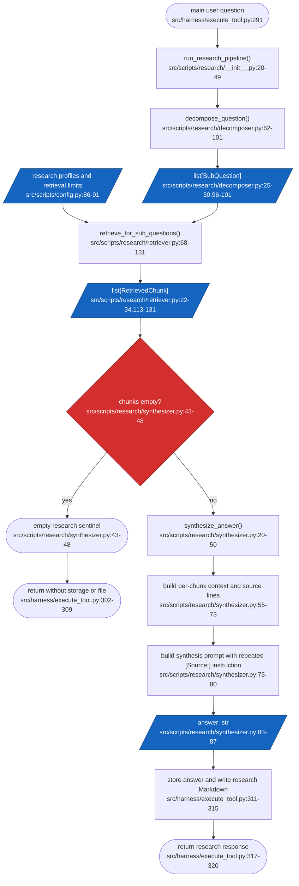
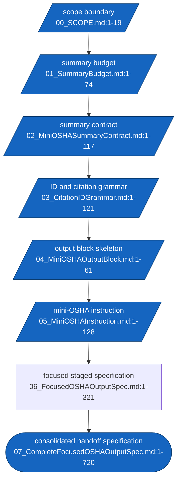

## Frontmatter

- Write date: 20260807
- Update date: 20260807
- Codebase last changed date: 20260805 (based on the existing OSHA project records)
- Implemented: N
- Status: APPROVED DESIGN SPECIFICATION 20260807
- Summary: This spec defines the Markdown instruction and output contract for independent mini-OSHAs handling one already-decomposed semantic or numerical query each. It limits each mini-OSHA to a bounded, self-contained report with semantic bullets, a numeric table, and machine-readable citations. It does not specify `var_ans`, database, parsing, or orchestrator integration.

## Scope boundary

In scope:

- The instruction given to each mini-OSHA
- The per-mini-OSHA summary budget equation
- Query, mini-OSHA, and source identifiers
- Semantic and numeric output structure
- Inline citations, ordinary bibliography entries, and derived citations
- Insufficient-evidence and conflicting-source behavior

Out of scope:

- `var_ans` implementation or ingestion
- Database design or persistence
- Python parsing or orchestration
- The broader OSHA system
- Retrieval, ranking, or source-selection implementation

## Problem space

### Problem definition

The proposed PSOAS flow starts each conversation turn with one main user query.
The decomposer splits it into first-level subqueries and then into individual
semantic or numerical sub-subqueries. One independent mini-OSHA handles
exactly one assigned sub-subquery and does not decompose it further. It does
not know the main query, parent branches, sibling mini-OSHAs, or broader system
objective.

The mini-OSHAs need a bounded and deterministic output contract. Without one,
their reports can vary in structure, repeat source information, mix semantic
and numeric findings, and consume an unpredictable portion of the shared token
budget. Source references also need stable identifiers so that each finding
can be traced to a filepath or to the earlier citations used in a derived
calculation.

### Failure instances

- A mini-OSHA returns a long narrative instead of a compact report, reducing
  the space available for other mini-OSHAs in the same turn.
- A report mixes qualitative statements and numerical metrics in the same
  bullet, making downstream use and comparison less reliable.
- A factual bullet or numeric row has no machine-readable citation marker.
- A derived number is presented without identifying the earlier source IDs
  used to calculate it.
- Two mini-OSHA blocks use ambiguous or colliding source identifiers.
- A mini-OSHA with insufficient evidence invents an answer or omits the
  required bibliography structure.

### Points of failure

| Point | Failure mechanism | Consequence |
|---|---|---|
| Summary allocation | Total summary budget is not divided across all sub-subqueries | One mini-OSHA can crowd out the others |
| Context boundary | Mini-OSHA assumes knowledge of the parent query | It answers a broader question it was not assigned |
| Semantic formatting | Paragraphs are mechanically split or mixed with metrics | Findings become difficult to parse and compare |
| Numeric formatting | Value, unit, and period are not separated | Metrics lose financial context |
| Citation identity | IDs do not encode query ownership | Sources cannot be traced reliably |
| Derived calculation | New number has no dependency citations | Calculation cannot be audited |
| Evidence failure | Unsupported answer is not marked | Master synthesis may treat absence as fact |

## Outcome imagination

### Target UX

For one main query per conversation turn, the master RLM creates subqueries and
sub-subqueries. The decomposer has already made each sub-subquery semantic or
numerical before invocation. Each mini-OSHA receives exactly one assigned
sub-subquery and returns one self-contained Markdown block within its equal
`Smini` limit.

The block contains:

- Machine-readable `osha_id`, `subquery_id`, and `assigned_ssq` markers
- Semantic findings as atomic bullets with bold topic labels
- Numeric findings in a table with separate value, unit, and period/comparison
  fields
- Inline citations beside every supported finding
- A mandatory bibliography at the end
- Derived-citation records when numbers are calculated from earlier citations

When evidence is insufficient, the block returns the explicit status marker
`[[OSHA_STATUS:INSUFFICIENT_EVIDENCE]]` and retains the mandatory bibliography
placeholder.

### What was desired by the user

The user wants two focused artifacts: a Markdown instruction that teaches each
independent mini-OSHA how to summarize its one assigned semantic or numerical
sub-subquery, and a
machine-readable output design that reduces repeated source text while
preserving traceability. The design must remain limited to the mini-OSHA
instruction and output contract; the `var_ans` and orchestrator interface will
be handled by a separate project.

# Solution space

## Idea of solving

Define a prompt-and-format contract for every independent mini-OSHA. The
instruction constrains the mini-OSHA's context, evidence behavior, length
priority, conflict handling, and output order. The output grammar gives every
finding and source a query-scoped identifier and separates semantic findings
from numeric findings.

## Type

Prompt and output-contract design. This is a proposed, non-code change. It
does not alter the current PSOAS implementation or define the downstream
`var_ans`/database/orchestrator interface.

## Design decisions in scope

- One main query per conversation turn; main-query IDs advance `A1`, `A2`,
  `A3`, and so on.
- One mini-OSHA per already-decomposed semantic or numerical sub-subquery; its
  `osha_id` equals its sub-subquery ID and it does not decompose further.
- Equal `Smini` allocation across all mini-OSHAs in the turn.
- Semantic findings are atomic bullets with bold topic labels.
- Numeric findings are table rows with separate value, unit, and
  period/comparison fields.
- Ordinary citations point to filepaths; derived citations point to prior
  source IDs and include a formula.
- A mandatory bibliography appears at the end of every block.

## Graph Change

### Current baseline

The existing research path has one decomposition call, retrieves BM25 chunks
for each first-level subquery, deduplicates them into one list, and performs
one final synthesizer call. It constructs a source line for each retrieved
chunk and asks the synthesizer to emit repeated inline `[Source: ...]`
citations.



### Proposed scoped contract

The proposed layer begins after one already-decomposed semantic or numerical
sub-subquery has been assigned. It does not define how the master RLM creates
that assignment or how `var_ans` consumes the block. It defines only what one
mini-OSHA must receive and return.

```mermaid
flowchart TD
    START(["main query A1<br/>03_CitationIDGrammar.md:9-14"]) --> ASSIGNSET["decomposer splits into individual semantic or numerical queries<br/>02_MiniOSHASummaryContract.md:17-24"]
    ASSIGNSET --> ONE[/"one assigned query per mini-OSHA<br/>02_MiniOSHASummaryContract.md:17-24"/]
    BUDGET[/"equal Smini limit<br/>01_SummaryBudget.md:5-17"/] -.-> ONE
    ONE --> MINI["mini-OSHA instruction<br/>no further decomposition<br/>05_MiniOSHAInstruction.md:7-10"]
    MINI --> EVIDENCE{"evidence supports assigned query?<br/>04_MiniOSHAOutputBlock.md:41-56"}
    EVIDENCE -->|no| INSUFF["emit status and placeholder bibliography<br/>04_MiniOSHAOutputBlock.md:50-56"]
    EVIDENCE -->|yes| TYPE{"semantic or numerical assignment?<br/>02_MiniOSHASummaryContract.md:17-24"]
    TYPE -->|semantic| SEM["atomic semantic bullets<br/>04_MiniOSHAOutputBlock.md:29-39"]
    TYPE -->|numerical| NUM["numeric table rows<br/>04_MiniOSHAOutputBlock.md:29-39"]
    SEM --> NUMSUP{"quantified support also present?<br/>04_MiniOSHAOutputBlock.md:37-39"}
    NUMSUP -->|yes| NUMSUPPORT["record support in Numeric Answer<br/>04_MiniOSHAOutputBlock.md:33-39"]
    NUMSUP -->|no| CITE["attach OSHA_CITE marker<br/>03_CitationIDGrammar.md:45-59"]
    NUMSUPPORT --> CITE
    NUM --> DERIVED{"number calculated from prior citations?<br/>03_CitationIDGrammar.md:95-108"}
    DERIVED -->|yes| DER["emit OSHA_DERIVED with inputs and formula<br/>03_CitationIDGrammar.md:95-108"]
    DERIVED -->|no| CITE
    DER --> CITE
    INSUFF --> BIB[/"mandatory bibliography<br/>03_CitationIDGrammar.md:61-93"/]
    CITE --> BIB
    BIB --> BLOCK[/"one mini-OSHA block<br/>04_MiniOSHAOutputBlock.md:5-27"/]
    BLOCK --> BOUND(["var_ans integration out of scope<br/>00_SCOPE.md:11-19"])

    classDef decision fill:#d32f2f,stroke:#7f1d1d,color:#fff
    classDef resource fill:#1565c0,stroke:#0d3f73,color:#fff
    class EVIDENCE,TYPE,NUMSUP,DERIVED decision
    class ONE,BUDGET,BIB,BLOCK resource
```

## Contract difference

| Concern | Current baseline | Proposed mini-OSHA contract |
|---|---|---|
| Unit of work | First-level subquery retrieval followed by one synthesis | One mini-OSHA per already-decomposed semantic or numerical sub-subquery |
| Context | Final synthesizer sees the original question and all retrieved chunks | Mini-OSHA sees only its one assigned semantic or numerical query |
| Semantic output | Free-form synthesized Markdown | Atomic bullets with bold topic labels |
| Numeric output | Mixed into generated prose | Dedicated table with separated fields |
| Ordinary source reference | Repeated `[Source: filename — section]` text | `[[OSHA_CITE:<source_id>]]` linked to filepath |
| Derived values | No derived-citation contract | New ID with prior IDs and formula |
| Empty evidence | Existing research sentinel strings | `[[OSHA_STATUS:INSUFFICIENT_EVIDENCE]]` plus mandatory placeholder bibliography |

## Failure modes

The following introduced failure modes have been addressed in the design:

| ID | Failure mode | How it propagates | Design response | Status |
|---|---|---|---|---|
| F1 | A mini-OSHA exceeds its summary allocation | One report crowds out other mini-OSHA reports | Divide the turn budget across all mini-OSHAs and prioritize direct answer/high-value findings | Resolved |
| F2 | Mini-OSHA assumes parent-query context | It answers a broader or different question | Explicit context boundary: use only `assigned_ssq` and available evidence | Resolved |
| F3 | Semantic and numeric facts are mixed | `var_ans` cannot reliably compare findings or metrics | Semantic bullets and numeric table are separate; mixed findings are split | Resolved |
| F4 | Finding has no citation | Master synthesis cannot trace the claim | Every semantic bullet and numeric row requires an inline citation | Resolved |
| F5 | Source IDs collide or lose ownership | A source is attributed to the wrong query branch | Hierarchical query/subquery/mini-OSHA/source IDs | Resolved |
| F6 | Derived number has no lineage | Calculation cannot be audited | New `OSHA_DERIVED` citation records prior IDs and formula | Resolved |
| F7 | Sources disagree | Conflicting figures may be silently merged | Prefer latest data period, then publication date; label material conflict | Resolved |
| F8 | Evidence is insufficient | Mini-OSHA may invent a response or omit required structure | Emit `OSHA_STATUS:INSUFFICIENT_EVIDENCE` and mandatory placeholder bibliography | Resolved |
| F9 | Filepath contains the bibliography delimiter `\|` | Python may split one filepath into multiple fields | Encode `|` as `%7C` inside the filepath; split first, then decode | Resolved |

### Resolution status

There are no unresolved findings in this specification. The `%7C` rule resolves the
only identified delimiter ambiguity. No code or parser is being changed in
this project.

## Unit tests

These are proposed deterministic tests for a future implementation. They are
not being created or run in this spec-only session.

| Test ID | Contract under test | Expected result | Test file |
|---|---|---|---|
| U0 | Query-ID grammar | `A1`, `A1a`, `A1a1`, and source suffixes parse into the correct hierarchy | `tests/test_osha_output_contract.py` |
| U1 | Metadata header | A block begins with `OSHA_ID`, `SUBQUERY_ID`, and `ASSIGNED_SSQ` markers | `tests/test_osha_output_contract.py` |
| U2 | Section order | Semantic Answer, Numeric Answer, and Bibliography appear in the approved order | `tests/test_osha_output_contract.py` |
| U3 | Citation integrity | Every citation marker resolves to a bibliography or derived record | `tests/test_osha_output_contract.py` |
| U4 | Derived lineage | Every derived record references existing prior IDs and includes a formula | `tests/test_osha_output_contract.py` |
| U5 | Numeric structure | Numeric rows separate value, unit, period/comparison, and citations | `tests/test_osha_output_contract.py` |
| U6 | Insufficient evidence | Status marker and `NO_FILEPATH` bibliography placeholder are present | `tests/test_osha_output_contract.py` |
| U7 | Budget priority | A generated block respects `Smini` and drops lower-priority detail first | `tests/test_osha_output_contract.py` |
| U8 | Escaped filepath | A filepath containing `|` round-trips through `%7C` encoding | `tests/test_osha_output_contract.py` |
| U9 | Atomic assignment | The block contains one `assigned_ssq`; the mini-OSHA does not decompose or answer a second query | `tests/test_osha_output_contract.py` |
| U10 | DeepSeek semantic fixture | The fixture produces atomic semantic bullets, separated quantified rows, citations, and a final bibliography | `tests/test_osha_output_contract.py` |

No LLM-calling tests are defined at this stage; implementation and user
approval would be required before any such tests are designed or run.

## Sample-derived semantic fixture

Use the sample image at:

```text
OSHA_summary_output_spec/sample images/520890b2-3258-457d-a059-2fafd1e86b95.jpeg
```

For the semantic assignment `What is the company's AI-server-related business
exposure?`, the desired result uses atomic bullets for the business meaning
and a separate numeric table for the quantified support. The complete target
block and iterative DeepSeek prompt-adjustment protocol are maintained in
`07_CompleteFocusedOSHAOutputSpec.md`.

## Hence File by file Change

This project contains specification artifacts only. No files in the OSHA
codebase are changed by this proposal.

### Specification-artifact graph



### Artifact responsibilities

| Artifact | Responsibility | Status |
|---|---|---|
| `00_SCOPE.md` | Limits this project to mini-OSHA instructions and output design | Confirmed |
| `01_SummaryBudget.md` | Defines the symbolic equal-allocation equation | Interim; `C` and maximum `n` remain external inputs |
| `02_MiniOSHASummaryContract.md` | Defines the one-query summary fields and sample-derived output shape | Approved |
| `03_CitationIDGrammar.md` | Defines query, mini-OSHA, source, ordinary-citation, derived-citation, and metadata IDs | Approved |
| `04_MiniOSHAOutputBlock.md` | Defines the Markdown block shape and structural rules | Approved |
| `05_MiniOSHAInstruction.md` | Defines the behavior instructions given to each mini-OSHA | Approved |
| `06_FocusedOSHAOutputSpec.md` | Records the focused problem, outcome, solution, graphs, failure modes, and validation | Approved |
| `07_CompleteFocusedOSHAOutputSpec.md` | Consolidates the approved handoff specification and DeepSeek fixture | Approved master |

## Execution

This session is specification design only. No prompt, parser, database,
`var_ans`, orchestrator, or OSHA source file is being implemented or tested.

When implementation is separately authorized, the deterministic contract
tests in this document should be built and run before any LLM-calling tests.
That implementation session must maintain a separate design-decision log and
update this master spec if implementation decisions change the approved
contract.
