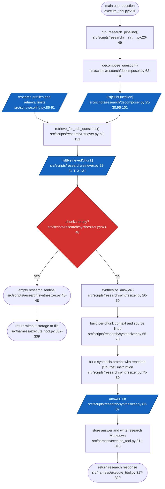
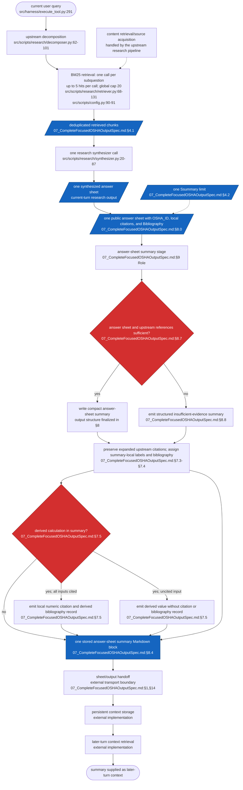

# Focused Research Answer-Sheet Summary and Citation Specification

## Frontmatter

- Write date: 20260807
- Update date: 20260811
- Codebase last changed date: 20260805 (based on the existing OSHA project records)
- Implemented: Y (option-A upstream answer-sheet boundary and summary adapter)
- Status: IMPLEMENTED — ANSWER-SHEET CITATION BOUNDARY 20260812
- Summary: This spec defines the Markdown instruction and output contract for the answer-sheet boundary and its downstream summary. The research pipeline decomposes one main question into 3–7 subquestions, performs one BM25 retrieval call per subquestion, deduplicates retrieved chunks under a global cap, and synthesizes one answer sheet. The Python answer-sheet boundary adds `OSHA_ID`, local numeric/section citation labels, and a grouped bibliography; the downstream project summarizes that labeled answer sheet for storage. This project excludes decomposition, retrieval, synthesis content design, persistent storage, `var_ans`, database, parser, orchestrator, PMS2, top-level routing, fallback behavior, and other broader OSHA implementation work.
- Design-method reference: `/Users/derickfeng/Desktop/DerickWorkingDir/wsnSpecsutekisa` (especially `SKILL.md`, `references/00_GoodBuildSpec.md`, `references/Failuremodes.md`, and `references/Problemspace.md`)

## 1. Scope boundary

### In scope

- The Markdown instruction given to the answer-sheet summary stage
- The input boundary between one synthesized research answer sheet and this
  summary stage
- The per-answer-sheet summary budget equation
- Main-user-query identifier and local numeric citation labels
- Citation-preserving answer-sheet summary output structure
- Inline citations, ordinary bibliography entries, and derived citations
- Preservation of upstream `[Source: filename — section]` references
- Insufficient-evidence and conflicting-source behavior
- Preservation of source/citation information carried by the synthesized answer sheet
- The summary artifact's handoff boundary to downstream persistence
- Deterministic validation requirements for the output contract

### Out of scope

- Redesigning the broader OSHA system
- Generating or synthesizing the research answer sheet
- Changing the research pipeline's decomposition or retrieval behavior
- Content retrieval, filesystem search, indexing, extraction/OCR, chunking, or
  ranking changes
- Rendering the synthesized answer sheet in the current conversation turn
- Persistent storage, sheet transport implementation, and later-turn context
  retrieval
- Decomposer cap-overflow, retry, truncation, or error handling
- PMS2 or unrelated harness behavior
- The top-level router's choice between research and PMS2
- Any PMS2 fallback trigger or fallback output contract
- Implementing broader OSHA, storage, orchestration, retrieval, or upstream
  pipeline changes
- Defining the master LLM's broader reasoning behavior beyond consuming this contract
- Defining whether `var_ans` receives raw Markdown or Python-parsed structured data
- Implementing or specifying `var_ans`, database, or orchestrator integration

## 2. Problem space

### 2.1 Problem definition

Each conversation turn contains exactly one main user query. The research
pipeline decomposes it into 3–7 subquestions, performs one BM25 retrieval call
per subquestion, deduplicates the retrieved chunks under the research cap, and
performs one synthesizer call. That synthesizer produces one answer sheet.
This project receives that one answer sheet and summarizes it; it does not
decompose, retrieve, or synthesize the research answer.

The top-level router, including any decision to invoke research or PMS2 and any
PMS2 fallback behavior, is outside this contract. PMS2 is relevant to this
specification only if a future design explicitly sends PMS2 output through the
research pipeline's summary-stage interface.

This project operates at answer-sheet granularity. It creates one public
answer-sheet block and one downstream summary-stage block for one synthesized
answer sheet per main user query. The upstream synthesizer draft is free-form
Markdown: it starts with a direct answer of 2–4 sentences, continues with
thematic `##` sections, and ends with a `## Key uncertainties` section.
Factual claims use the upstream citation text `[Source: filename — section]`.
At the answer-sheet boundary, deterministic Python adds the percent-encoded
`OSHA_ID`, `OSHA_SUMMARY_TYPE:ANSWER_SHEET`, local numeric/section labels, and
the grouped `## Bibliography`. The downstream summary adapter expands those
local labels back to exact upstream references before asking the summary model
to summarize. This project does not receive separate mini-OSHA packages,
sibling branches, or the complete current-turn transcript unless those are
explicitly embedded in the answer-sheet input contract.

The summary stage therefore requires a bounded and deterministic output
contract. Without one, stored summaries can vary in structure, repeat source
information, mix semantic and numeric findings, and consume an unpredictable
portion of the shared token budget. Source references also need stable local
labels so that each cited summarized claim can be traced to the upstream source
reference text in the answer sheet or to earlier citations used in a derived
calculation. The upstream citation text is preserved in the bibliography; this
project assigns local numeric labels to it. Claims that arrive without an
upstream citation remain explicitly uncited rather than receiving an invented
source.

The uploaded sample images in
`OSHA_summary_output_spec/sample images/` show the target information shape:
section-based qualitative findings, atomic bullets, financial and operating
metrics, periods, comparisons, units, percentages, scenario effects, and
valuation information.

### 2.2 Failure instances

- The summary stage returns a long narrative instead of a compact stored
  artifact, reducing the space available for other summary blocks.
- A report mixes qualitative statements and numerical metrics in the same
  bullet, making downstream comparison unreliable.
- A supported factual bullet or numeric row has no local numeric citation marker.
- A derived number is presented without identifying the earlier source labels
  used to calculate it.
- Two answer-sheet summary blocks use ambiguous or colliding local citation labels.
- An answer-sheet summary with insufficient evidence invents an answer or omits the
  required bibliography structure.

### 2.3 Points of failure

| Point | Failure mechanism | Consequence |
|---|---|---|
| Summary allocation | The one summary budget is not enforced | The stored answer-sheet summary exceeds the per-turn allocation |
| Context boundary | Summary stage assumes knowledge outside the answer sheet | It answers a broader or different question |
| Semantic formatting | Paragraphs are mechanically split or mixed with metrics | Findings become difficult to parse and compare |
| Numeric formatting | Value, unit, and period are not separated | Metrics lose financial context |
| Citation identity | Local labels do not resolve to the upstream source-reference text | Cited claims cannot be traced reliably |
| Derived calculation | New number has no dependency citations | Calculation cannot be audited |
| Answer-sheet input failure | Missing answer sheet is not marked | Later context retrieval may treat absence as fact |

## 3. Outcome imagination

### 3.1 Target UX

For one main query per conversation turn, the research pipeline produces one
synthesized answer sheet. The summary stage receives that answer sheet and
returns one self-contained Markdown block within its assigned summary limit.
The block is the artifact handed downstream for persistent context storage.

The block contains:

- A machine-readable identifier containing the main user query
- A compact summary of the synthesized answer sheet
- Inline citations beside every supported summarized claim; upstream-uncited
  claims may remain without a citation
- A mandatory bibliography at the end
- Derived-citation records when numbers are calculated from earlier citations

When the received answer sheet is unavailable, the block returns
`[[OSHA_STATUS:INSUFFICIENT_EVIDENCE]]` and retains the mandatory bibliography
placeholder.

### 3.2 What was desired by the user

The user wants two related artifacts:

1. The one answer sheet produced in the current conversation turn by the
   research pipeline's synthesizer.
2. One machine-readable, citation-preserving summary of that answer sheet
   that can be sent through the sheet and stored for later-turn context
   retrieval.

The design in this file is limited to the answer-sheet summary instruction and
output contract. Decomposition, retrieval, synthesis, persistence, and the
`var_ans`/orchestrator interfaces are separate projects.

## 4. Summary budget

### 4.1 Query hierarchy

```text
One main user query per turn
  → m research subquestions, with `3 ≤ m ≤ 7` in the current decomposer
  → one BM25 retrieval call per subquestion
  → up to `Rtopk = 5` retrieved chunks per call
  → deduplicated global retrieval set capped at `Rmax = 20` chunks
  → one synthesizer call
  → one final research answer sheet
  → one answer-sheet summary block
```

There is one summary block per main user query/answer sheet. This project does
not create or summarize separate mini-OSHA branches.

### 4.2 Symbolic equation

Let:

- `Q` = the main user question, estimated at approximately 26 tokens for a
  20-word question
- `m` = number of research subquestions, bounded by `3 ≤ m ≤ 7` in the
  current decomposer
- `Rtopk` = retrieval result cap per subquestion, currently `5`
- `Rmax` = global deduplicated retrieved-chunk cap, currently `20`
- `Cresearch` = all non-summary token usage for the main question, research
  decomposition, retrieved-chunk context, synthesizer answer sheet, and other
  separately specified upstream/downstream components
- `Ssummary` = token limit for the one returned answer-sheet summary block,
  including metadata, summary, citations, and bibliography

With 8 conversation turns under a 500,000-token total budget:

```text
Tturn < 500,000 / 8
Tturn < 62,500 tokens

Cresearch + Ssummary + Q < 62,500

Ssummary < 62,500 − Cresearch − Q
Ssummary < 62,474 − Cresearch    [using Q ≈ 26 tokens]
```

`Ssummary` remains symbolic until `Cresearch` and the runtime counting method
are known. There is exactly one summary block for the one answer sheet; no
branch-count allocation applies to this project.

### 4.3 Budget priority rule

When approaching `Ssummary`, preserve information in this order, provided the
mandatory returned-block structure can still fit:

1. Direct answer or conclusion
2. Highest-value supporting findings
3. Important numeric facts and their context
4. Necessary citations and bibliography entries
5. Lower-priority detail

Mandatory metadata, citations, and bibliography structure must not be removed.
If that mandatory structure cannot fit within `Ssummary`, the allocation is
invalid and must be increased upstream. Otherwise, lower-priority detail is
omitted before the limit is exceeded.

## 5. Solution space

### 5.1 Idea of solving

Define a prompt-and-format contract for the summary stage that receives one
final synthesized answer sheet. The instruction constrains the summary stage's
input context, answer-sheet coverage, length priority, conflict handling, and
output order. The output grammar uses the main user query as the summary
identifier and local source labels for citations.

### 5.2 Type

Prompt and output-contract design with a standalone implementation boundary.
It does not alter the current PSOAS implementation or define the downstream
`var_ans`/database/orchestrator interface.

### 5.3 Approved design decisions

- One main query per conversation turn; the main user query itself identifies
  the corresponding summary block. No separate block or answer-sheet label is
  assigned.
- One answer sheet is produced by one research synthesizer call per main user
  query.
- The summary stage receives one final answer sheet and returns one summary
  block for that sheet.
- The summary stage does not decompose the query, call retrieval, call the
  synthesizer, or create mini-OSHA branches.
- The current research pipeline creates 3–7 subquestions, calls BM25 once per
  subquestion, retrieves up to 5 hits per call, deduplicates them, and passes
  at most 20 unique chunks to the synthesizer.
- The answer-sheet summary may contain both qualitative and quantitative facts
  present in the synthesized answer; no upstream query-type marker is assumed.
- The answer sheet's existing `[Source: filename — section]` citations are
  upstream input. This project preserves each full filename once as a parent
  bibliography entry, groups sections from that file beneath it, and assigns
  local subsection labels such as `[1.1]` and `[1.2]`; no filepath is required.
- The upstream answer-sheet Markdown format is preserved as the summary
  stage's input format: direct answer first, thematic `##` sections, and final
  `## Key uncertainties`.
- Source acquisition, retrieval, filepath resolution, and source-file mapping
  are outside this summary
  specification.
- Derived-citation records appear in the final Bibliography section; the
  summarized claim uses an inline citation marker for the derived label.
- Derived calculations may chain through earlier ordinary or derived local
  citation labels, with no forward references.
- Ordinary sources and derived calculations share one local positive-integer
  citation sequence within each summary sheet. Labels are assigned in
  creation/first-use order and reset for the next summary sheet.
- Repeated identical upstream `[Source: filename — section]` references reuse
  the same local numeric label within one summary sheet.
- An upstream citation bracket may contain multiple atomic references separated
  by `; Source: `, for example `[Source: file.md — Section A; Source: file.md —
  Section B]`. Split these into separate local child labels; if both sections
  use the same filename, they share the same integer parent label.
- Distinct sections from the same full filename share one integer parent label.
  Their indented child labels use the form `[1.1]`, `[1.2]`, and so on. Inline
  claims cite the child label; the child bibliography line contains only the
  section text and does not repeat `[Source: ...]`.
- `FORMULA:` uses a human-readable audit expression; no executable formula
  grammar is required.
- Derived values may use sensible rounding; no fixed precision is required.
- Insufficient-evidence blocks retain the complete summary metadata header.
- Every emitted token in the complete answer-sheet summary block counts toward
  `Ssummary`.
- Upstream source-reference text is the only source information required by
  this project; no filepath is required or resolved.
- The answer-sheet summary stage is invoked once per answer sheet as a logical
  operation. Its initial integration may make one retry after a failed
  provider attempt. Ordinary citation labels reset for each summary sheet and
  do not require cross-run stability.
- The one `Ssummary` allocation applies to the one summary block for the turn.
- Initial upstream integration preserves the raw synthesizer answer for the
  current-turn response and invokes this project separately to create the
  stored-context summary artifact.
- For the initial upstream integration, `Ssummary` is supplied by the fixed
  integration constant `4000`. A configurable field and dynamic turn-budget
  derivation remain deferred; this value is an integration setting, not a new
  output-contract rule.
- Initial upstream integration retries summary generation once with the same
  `Ssummary = 4000` allocation. A draft that contains no upstream source
  references when the answer sheet contains cited evidence is a failed
  attempt. If both attempts fail for that reason, retain the last draft as the
  summary but populate its Bibliography with every exact upstream source
  reference found in the answer sheet; do not invent claim-level inline labels
  because the mapping is unavailable. Other summary failures preserve the raw
  synthesizer answer for the current turn and are logged.
- A successful initial upstream integration stores the summary in both a
  separate in-memory registry handle and a separate session Markdown file;
  the raw answer's existing registry/file storage remains unchanged.
- If the provider reaches its output ceiling inside an upstream source
  reference, the wrapper drops the incomplete trailing claim before assigning
  local citations; malformed source-reference text is never persisted.
- Summary claims preserve the answer sheet's useful qualitative and numeric
  context rather than forcing an unprovided semantic/numeric assignment.
- Ordinary citations point to upstream source-reference text; derived citations
  point to prior local citation labels and include a formula.
- A mandatory bibliography appears at the end of every block.
- The selected live summary-stage provider is DeepSeek through its
  OpenAI-compatible chat-completions interface. The runtime model name is an
  explicit implementation input; this specification does not hard-code
  deepseek-v4-pro or deepseek-v4-flash.
- The live model boundary uses architecture B: DeepSeek emits only draft
  summary content containing any exact upstream `[Source: filename — section]`
  references it preserves. The deterministic Python wrapper owns the final
  `OSHA_ID`, `OSHA_SUMMARY_TYPE`, section headings, local numeric citation
  labels, and Bibliography. A model-generated final block is not accepted as
  the public output.

## 6. Graph change

### 6.1 Current baseline

The existing research path has one decomposition call, retrieves BM25 chunks
for each first-level subquery, deduplicates them into one list, and performs
one final synthesizer call. It constructs a source line for each retrieved
chunk and asks the synthesizer to emit repeated inline `[Source: ...]`
citations.



### 6.2 Proposed scoped contract

The proposed layer begins after the current research pipeline's synthesizer has
produced one answer sheet. It does not define how the main query is
decomposed, how BM25 retrieval works, how the answer sheet is synthesized, or
how persistent storage and later context retrieval are implemented. It defines
what the summary stage receives, how it compresses and cites that answer sheet,
and what one bounded summary block it returns.



### 6.3 Summary-contract difference

| Concern | Current baseline | Proposed answer-sheet summary contract |
|---|---|---|
| Unit of work | One research answer sheet per main query | One summary block per answer sheet |
| Context | Synthesizer sees the original question and all retrieved chunks | Summary adapter receives one public labeled answer sheet and expands its bibliography to upstream source references |
| Answer structure | Free-form synthesized Markdown | Compact citation-preserving summary; exact structure is defined in §8 |
| Research fan-out | 3–7 subquestions; one retrieval call per subquestion | No additional fan-out |
| Ordinary source reference | Repeated `[Source: filename — section]` text | Grouped local parent label for the full filename with indented section sublabels |
| Derived values | No derived-citation contract | New local numeric citation label with prior local labels and formula |
| Empty answer/source references | Existing research sentinel strings | `[[OSHA_STATUS:INSUFFICIENT_EVIDENCE]]` plus mandatory placeholder bibliography |
| Lifetime | Answer sheet returned/stored by the existing research path | Summary block is handed to persistent context storage for later retrieval |

## 7. Answer-sheet and citation grammar

### 7.1 Main-query identity and local citation labels

The summary block is identified by the main user query itself. No separate
block ID or answer-sheet ID is assigned.

Ordinary citation labels are local to each summary sheet:

```text
Summary block identity: <percent-encoded main user query>
Parent labels in that block: 1, 2, 3, ...
Child labels in each parent group: 1.1, 1.2, 1.3, ...
```

Example:

```text
[1.1]
[1.2]
```

Parent labels reset independently for every answer-sheet or summary block. The
same parent label, such as `1`, may therefore refer to different full
filenames in different blocks. The deterministic boundary assigns parent
labels in first-use order to distinct full filenames and child labels in
first-use order to distinct sections within each filename. Repeated use of the
same filename-section pair reuses its child label. A derived calculation's
label interaction with this parent/child namespace is specified separately.

### 7.2 Approved metadata markers

Every block begins with:

```text
[[OSHA_ID:<percent_encoded_main_user_query>]]
[[OSHA_SUMMARY_TYPE:ANSWER_SHEET]]
```

The answer-sheet boundary receives the original main user query from the
research pipeline and serializes it in `OSHA_ID` using UTF-8 percent-encoding.
Every UTF-8 byte is
percent-encoded except the RFC 3986 unreserved characters `A-Z`, `a-z`,
`0-9`, `-`, `.`, `_`, and `~`; hexadecimal digits use uppercase. The stored
identifier must decode back to the exact original query, including whitespace,
newlines, punctuation, and non-ASCII characters. No subquery, sub-subquery,
mini-OSHA, or assigned-query marker is part of this contract.

The same metadata grammar is retained by the downstream summary block.

### 7.3 Approved ordinary citations

Place the marker directly after the semantic bullet it supports. For numeric
rows, place the marker in the table's final `citations` column:

```text
[<citation_label>]
```

Example:

```text
[1]
```

Multiple markers may be placed together when one summarized claim combines
support from multiple source files:

```text
[1] [2]
```

### 7.4 Approved ordinary bibliography entries

Each ordinary bibliography group contains the full upstream filename once,
followed by indented section children. The parent line does not use an
ellipsis, and the child line contains only the display section text. When an
upstream section contains a recognizable company/entity prefix such as
`Lumentum Holdings Inc. (LITE) >`, the summary removes that repeated prefix
from the child display text wherever it appears, including after an em dash or
in repeated occurrences in a semicolon-separated section string. Child lines use
four non-breaking spaces (`U+00A0`) for visual indentation; four ordinary
ASCII spaces would make Markdown render the children as a monospace code
block in editors such as VS Code:

```text
[<parent_label>] [Source: <full_filename>]
    [<parent_label>.<section_label>] <section>
```

Example:

```text
[1] [Source: 20251125_Mizuho_Securities_LITE_LITE-_LITE_ing_the_AI_Optical_Revolution_Initiate_at_O.md]

    [1.1] Exhibit 12–13

    [1.2] Competitive Landscape

[2] [Source: another_full_filename.md]

    [2.1] Another section
```

Only upstream source references cited by an emitted claim or used by an
emitted derived record appear in the bibliography. In a conflicting-source
case, unselected upstream references are omitted.

Order parent groups by first use, order child sections by first use within each
parent, then place derived records after ordinary groups in derived-record
creation order.

The bibliography is mandatory and appears at the end of every block. A literal
`|` inside the upstream filename or section must be preserved as part of the
source-reference text; the parser must not interpret it as a filepath separator.

### 7.5 Approved derived citations

Derived numbers use a local numeric citation label in the same namespace as
ordinary citations. Because the upstream format defines no derived citation,
the derived bibliography record remains project-specific and records the prior
citation labels and calculation formula:

```text
[<citation_label>] [Derived: FROM <citation_label_1>,<citation_label_2> | FORMULA: <expression>]
```

Example:

```text
[3]
[3] [Derived: FROM 1.1,2.1 | FORMULA: operating_profit/net_sales]
```

When all required inputs have local citation labels, the derived number
receives a new local numeric citation marker using the next label. Its
project-specific derived bibliography record must identify the earlier local
citation labels used as inputs and appears in the final Bibliography section.

If any required input claim is uncited upstream, calculate the derived value if
the numeric inputs are present, but emit it without a local numeric citation
and without a derived bibliography record. Do not invent labels for uncited
inputs.

## 8. Answer-sheet summary contract

### 8.0 Upstream answer-sheet public boundary

The research synthesizer returns an unwrapped draft containing exact upstream
references in `[Source: filename — section]` form. A deterministic Python
boundary immediately wraps that draft before it is printed in the current
turn or handed to the summary stage. It adds:

```markdown
[[OSHA_ID:<percent_encoded_main_user_query>]]
[[OSHA_SUMMARY_TYPE:ANSWER_SHEET]]

<the original synthesized Markdown with local inline labels>

## Bibliography

[<parent_label>] [Source: <full_filename>]

    [<parent_label>.<section_label>] <section>
```

The boundary assigns local labels in first-use order, preserves the full
filename, splits distinct sections into child labels, reuses labels for
repeated filename-section pairs, and moves citation-only lines to the end of
the preceding claim. The public answer sheet keeps the synthesizer's existing
thematic Markdown sections; it is not rewritten into the downstream
`## Answer Summary` structure. The summary adapter reverses the local labels
to exact upstream references before invoking the summary model.

The answer-sheet model profile declares a `max_tokens` setting, but the current
DeepSeek completion path does not explicitly pass that setting for ordinary
research synthesis. Therefore the effective answer-sheet output cap remains a
separate unresolved runtime concern; this option-A citation change does not
alter it.

### 8.1 Answer-sheet summary input fields

The answer-sheet summary stage receives:

1. One final public answer sheet returned by the research pipeline, including
   `OSHA_ID`, local citations, and its Bibliography
2. The main user query, used as the summary identifier
3. The assigned `Ssummary` output budget

The answer sheet carries deterministic local citation labels and its grouped
bibliography. The summary adapter expands those labels to the exact upstream
`[Source: filename — section]` references before the model call. No filepath,
raw retrieved chunk, source-file mapping, or opaque source metadata is
required by the summary project.

The answer sheet is the summary stage's evidence input. The summary stage does
not retrieve additional content, does not call the synthesizer again, and does
not require the raw retrieved chunks as input. The summary model preserves the
expanded upstream references; the deterministic summary wrapper assigns its
own local labels in the stored summary block.

### 8.2 Required output fields

Each answer-sheet summary output contains:

1. The main user query used as the summary identifier
2. One compact summary of the synthesized answer sheet
3. Citation markers linked to a bibliography
4. A mandatory bibliography section

### 8.3 Context boundary

The summary stage receives only one synthesized answer sheet in the upstream
Markdown format, the main user query used as the summary identifier, and
`Ssummary`. It may use the main user query as the block identifier, but must
not expand the task beyond summarizing the answer sheet. It does not assume
access to source files, filepaths, source-file mappings, decomposer
subquestions, raw retrieved chunks, other turns, or the broader PSOAS
objective.

If the answer sheet is missing, unavailable, or lacks sufficient upstream
source references for a faithful summary, the summary stage must return
the structured `INSUFFICIENT_EVIDENCE` block defined in §8.8. It must not
perform additional content retrieval under this contract.

### 8.4 Exact block layout

The answer-sheet summary stage returns exactly one block in this order:

```markdown
[[OSHA_ID:<percent_encoded_main_user_query>]]
[[OSHA_SUMMARY_TYPE:ANSWER_SHEET]]

## Answer Summary

<compact summary of the synthesized answer sheet with inline citations>

## Bibliography

[<parent_label>] [Source: <full_filename>]
    [<parent_label>.<section_label>] <section>

[<derived_label>] [Derived: FROM <citation_label_1>,<citation_label_2> | FORMULA: <expression>]
```

### 8.5 Answer-summary rules

The summary must faithfully compress the synthesized answer sheet without
inventing claims, changing supported values, or adding conclusions absent from
the answer sheet. It may preserve qualitative and quantitative facts together
when necessary to retain the answer's meaning.

Supported summarized claims must have an inline numeric citation marker.
Upstream claims that contain no `[Source: filename — section]` reference may be
retained without a citation; do not invent one. Use the fixed summary structure
from §8.4 with a compact Markdown summary; bullets or tables may be used as
needed, and no semantic/numeric type split is required.

```text
- <summarized claim> [<citation_label>]
```

### 8.6 Derived-summary rules

If the summary calculates a new number rather than copying the answer sheet and
all required inputs have local citation labels, the new number receives a local
numeric citation label and a project-specific derived bibliography record with
the earlier local citation labels and a human-readable formula. If any required
input is uncited upstream, calculate the number if possible but emit it without
a citation and without a derived bibliography record. If the answer sheet
already contains a number,
the summary preserves its stated value and context rather than recalculating it.

### 8.7 Answer-sheet coverage and conflict rules

Every supported summarized claim must contain an inline numeric citation
marker. If an answer-sheet claim lacks an upstream `[Source: ...]` reference,
retain the claim without a citation and do not invent one. The summary stage
does not retrieve additional content to fill the gap. Return
`INSUFFICIENT_EVIDENCE` only when the answer sheet itself is missing or
unavailable, not merely because one upstream claim is uncited. However, a
model draft that contains no upstream source references at all when the input
answer sheet contains cited evidence is invalid and is retried once. If the
retry is also entirely uncited, use the explicit fallback: retain that draft
  and list every exact upstream source reference from the answer sheet in the
  Bibliography, without assigning those sources to claims inline.
- If the provider returns no summary text on both attempts, emit a valid
  `[[OSHA_STATUS:SUMMARY_UNAVAILABLE]]` block with the query metadata and the
  mandatory `[Source: unavailable]` bibliography placeholder. Do not silently
  omit the summary artifact.

When the synthesized answer sheet contains comparable source statements that
disagree about the same subject, metric, and period, preserve the answer
sheet's selected statement and do not silently merge conflicting values. If a
new selection is unavoidable, compare data period first and publication date
second when available. Emit only the selected result and do not mention or
label the conflict in the summary output.
Further conflict-selection details are deferred to later development.

### 8.8 Insufficient-evidence block

If the answer sheet is missing or unavailable, preserve the mandatory
bibliography section and emit the insufficient-evidence block instead of a
partial summary:

```text
[[OSHA_ID:<percent_encoded_main_user_query>]]
[[OSHA_SUMMARY_TYPE:ANSWER_SHEET]]
[[OSHA_STATUS:INSUFFICIENT_EVIDENCE]]

## Bibliography

[Source: unavailable]
```

### 8.8.1 Invalid main-query identifier or answer-sheet input block

If the main user query identifier or required answer-sheet input is missing or
malformed, emit this structured block instead of an answer or an
insufficient-evidence result:

```text
[[OSHA_ID:<INVALID>]]
[[OSHA_SUMMARY_TYPE:ANSWER_SHEET]]
[[OSHA_STATUS:INVALID_IDENTIFIER]]

## Bibliography

[Source: unavailable]
```

For example, if the main user query is empty:

```text
[[OSHA_ID:<INVALID>]]
[[OSHA_SUMMARY_TYPE:ANSWER_SHEET]]
[[OSHA_STATUS:INVALID_IDENTIFIER]]

## Bibliography

[Source: unavailable]
```

If the main user query identifier is malformed or cannot be percent-decoded and the answer sheet or its source
metadata is also missing or unavailable, use the combined status and
bibliography placeholder:

```text
[[OSHA_ID:<INVALID>]]
[[OSHA_SUMMARY_TYPE:ANSWER_SHEET]]
[[OSHA_STATUS:INVALID_IDENTIFIER+INSUFFICIENT_EVIDENCE]]

## Bibliography

[Source: unavailable]
```

### 8.9 Length behavior

Stay within the assigned symbolic `Ssummary` summary-token limit. The tokenizer
and runtime counting/enforcement mechanism are deferred to implementation. If
`Ssummary` is
below the minimum needed for the mandatory returned-block structure, treat the
allocation as invalid and require an upstream increase; do not exceed the
limit or remove required structure. Otherwise, when the report approaches the
limit, omit lower-priority detail before exceeding it. Do not invent a token
or character limit until `Cresearch` and the runtime counting method are known.

### 8.10 DeepSeek prompt-testing fixture

The spec must include a concrete desired answer so a future DeepSeek test can
be judged against a stable target. The target is structural and semantic; the
model does not need to reproduce the wording verbatim.

#### Assigned main user query and answer sheet

```text
main_user_query: What were the company's high-layer substrate drill overseas sales and AI-dedicated capex?
```

#### Synthesized answer-sheet input fixture

The summary-stage test receives the one answer sheet returned by the research
synthesizer. The input contains no citation labels assigned by this summary
project:

```text
Answer sheet:
The company’s high-layer substrate drill business represented 61% of total
overseas sales in H1 FY2026. Capital expenditure for new AI-dedicated drill
production lines totaled ¥3.2 billion in H1 2026. [Source: source.md — Sales]
[Source: source.md — Capital Expenditure]

## Supporting facts

The sales mix and capex figures are reported for the same H1 period.
[Source: source.md — Sales]

## Key uncertainties

No additional uncertainty is stated in the answer sheet.

```

The upstream source-reference text is preserved; no filepath is required or
assigned by this summary project.

#### Desired model-draft shape

The model is expected to return only summary content. It may use Markdown
bullets or paragraphs and must preserve exact upstream source references, but
it must not return metadata, local numeric labels, or a Bibliography section.
The deterministic wrapper converts this draft into the public block below.

#### Desired public output shape

```markdown
[[OSHA_ID:What%20were%20the%20company%27s%20high-layer%20substrate%20drill%20overseas%20sales%20and%20AI-dedicated%20capex%3F]]
[[OSHA_SUMMARY_TYPE:ANSWER_SHEET]]

## Answer Summary

- The company’s high-layer substrate drill business represented 61% of total overseas sales in H1 FY2026. [1.1]
- Capital expenditure for new AI-dedicated drill production lines totaled ¥3.2 billion in H1 2026. [2.1]

## Bibliography

[1] [Source: source.md]

    [1.1] Sales

[2] [Source: capex.md]

    [2.1] Capital Expenditure
```

The summary preserves the answer sheet's quantitative context without requiring
an upstream semantic/numeric assignment.

#### Iterative prompt-adjustment protocol

When the DeepSeek output does not match the target contract, a future Codex
execution session should:

1. Run one answer-sheet summary stage against the same answer-sheet fixture.
2. Check metadata markers, section order, summary coverage, citation references,
   and bibliography syntax.
3. Identify the smallest prompt instruction that explains the deviation.
4. Adjust the summary-stage prompt while preserving the approved schema and ID
   grammar.
5. Rerun the same fixture and compare again until the structural contract
   passes or the user stops the iteration.

This is a future LLM-testing workflow, not an LLM test run in the current
specification session.

## 9. Normative answer-sheet summary instruction

The following is the instruction to give the single answer-sheet summary
stage for one synthesized research answer sheet.

### Role

You summarize one final answer sheet produced by one research synthesizer call.
Do not decompose the main query, call retrieval, call the synthesizer again,
generate a new answer sheet, or create separate mini-OSHA branches. Produce
only one concise, self-contained draft summary. The deterministic wrapper,
not the model, creates the final stored-context block.

### Context boundary

You receive one public answer sheet containing deterministic local numeric
labels and a grouped Bibliography, plus the supplied main-user-query
identifier and `Ssummary`. The summary adapter expands those labels to exact
upstream `[Source: filename — section]` references before this instruction is
given to the model. Preserve those exact upstream references in the draft; do not
resolve paths, retrieve files, inspect raw chunks, or invent a source
reference. Treat the main user query as an identifier, not as permission to
assume access to the decomposer's subquestions, complete transcript, or
broader OSHA objective.

### Length priority

Stay within the assigned `Ssummary` summary-token limit. The model's response
is draft content; the deterministic wrapper adds mandatory final metadata,
section headings, local citation labels, and the bibliography. If the draft
approaches the limit, preserve information in this order:

1. Direct answer or conclusion
2. Highest-value supporting facts from the answer sheet
3. Important numeric facts and their context
4. Necessary citations and bibliography entries
5. Lower-priority detail

Omit lower-priority detail before exceeding the limit. Do not emit the
mandatory final metadata, local citation labels, or bibliography yourself.

### Evidence requirement

For every supported summarized claim with an upstream
`[Source: filename — section]` reference, preserve that exact reference inline.
If an upstream claim has no such reference, preserve the claim without a
citation and do not invent a source reference. Return no status marker;
`INSUFFICIENT_EVIDENCE` is created by the wrapper only when the answer sheet
itself is missing or unavailable. Do not retrieve additional content to fill a
citation gap.

### Calculation requirement

You may calculate derived numbers when the required numeric inputs are present
in the answer sheet. Preserve the exact upstream source references supporting
the calculation. Do not create local numeric labels or derived bibliography
records; those belong to the deterministic wrapper. If a required input is
uncited upstream, calculate the number if possible but emit it without a
source reference. Do not create forward references.
If a required calculation cannot be computed, emit an unavailable result with
any available input citations and do not emit a derived bibliography record for
the unavailable result.

### Conflict requirement

When the answer sheet contains comparable source statements that disagree
about the same subject, metric, and period, preserve the answer sheet's
selected statement. If a new selection is unavoidable, compare data period
first and publication date second when available. Emit only the selected
result and do not mention or label the conflict in the stored summary.

### Output requirement

The deterministic wrapper returns exactly one public block in the approved
order. The model itself returns only the draft described in §9. The wrapper
creates:

1. `OSHA_ID` and `OSHA_SUMMARY_TYPE` metadata markers
2. `## Answer Summary`
3. `## Bibliography`

If evidence is insufficient, retain the metadata, replace the answer section
with `[[OSHA_STATUS:INSUFFICIENT_EVIDENCE]]`, and include the literal
`## Bibliography` heading and mandatory placeholder entry. Preserve
qualitative and quantitative facts together when that is necessary to retain
the meaning of the synthesized answer sheet; this contract does not require a
semantic/numeric type split.

If the answer sheet exists but the summary provider returns no text on both
attempts, emit the following structured artifact instead of treating the
summary as absent:

```markdown
[[OSHA_ID:<percent-encoded main user query>]]
[[OSHA_SUMMARY_TYPE:ANSWER_SHEET]]
[[OSHA_STATUS:SUMMARY_UNAVAILABLE]]

## Bibliography

[Source: unavailable]
```

## 10. Failure modes and resolutions

| ID | Failure mode | How it propagates | Design response | Status |
|---|---|---|---|---|
| F1 | The answer-sheet summary exceeds `Ssummary` or cannot fit mandatory structure | The stored summary exceeds the per-turn allocation or cannot be parsed | Omit lower-priority detail first; if mandatory structure cannot fit, reject the allocation upstream | Resolved |
| F2 | Summary stage assumes context outside the answer sheet | It summarizes a broader or different question | Use only the answer sheet, main-user-query identifier, and `Ssummary` | Resolved |
| F3 | Summary stage creates mini branches or performs research work | Scope expands into decomposition, retrieval, or synthesis | Invoke exactly once per answer sheet; do not fan out or call upstream research components | Resolved |
| F4 | Summary claim has no upstream source reference | Later context retrieval cannot trace the claim | Preserve the claim without a citation; do not fabricate a local label or source reference | Resolved |
| F5 | Local numeric labels are ambiguous within one summary sheet | A claim is attributed to the wrong upstream reference | Reset labels per sheet, assign them in first-use order, and list the upstream reference in that sheet's Bibliography | Resolved |
| F6 | Derived number has no lineage | A cited derived calculation cannot be audited | Add a project-specific derived bibliography record with prior local labels and a formula; if an input is uncited, leave the derived result uncited instead | Resolved |
| F7 | Answer sheet contains conflicting source statements | Conflicting figures may be silently merged or emitted inconsistently | Preserve the synthesizer's selected statement; if selection is unavoidable, use data period first and publication date second | Resolved |
| F8 | Answer sheet is missing or unavailable | Summary cannot faithfully summarize the research result | Emit `OSHA_STATUS:INSUFFICIENT_EVIDENCE` and the mandatory placeholder bibliography for the entire block | Resolved |
| F9 | Upstream source-reference text contains parser-special characters | A bibliography entry may be split or normalized incorrectly | Preserve the upstream `[Source: filename — section]` text as one entry and do not reinterpret its contents | Resolved |
| F10 | Upstream answer-sheet production is mistaken for this contract | Scope expands into source acquisition, chunking, ranking, or synthesis design | Treat the synthesized answer sheet and its existing source-reference text as the boundary | Resolved |
| F11 | Answer sheet mixes qualitative and quantitative facts | Relevant facts may be dropped because of an unnecessary type split | Permit both kinds of facts in one answer summary when supported | Resolved |
| F12 | Upstream answer-sheet claim has no source reference | Later context retrieval cannot trace that claim | Preserve the claim without a citation; do not invent a reference | Resolved |
| F13 | Main user query identifier is not valid UTF-8 percent-encoded text | The stored block cannot be matched back to the exact originating query | Emit `INVALID_IDENTIFIER` and do not attempt to normalize or guess the query | Resolved |
| F14 | Model returns an entirely uncited draft despite cited input | The summary would have no traceable bibliography | Reject and retry once; if still entirely uncited, retain the draft and attach all exact answer-sheet source references in the Bibliography without claim-level labels | Resolved |
| F15 | Summary provider returns no text after retries | No summary artifact is created even though the research answer exists | Emit `SUMMARY_UNAVAILABLE` with metadata and the mandatory placeholder bibliography | Resolved |

## 11. Validation and unit tests

These are proposed deterministic tests for a future implementation. They are
not being created or run in this spec-only project.

| Test ID | Contract under test | Expected result | Test file |
|---|---|---|---|
| U0 | Main-query/source-label grammar | The percent-encoded main user query, child source labels such as `1.1` and `2.1`, and derived top-level label `3` parse correctly | `tests/test_osha_output_contract.py` |
| U1 | Metadata header | A block begins with the serialized main user query in `OSHA_ID` and `OSHA_SUMMARY_TYPE:ANSWER_SHEET` | `tests/test_osha_output_contract.py` |
| U2 | Section order | Metadata, `## Answer Summary`, and `## Bibliography` appear in approved order | `tests/test_osha_output_contract.py` |
| U3 | Citation integrity | Every inline citation resolves to an ordinary bibliography or derived record | `tests/test_osha_output_contract.py` |
| U4 | Derived lineage and placement | When all inputs are cited, every derived record uses the next shared local numeric label, references existing prior local labels, and includes a formula; the summarized claim cites that label | `tests/test_osha_output_contract.py` |
| U5 | Mixed content preservation | A fixture containing qualitative and quantitative facts preserves both when supported | `tests/test_osha_output_contract.py` |
| U6 | Missing answer sheet | Missing answer sheet produces the status marker and `[Source: unavailable]` placeholder | `tests/test_osha_output_contract.py` |
| U7 | Budget priority and minimum | A generated block fits `Ssummary`; lower-priority detail is dropped first; mandatory structure is never dropped | `tests/test_osha_output_contract.py` |
| U8 | Upstream source-reference preservation | `[Source: filename — section]` is reproduced in the matching bibliography entry without citation-text transformation | `tests/test_osha_output_contract.py` |
| U9 | Single-stage boundary | The contract emits one summary block and performs no decomposition, retrieval, or synthesis | `tests/test_osha_output_contract.py` |
| U10 | Answer-sheet fixture | The fixture produces a compact summary with inline citations and a final bibliography | `tests/test_osha_output_contract.py` |
| U11 | Bibliography order | Ordinary bibliography entries appear in local label order, followed by derived records in creation order | `tests/test_osha_output_contract.py` |
| U12 | Invalid required metadata | Missing or malformed main-query `OSHA_ID` produces the invalid-identifier block with `[Source: unavailable]` | `tests/test_osha_output_contract.py` |
| U13 | Multiple source citations | A supported claim may contain multiple local inline citation labels, with each cited source appearing once in the bibliography | `tests/test_osha_output_contract.py` |
| U14 | Uncited upstream claim | A claim without an upstream `[Source: ...]` reference is preserved without a local citation and without an invented bibliography entry | `tests/test_osha_output_contract.py` |
| U15 | No stale branch markers | Output contains no `SUBQUERY_ID`, `ASSIGNED_SSQ`, or mini-OSHA marker | `tests/test_osha_output_contract.py` |
| U16 | Answer-sheet input boundary | Filepaths, raw chunks, raw transcript, and additional retrieval are not required or implicitly consumed | `tests/test_osha_output_contract.py` |
| U17 | Uncomputable derived result | A supported-input calculation failure emits an unavailable result, cites input sources, and emits no derived bibliography record | `tests/test_osha_output_contract.py` |
| U18 | Missing derived input | A missing required calculation input emits an unavailable result and no derived bibliography record | `tests/test_osha_output_contract.py` |
| U19 | Combined metadata/evidence failure | Malformed identifier plus unavailable evidence emits one combined status and matching placeholder | `tests/test_osha_output_contract.py` |
| U20 | Main-query identifier round-trip | UTF-8 percent-encoding and decoding reproduce the exact original query, including whitespace, punctuation, and non-ASCII characters | `tests/test_osha_output_contract.py` |
| U21 | Uncited derived input | A computable derived value using an uncited upstream input is emitted without a local citation or derived bibliography record | `tests/test_osha_output_contract.py` |
| U22 | Repeated upstream reference | Repeated identical `[Source: filename — section]` references reuse one local numeric label and one bibliography entry | `tests/test_osha_output_contract.py` |

No LLM-calling tests are defined at this stage. Implementation and user
approval would be required before such tests are designed or run.

## 12. Hence file-by-file change

The project began as specification-only work. The current implementation
artifacts are listed below; the upstream OSHA codebase remains unchanged.

| Artifact | Responsibility | Status |
|---|---|---|
| `00_SCOPE.md` | Limits the project to one synthesized answer-sheet summary and its output contract | Confirmed |
| `01_SummaryBudget.md` | Records the symbolic one-block `Ssummary` equation | Interim; `Cresearch` and runtime counting remain external inputs |
| `02_MiniOSHASummaryContract.md` | Existing artifact name; responsibility is migrated to the answer-sheet summary field contract | Update required |
| `03_CitationIDGrammar.md` | Defines the main-user-query identifier, local numeric citations, upstream-format bibliography entries, derived citations, and metadata markers | Update required |
| `04_MiniOSHAOutputBlock.md` | Existing artifact name; responsibility is migrated to the answer-sheet Markdown block shape | Update required |
| `05_MiniOSHAInstruction.md` | Existing artifact name; responsibility is migrated to the single answer-sheet summary instruction | Update required |
| `06_FocusedOSHAOutputSpec.md` | Earlier staged master spec and audit record | Approved reference |
| `07_CompleteFocusedOSHAOutputSpec.md` | Single consolidated answer-sheet summary handoff specification | Current master spec |
| `MiniOSHA_Summary_Context_Flow_Diagram.md` | Supporting current-turn answer sheet → summary → persistent-context flow diagram | Supporting artifact; filename retained |
| `pyproject.toml` | Standalone package metadata and pytest configuration | Implementation in progress |
| `src/osha_summary/identifier.py` | Main-query identifier encoding and decoding | Implemented; deterministic tests passing |
| `src/osha_summary/citations.py` | Local source-reference label assignment | Implemented; deterministic tests passing |
| `src/osha_summary/contract.py` | Metadata header construction | Implemented; deterministic tests passing |
| `src/osha_summary/validator.py` | Summary-block contract validation | Implemented; deterministic tests passing |
| `src/osha_summary/renderer.py` | Summary block, status block, and budget rendering | Implemented; deterministic tests passing |
| `src/osha_summary/prompt.py` | Normative provider-neutral summary prompt | Implemented; deterministic tests passing |
| `src/osha_summary/deepseek.py` | DeepSeek OpenAI-compatible model adapter | Implemented; live API not tested |
| `src/osha_summary/summary.py` | Summary-stage boundary and client orchestration | Implemented; live API not tested |
| `src/osha_summary/cli.py` | Standalone local execution entrypoint | Implemented; sibling upstream bridge added |
| `tests/` | Deterministic contract, prompt, adapter, and CLI tests | Implementation in progress |

## 13. Execution boundary

The original specification session was design-only. Implementation is now
authorized for the standalone summary project. No database, var_ans,
orchestrator, persistent storage, or upstream OSHA source file is being
implemented in this project.

When implementation is separately authorized, build and run the deterministic
contract tests before any LLM-calling tests. That implementation session must
update this master spec before proceeding if implementation changes the
approved contract.
The current implementation follows that order: deterministic tests first,
then mocked model-client tests. The sibling upstream bridge now has a fixed
`Ssummary = 4000` handoff, one retry, and dual summary storage; live DeepSeek
and end-to-end research-pipeline testing remain pending.

## 14. Remaining external inputs

The answer-sheet summary contract is defined, but the following external
interfaces are intentionally not fixed in this specification:

- Total research-token constant and runtime accounting method for `Cresearch`
- Any non-output token reserve for system prompts or serialization
- Later implementation's tokenizer and runtime mechanism for counting and
  enforcing `Ssummary`
- The transport shape for the synthesizer's final answer sheet
- Dynamic derivation and upstream configuration of `Ssummary` remain deferred;
  the initial integration constant is fixed at `4000`
- The transport field carrying the original main user query; its UTF-8
  percent-encoding and decoding rules are fixed in §7.2
- The transport shape for the upstream answer-sheet Markdown and its existing
  `[Source: filename — section]` references
- Sheet/output handoff transport and downstream persistent-storage schema
- Later-turn context-retrieval interface
