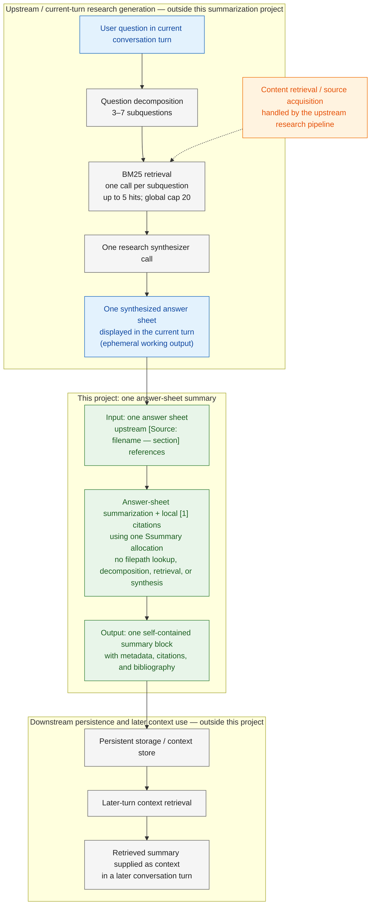

# Research Answer Sheet → Persistent Context Flow

## Boundary represented

The upstream research pipeline decomposes the main query into 3–7 subquestions,
retrieves and deduplicates source chunks, and uses one synthesizer call to
produce one answer sheet containing `[Source: filename — section]` references.
This project receives that answer sheet, assigns local numeric citation labels,
and returns one compact summary block. It does not receive or resolve
filepaths. The answer sheet remains available in the current conversation turn.
The summary block is the artifact sent to persistent storage for retrieval as
context in later conversation turns.

Source acquisition/content retrieval, persistent storage, and later context
retrieval are shown as connected systems but are not defined by this diagram's
summarization project.
