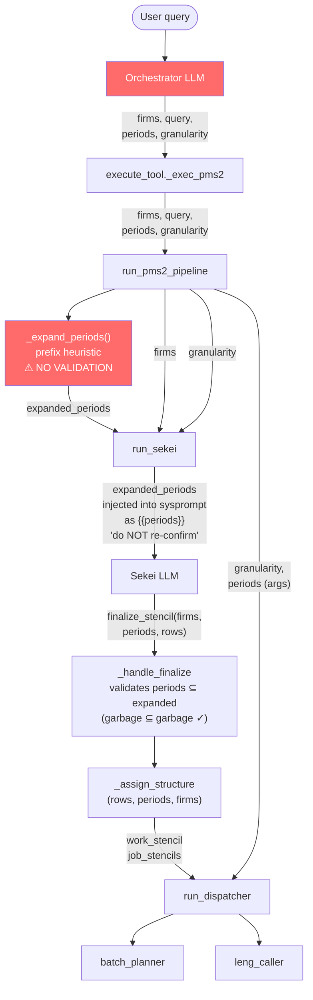
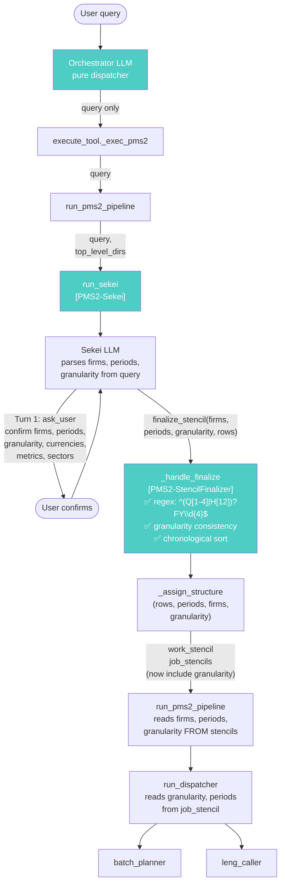
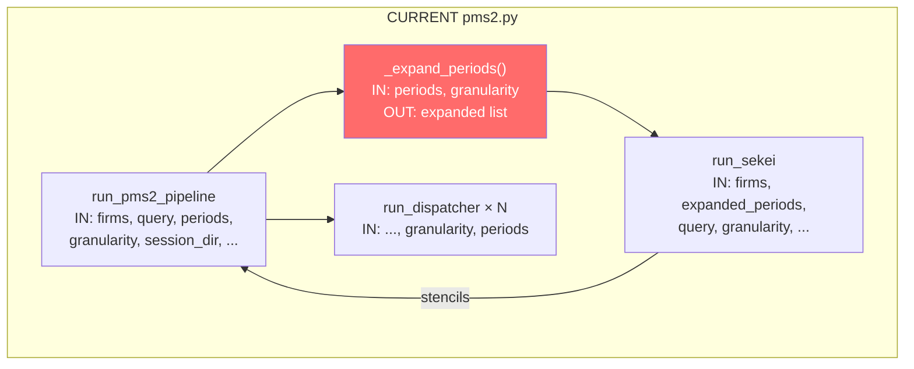
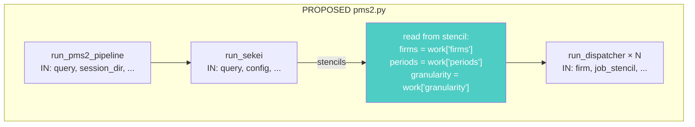
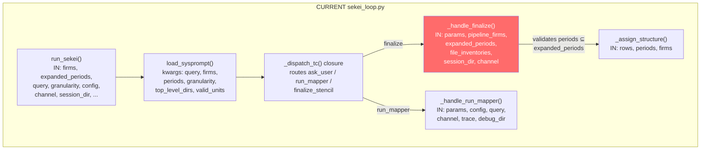
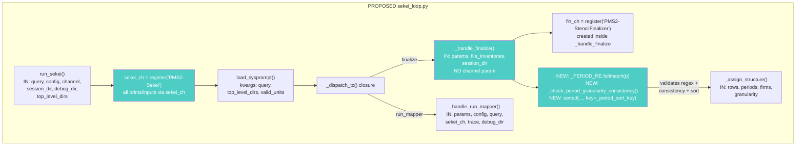
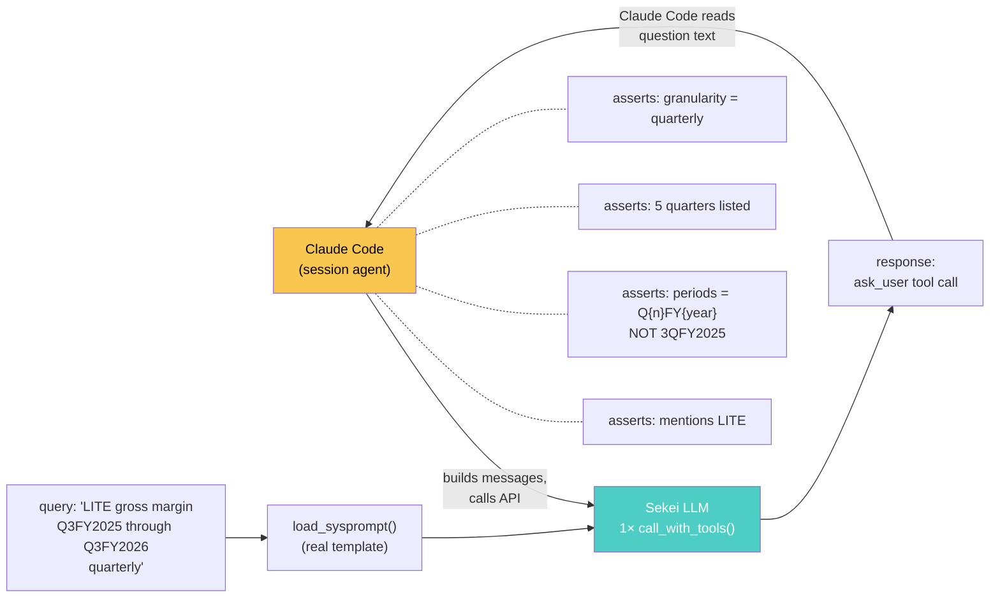
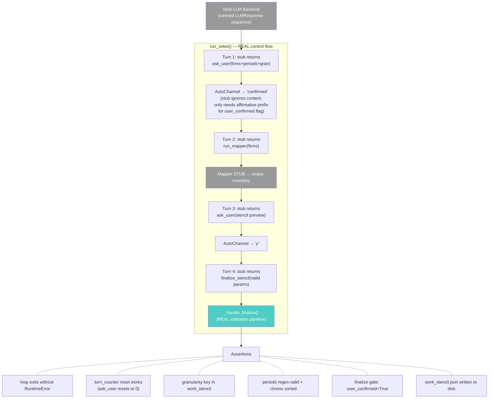
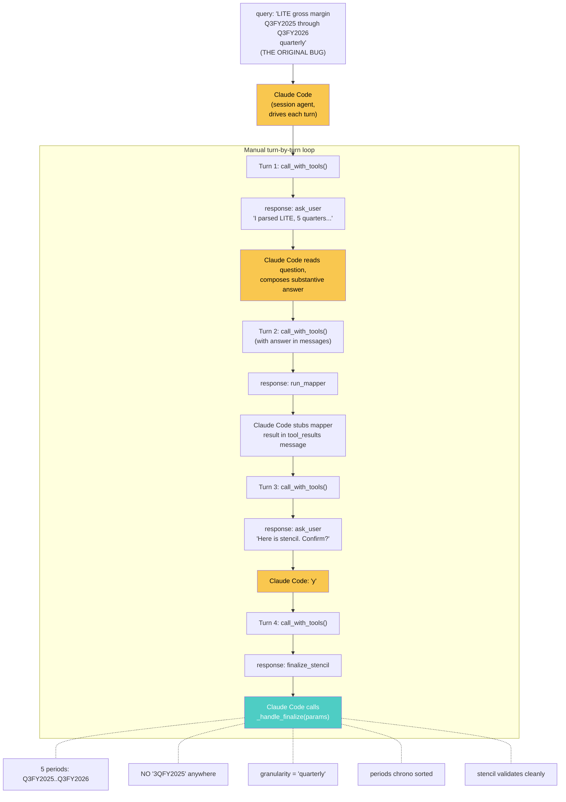

# Spec 19: Sekei Delegates — Period/Firm/Granularity to Sekei

## Frontmatter
- Write date: 20260728
- Update date: 20260728
- Codebase last changed date: 20260728
- Implemented: Y (S1-S4 complete, 20260728)
- Orchestrator LLM fails at period format parsing ("3QFY2025"
  vs "Q3FY2025"), causing 4x period explosion via
  `_expand_periods`. Fix: remove firms/periods/granularity
  from `run_pms2` tool schema entirely, let Sekei parse from
  raw query and validate via regex at `finalize_stencil`.
  Breaking change across 9 files + 3 test files.

## Problem space

### Problem definition

Orchestrator LLM parses firms, periods, and granularity from
user queries, passes as structured args to
`run_pms2(firms, query, periods, granularity)`. Three layers
between user intent and Sekei: orchestrator LLM (parses) →
`_expand_periods` (prefix heuristic) → Sekei (trusts blindly).
No validation at any layer.

### Failure instance

User: "Gross Margin for LITE, 3QFY2025 through 3QFY2026, quarterly"

Orchestrator confirmed correctly (5 quarters), user said "correct".
Orchestrator called `run_pms2(periods=["3QFY2025","4QFY2025",
"1QFY2026","2QFY2026","3QFY2026"], granularity="quarterly")`.

`_expand_periods` checks `p.startswith("Q1","Q2","Q3","Q4")`.
`"3QFY2025"` starts with `"3Q"` not `"Q3"` → guard misses →
falls to expansion branch → prepends Q1-Q4 to each:

```
"3QFY2025" → "Q13QFY2025", "Q23QFY2025", "Q33QFY2025", "Q43QFY2025"
5 inputs × 4 prefixes = 20 garbage period codes
```

Sekei receives 20 nonsense strings, prompt says "already
expanded by Python, do NOT re-confirm" → trusts blindly →
PMS2 confused, asks user about "sub-periods", pipeline stalls.

### Points of failure

1. **Tool schema** (`system_prompt.py:38-42`): periods
   description only shows annual examples
   (`['FY2025','FY2026']`). No quarterly format spec. LLM
   freestyles → `"3QFY2025"` instead of `"Q3FY2025"`.

2. **`_expand_periods`** (`pms2.py:85-113`): Prefix-based
   routing heuristic, not a validator. No regex. No rejection.
   No logging. Silent 4x blowup on format mismatch.

3. **`_exec_pms2`** (`execute_tool.py:247`): Zero validation
   between LLM output and pipeline input. Passes args verbatim.

4. **Sekei sysprompt**: "Periods: {{periods}} (already expanded
   by Python from granularity) — do NOT re-confirm." Trusts
   garbage.

---

## Outcome imagination

### Target UX

```
python src/psoas.py
> LITE primary seg rev (laser?) for fy24-26 + capex + gross margin
[ORCHESTRATOR] PMS2 query, fwding to sekei
[PMS2-Sekei] hi, u want this?
  Firms: LITE (Lumentum)
  Periods: FY2024, FY2025, FY2026
  Granularity: annual
  Currency: USD
  Metrics: Laser Revenue (retrieve), CAPEX (retrieve),
           Revenue (helper), Gross Profit (helper),
           Gross Margin (compute = GP/Rev)
  Sector folders: 0 Optical/
  Confirm? [y / edit]
> y
[PMS2-Sekei] running mapper...
[PMS2-Sekei] stencil preview:
  | # | Metric | Type | Formula | Role | Unit |
  ...
  Confirm? [y / edit]
> y
[PMS2-StencilFinalizer] Stencil finalized: 5 rows × 3 periods = 15 cells.
  3 ans metrics: Laser Revenue, CAPEX, Gross Margin.
  Topo sort OK. Formulas rewritten to Rn notation.
```

### Wat was desired

- Orchestrator should NOT touch periods, firms, or granularity
- Orchestrator is a dumb router: recognize PMS2 query, forward
  raw query string
- Sekei — the agent that already confirms the stencil with the
  user — should also decide/confirm firms, periods, granularity
- Period format enforced by deterministic Python regex at
  `finalize_stencil` time, not by LLM honor system
- Channel labels: `[PMS2-Sekei]` for sekei, `[PMS2-StencilFinalizer]`
  for finalize output

---

# Solution space

### Idea

Remove `firms`, `periods`, `granularity` from `run_pms2` tool
schema. Sekei parses all three from raw query, confirms with
user in Turn 1 `ask_user`, outputs canonical format strings
via `finalize_stencil`. Python regex validates at finalize.

### Type: breaking

- `run_pms2` tool schema loses 3 of 4 params
- `run_pms2_pipeline` signature changes (3 args removed)
- `run_sekei` signature changes (3 args removed)
- `run_dispatcher` signature changes (2 args removed)
- `_handle_finalize` signature changes (3 args removed: pipeline_firms, expanded_periods, channel)
- `_assign_structure` signature changes (1 arg added)
- `_expand_periods` deleted entirely
- Sekei sysprompt rewritten (template vars removed)
- Orchestrator sysprompt updated
- 10 test break points across 3 test files (see FM-2)

### Points of chg

**Graph (pipeline) design affected:**
- Orchestrator node: output contract shrinks (query only)
- `_expand_periods` node: deleted
- Sekei node: input contract shrinks (no pre-parsed
  firms/periods/granularity), output contract grows
  (stencils now carry granularity)
- `_handle_finalize` node: new validation responsibility
  (regex + consistency check, replaces subset check),
  channel param removed (creates own `fin_ch` internally)
- `_assign_structure` node: input grows (granularity param),
  output grows (granularity in stencils)
- Dispatcher node: input contract shrinks (reads from
  stencil, not args)

**Downstream nodes NOT affected (verified):**
- `leng_caller.py` — reads `job_stencil["periods"]`
- `merge_compute.py` — reads `work_stencil["periods"]`
- `batch_planner.py` — reads `job_stencil["periods"]` via
  cell descriptions
- `_resolve_fiscal_calendar` — receives periods/granularity
  from dispatcher's local vars (still works after dispatcher
  reads from stencil)

---

## Graph Change

### BEFORE (current pipeline)



**Input/output contracts (before):**
```
Orchestrator → run_pms2:
  IN:  firms: list[str], query: str, periods: list[str], granularity: str
  OUT: display_stencils (via opaque handles)

run_pms2_pipeline:
  IN:  firms, query, periods, granularity, session_dir, ...
  OUT: list[dict] (display stencils)

_expand_periods:
  IN:  periods: list[str], granularity: str
  OUT: list[str] (expanded, deduped)

run_sekei:
  IN:  firms, expanded_periods, query, granularity, config, ...
  OUT: (work_stencil, ans_stencil, job_stencils, file_inventories)

_handle_finalize:
  IN:  params, pipeline_firms, expanded_periods, file_inventories, session_dir, channel
  OUT: (data|None, status_string)

_assign_structure:
  IN:  sorted_rows, periods, firms
  OUT: (work_stencil, ans_stencil, job_stencils)
       work_stencil keys: firms, periods, col_letters, rows, values, sources
       job_stencil keys:  firm, periods, col_letters, rows, values, sources

run_dispatcher:
  IN:  firm, job_stencil, file_inventory, granularity, periods, channel, config, ...
  OUT: dict (filled job_stencil with status)
```

### AFTER (proposed)



**Input/output contracts (after):**
```
Orchestrator → run_pms2:
  IN:  query: str                          ← was 4 params, now 1
  OUT: display_stencils (via opaque handles)

run_pms2_pipeline:
  IN:  query, session_dir, ...             ← firms/periods/granularity REMOVED
  OUT: list[dict] (display stencils)
  INTERNAL: reads firms, periods, granularity from work_stencil after sekei

_expand_periods:
  DELETED

run_sekei:
  IN:  query, config, channel, session_dir, debug_dir, top_level_dirs  ← firms/periods/granularity REMOVED
  OUT: (work_stencil, ans_stencil, job_stencils, file_inventories)  ← unchanged

_handle_finalize:
  IN:  params, file_inventories, session_dir           ← pipeline_firms/expanded_periods/channel REMOVED
  OUT: (data|None, status_string)                      ← unchanged
  NEW: regex period validation, granularity validation, consistency check, chrono sort
  INTERNAL: creates fin_ch = register("PMS2-StencilFinalizer") for summary print

_assign_structure:
  IN:  sorted_rows, periods, firms, granularity: str = "annual"  ← granularity ADDED (default guards future callers)
  OUT: (work_stencil, ans_stencil, job_stencils)
       work_stencil keys: firms, periods, granularity, col_letters, rows, values, sources  ← +granularity
       job_stencil keys:  firm, periods, granularity, col_letters, rows, values, sources   ← +granularity

run_dispatcher:
  IN:  firm, job_stencil, file_inventory, channel, config, ...  ← granularity/periods REMOVED
  OUT: dict (filled job_stencil with status)                     ← unchanged
  INTERNAL: reads granularity = job_stencil["granularity"], periods = job_stencil["periods"]
```

### Canonical period formats (new validation contract)

Regex: `^(Q[1-4]|H[12])?FY\d{4}$`

| Granularity | Format | Examples |
|-------------|--------|----------|
| annual | `FY{year}` | `FY2024`, `FY2025` |
| quarterly | `Q{n}FY{year}` | `Q1FY2025`, `Q3FY2026` |
| half | `H{n}FY{year}` | `H1FY2025`, `H2FY2026` |

Consistency: all periods must match declared granularity.
`granularity="quarterly"` + `"FY2025"` → rejected with error
message telling LLM the expected format.

---

## Hence File-by-file Change

The graph change above defines every input/output contract
diff. Each file change below is a direct consequence. Complex
files get internal function graphs (current → proposed).

### 1. `src/harness/system_prompt.py`

**Contract**: `run_pms2` schema: 4 params → 1 param.

Remove `firms`, `periods`, `granularity` from properties and
required. Only `query` remains.

```python
# AFTER
"properties": {
    "query": {
        "type": "string",
        "description": (
            "Full user query including firms, metrics, "
            "and periods. e.g. 'LITE, Innolight gross margin, "
            "revenue FY2025-FY2027 quarterly'"
        ),
    },
},
"required": ["query"],
```

### 2. `sysprompts/orchestrator/deepseek_v4pro_orchestrator.md`

**Contract**: Orchestrator no longer pre-parses. Just forwards.

Delete "PMS2 extraction parameters" section (lines 75-101).
Replace with:

```markdown
## PMS2 extraction

run_pms2 takes only a query string. Pass the user's full
request — Sekei handles firm identification, period parsing,
granularity, metric decomposition, and user confirmation
internally. Do not pre-parse firms, periods, or granularity.

One call per request. If the user wants mixed granularity
("LITE quarterly, Innolight annual"), Sekei will clarify.
```

NOTE: The example at ~line 66 already uses single-arg format
(`run_pms2(query=...)`). No change needed there — only the
"PMS2 extraction parameters" section is affected.

### 3. `src/harness/execute_tool.py`

**Contract**: `_exec_pms2` reads only `query` from params.

```python
# AFTER
def _exec_pms2(params: dict) -> str:
    query = params["query"]
    channel = register("PMS2")
    display_stencils = run_pms2_pipeline(
        query=query, session_dir=_session_dir,
        channel=channel, config=_config, debug_dir=_debug_dir,
    )
    # rest unchanged — reads firm from stencil["firm"]
```

### 4. `src/scripts/PMS2/pms2.py`

**Internal function graph (current → proposed):**





`_expand_periods` deleted. `_Q_PREFIXES`/`_H_PREFIXES` deleted.

**Contract**: `run_pms2_pipeline(query, session_dir, ...)`.
Reads firms/periods/granularity from stencils after sekei.

- DELETE `_expand_periods`, `_Q_PREFIXES`, `_H_PREFIXES`
- Update module docstring (line 3 says "T0 scope:
  _expand_periods only" — stale after deletion)
- Remove `firms`, `periods`, `granularity` from signature
- Print `"PMS2 pipeline starting."` instead of counts
  (firms/periods unknown pre-sekei, cannot print them)
- After `run_sekei` returns: read `firms`, `periods`,
  `granularity` from `work_stencil`:
  ```python
  firms = work_stencil["firms"]
  periods = work_stencil["periods"]
  granularity = work_stencil["granularity"]
  ```
  These local vars replace the old function args for ALL
  downstream code: the Phase 1 print (line 210-212),
  `max_workers=len(firms)` (line 234), the firm fallback
  `firms[i]` (line 237), `run_dispatcher` calls, and the
  per-firm fill reporting loop.
- Remove `granularity`/`periods` from `run_dispatcher` call
- The `firms[i]` fallback in `firm = job.get("firm",
  firms[i] ...)` (line 237) still works because `firms` is
  now a local var read from `work_stencil["firms"]` — no
  change needed to that line

### 5. `src/scripts/PMS2/sekei_loop.py`

Largest change. Multiple sub-changes driven by the graph
contract changes.

**Internal function graph (current → proposed):**





**New module-level functions** (additive, step 1 of build):
```
_PERIOD_RE          — compiled regex constant
_period_sort_key()  — IN: str, OUT: (int, int)
_check_period_granularity_consistency()
                    — IN: list[str], str, OUT: str|None
```

**5a. `run_sekei` signature** — remove `firms`,
`expanded_periods`, `granularity`. At top of `run_sekei`,
register a local channel: `sekei_ch = register("PMS2-Sekei")`.
Replace ALL `channel.print(...)` and `channel.input(...)`
calls inside `run_sekei` with `sekei_ch.print(...)` /
`sekei_ch.input(...)`. This means:
- Line 231: `channel.print(response.text)` → `sekei_ch.print(...)`
- Line 263: `channel.input(...)` → `sekei_ch.input(...)`
- Line 293: `channel.input("Finalize stencil?")` → `sekei_ch.input(...)`
- Line 317-320: `_handle_run_mapper(..., channel, ...)` →
  `_handle_run_mapper(..., sekei_ch, ...)`
  (mapper status prints under [PMS2-Sekei])
- Line 218: `_router.start_spinner("PMS2")` →
  `_router.start_spinner("PMS2-Sekei")`
The `channel` param stays in signature (pipeline-level,
labeled "PMS2") but is NOT used inside `run_sekei` — kept
for potential future pipeline-level logging.
`_handle_finalize` no longer receives any channel param (5e).

**5b. `load_sysprompt` kwargs** — remove `firms`, `periods`,
`granularity`. Only pass `query`, `top_level_dirs`,
`valid_units`.

CRITICAL: `load_sysprompt` uses `str.replace()` for
`{{placeholder}}`, raises `ValueError` on unresolved vars.
Extra kwargs silently ignored. Danger = removing kwarg but
leaving `{{firms}}` in template. Update template (§8) AND
kwargs in lockstep.

**5c. `_handle_finalize` call** — remove `pipeline_firms`,
`expanded_periods`, `channel` args. New call:
`_handle_finalize(tc.input, file_inventories, session_dir)`
Also delete `pipeline_firms = firms` (line 205) — dead var.

**5d. `finalize_stencil` tool schema** — add `granularity`
field (`enum: [annual, quarterly, half]`). Add to `required`.

**5e. `_handle_finalize` new validation** — new signature
`(params, file_inventories, session_dir)`. Note: `channel`
param REMOVED entirely — the old signature used it for the
missing-firm warning (deleted in 5f) and the summary print
(now goes to `fin_ch`). No remaining uses = no param.

Extract `granularity` from params (new field per 5d):
```python
granularity = params.get("granularity")
if granularity not in ("annual", "quarterly", "half"):
    return None, f"Error: granularity '{granularity}' invalid..."
```

Change `submitted_periods` from `set()` to `list()` — old
code used set for subset check, new code needs list for
chrono sort. Dedup via `list(dict.fromkeys(...))`:
```python
submitted_periods = list(dict.fromkeys(params.get("periods", [])))
```

Replace old subset checks with:
- Regex period validation: `_PERIOD_RE.fullmatch(p)` for each
- Period-granularity consistency via
  `_check_period_granularity_consistency(submitted_periods, granularity)`
- Chronological sort: `periods = sorted(submitted_periods, key=_period_sort_key)`
- Channel: `fin_ch = register("PMS2-StencilFinalizer")`
  inside `_handle_finalize`. Use `fin_ch` for the summary
  print only. Errors still go via return string (no channel
  needed — LLM reads the tool result string).
- Pass `granularity` to `_assign_structure`:
  `_assign_structure(sorted_rows, periods, submitted_firms, granularity)`

**5f. Firm validation** — simplified to non-empty check.
Delete `extra_firms` check (no `pipeline_firms` to compare
against). Delete `missing_firms` warning (same reason — no
reference list). Per-row firm ∈ `submitted_firms` check
unchanged.

### 6. `src/scripts/PMS2/stencil_topo.py`

**Contract**: `_assign_structure` gains `granularity: str = "annual"` param (default
guards future callers that omit it). Stores in work_stencil and each job_stencil.

### 7. `src/scripts/PMS2/dispatcher.py`

**Contract**: `run_dispatcher` loses `granularity`, `periods`
args. Reads from `job_stencil["granularity"]` and
`job_stencil["periods"]` at top of function body.

### 8. `sysprompts/pms2_sekei/anthropic_opushighthink.md`

**Contract**: Sekei now parses firms/periods/granularity from
query. Template vars `{{firms}}`, `{{periods}}`,
`{{granularity}}` removed.

Delete "Your inputs (pre-structured, do NOT re-confirm)"
section. Replace with:

```markdown
## Your inputs

- **Query**: {{query}}

Parse from this query:
- **Firms**: identify company names/tickers. Cross-check
  against top-level directories (below) for exact matches.
  If a firm has no matching directory, flag to user.
- **Periods**: determine fiscal year range. Output canonical
  format strings ONLY:
  - Annual: `FY{year}` (e.g. `FY2025`)
  - Quarterly: `Q{n}FY{year}` (e.g. `Q3FY2025`)
  - Half-yearly: `H{n}FY{year}` (e.g. `H1FY2025`)
  - **NEVER** use `3QFY2025`, `3Q25`, `FY25`, or any other
    format. `Q3FY2025` is correct, `3QFY2025` is wrong.
  - Year is always 4 digits.
  - Quarter ordering within a fiscal year: Q1 → Q2 → Q3 → Q4.
    "Q3FY2025 through Q3FY2026" = Q3FY2025, Q4FY2025,
    Q1FY2026, Q2FY2026, Q3FY2026.
- **Granularity**: `annual`, `quarterly`, or `half`. Infer
  from context. Default annual unless user specifies otherwise.
  If mixed granularity requested, clarify — one per call.

## What YOU decide (with user confirmation)

1. **Firms** — parsed from query, confirmed with user
2. **Periods and granularity** — parsed from query, confirmed
3. **Reporting currency per firm** — propose from domain knowledge
4. **Metric decomposition** — which helper rows and formulas
5. **Sector folder inclusion** — which 0-prefixed folders
6. **The complete stencil** — all rows, all firms, all formulas
```

Update Turn 1 to bundle firms + periods + granularity
confirmation into the existing first ask_user call (alongside
sector folders, currencies, metric disambiguation).

Update finalize_stencil instructions to mention granularity
as required field.

Update "Critical constraints" section (line ~155):
- Change "Use the EXACT firm names and period strings from
  your inputs" → "Use the EXACT firm names from top-level
  directories. Use canonical period format strings only
  (see 'Periods' section above)."
- Remove "No reordering" (Python now sorts chronologically).

### 9. `src/scripts/PMS2/README.md`

Update to reflect `run_pms2(query)` single-arg interface.

---

## Failure modes

### FM-1: Template var mismatch → crash

`load_sysprompt` raises `ValueError` if `{{placeholder}}`
unresolved. Remove `{{firms}}`/`{{periods}}`/`{{granularity}}`
from template (§8) AND remove kwargs from `load_sysprompt()`
call (§5b) in lockstep. Forgetting either side:
- Template has `{{firms}}`, kwarg removed → `ValueError` on
  first sekei call (crash)
- Kwarg passed, template lacks `{{firms}}` → silently ignored
  (harmless but sloppy)

**Guard**: `TestLoadSyspromptSync` unit test (§Unit tests).

### FM-2: Test call sites → ImportError/TypeError (3 files, 10 break points)

| File | Line(s) | Breaks how |
|------|---------|-----------|
| `test_pms2_unit.py:24` | imports `_expand_periods` | `ImportError` |
| `test_pms2_unit.py:836,923,942,962,989,1010` | 6× `_handle_finalize(pipeline_firms=, expanded_periods=, channel=)` | `TypeError` |
| `test_pms2_m1_live.py:205` | `run_sekei(firms=, expanded_periods=, granularity=)` | `TypeError` |
| `test_pms2_m3b_live.py:137` | `run_pms2_pipeline(firms=, periods=, granularity=)` | `TypeError` |
| `test_pms2_m3b_live.py:370` | `run_dispatcher(granularity=, periods=)` | `TypeError` |

### FM-3: Sekei parses periods wrong → silent wrong data

LLM outputs `"FY24"` (2-digit), skips a quarter, uses
`"3QFY2025"`. Format errors caught by regex at finalize →
error message back to LLM → retry. Range errors (wrong
quarters) caught by user confirmation in Turn 1.

**New non-deterministic node**: Sekei now does period parsing.
Previously deterministic (orchestrator passed, Python
expanded). Now LLM-dependent. Mitigated by:
1. Regex validation (deterministic gate)
2. User confirmation (human gate)
3. Explicit format examples in sysprompt

### FM-4: Missing granularity key → KeyError

If `_assign_structure` forgets to store `granularity` →
`work_stencil["granularity"]` KeyError in `pms2.py` and
`dispatcher.py`.

**Guard**: `TestAssignStructureGranularity` unit test.

### FM-5: Period sort bug → wrong column order

`_period_sort_key` parses `"Q3FY2025"` → `(2025, 3)`. Bug in
parser → wrong column ordering in stencil. String sort would
put `Q1FY2026` before `Q4FY2025`.

**Guard**: `TestPeriodSortKey` unit test with cross-FY range.

### FM-6: Stale orchestrator sysprompt → LLM confusion

If orchestrator examples still show 4-arg `run_pms2` call,
LLM may pass extra args. `_exec_pms2` ignores them (only reads
`query`), so no crash — but wastes LLM reasoning on parsing
firms/periods that get thrown away.

**Guard**: Update examples (§2). Not testable mechanically.

### FM-7: Finalize periods diverge from confirmed periods

Old system: `_handle_finalize` checked `submitted ⊆
expanded_periods`. New system: regex + consistency only.
A misbehaving LLM could confirm "FY2025-FY2027 quarterly"
(15 periods) with user in Turn 1, then finalize with only
["Q1FY2025"] — regex passes, consistency passes, user never
sees the mismatch.

**Severity**: Low. LLM would need to actively contradict
its own prior turn. Anthropic models don't do this in
practice. If it happens, the output stencil would have
fewer periods than expected — visible to user in the
finalize summary print.

**No guard added** — cost/benefit ratio too low. The user
sees the finalize summary (5 rows x 1 period vs 5 rows x
15 periods) and would notice. If this proves to be an issue,
add a state variable tracking confirmed periods from Turn 1
ask_user response and cross-check at finalize.

### FM-8: LLM omits granularity in finalize → recoverable

Anthropic API rejects tool call missing required field → LLM
retries. Backup: explicit None check in `_handle_finalize`.

**Butterfly**: If LLM burns 2+ retries on missing granularity,
may exhaust `_MAX_TURNS` (8) before finalizing. Low risk —
Anthropic enforces required fields strictly.

---

## Unit tests

**File: `tests/test_spec19_unit.py`** — SEPARATE file. Do NOT
pollute `tests/test_pms2_unit.py` with new tests. All Spec 19
unit tests go in this dedicated file.

For each deterministic component, build unit test THEN run
before any LLM building.

### Cleanup in `tests/test_pms2_unit.py` (existing file)

These are modifications to the existing test file to remove
dead code and fix broken call sites. NOT new tests.

**Delete:**
- `TestExpandPeriods` class (6 tests) — function deleted
- `from src.scripts.PMS2.pms2 import _expand_periods` import

**Update** (signature changes) — all 6 `_handle_finalize`
call sites in `TestHandleFinalize` class. Remove
`pipeline_firms=`, `expanded_periods=`, AND `channel=` kwargs.
Add `"granularity": "annual"` to ALL `params` dicts. New call
pattern: `_handle_finalize(params, file_inventories={},
session_dir=tmp_path)`.

Surviving tests requiring signature update only:
- `test_happy_path_two_firm` (line 836)
- `test_circular_dep_error` (line 989)

Tests requiring rewrite or deletion:
- `test_extra_firm_rejected`: delete (no `pipeline_firms`)
- `test_missing_firm_warning`: delete (no reference list)
- `test_extra_period_rejected`: rewrite → regex rejection
- `test_period_reordering_canonical`: rewrite → chrono sort

### New tests (in `tests/test_spec19_unit.py`)

| ID | Test | Description | Built | Ran |
|----|------|-------------|-------|-----|
| U0 | `TestAssignStructureGranularity::test_granularity_stored_in_work_stencil` | `_assign_structure` with granularity="quarterly" → assert key exists + value matches | Y | Y |
| U1 | `TestAssignStructureGranularity::test_granularity_stored_in_each_job_stencil` | 2-firm stencil, granularity="annual" → both job_stencils have key | Y | Y |
| U2 | `TestPeriodValidation::test_valid_annual_periods` | `["FY2024","FY2025"]` pass `_PERIOD_RE` | Y | Y |
| U3 | `TestPeriodValidation::test_valid_quarterly_periods` | `["Q1FY2025","Q4FY2026"]` pass | Y | Y |
| U4 | `TestPeriodValidation::test_valid_half_periods` | `["H1FY2025","H2FY2025"]` pass | Y | Y |
| U5 | `TestPeriodValidation::test_reject_3Q_format` | `"3QFY2025"` fails (THE ORIGINAL BUG) | Y | Y |
| U6 | `TestPeriodValidation::test_reject_2digit_year` | `"FY25"` fails | Y | Y |
| U7 | `TestPeriodValidation::test_reject_Q5` | `"Q5FY2025"` fails | Y | Y |
| U8 | `TestPeriodValidation::test_reject_bare_year` | `"2025"` fails | Y | Y |
| U9 | `TestPeriodValidation::test_reject_no_FY` | `"Q32025"` fails | Y | Y |
| U10 | `TestPeriodGranularityConsistency::test_annual_with_Q_prefix_rejected` | granularity="annual", period="Q1FY2025" → error | Y | Y |
| U11 | `TestPeriodGranularityConsistency::test_quarterly_with_bare_FY_rejected` | granularity="quarterly", period="FY2025" → error | Y | Y |
| U12 | `TestPeriodGranularityConsistency::test_half_with_Q_prefix_rejected` | granularity="half", period="Q1FY2025" → error | Y | Y |
| U13 | `TestPeriodSortKey::test_annual_sort` | `["FY2026","FY2024","FY2025"]` → `["FY2024","FY2025","FY2026"]` | Y | Y |
| U14 | `TestPeriodSortKey::test_quarterly_sort_within_fy` | `["Q3FY2025","Q1FY2025","Q4FY2025","Q2FY2025"]` → `[Q1,Q2,Q3,Q4]FY2025` | Y | Y |
| U15 | `TestPeriodSortKey::test_quarterly_sort_cross_fy` | `[Q1FY26,Q4FY25,Q3FY25,Q2FY26,Q3FY26]` → `[Q3FY25,Q4FY25,Q1FY26,Q2FY26,Q3FY26]` | Y | Y |
| U16 | `TestPeriodSortKey::test_half_sort` | `[H2FY2025,H1FY2025,H1FY2026]` → `[H1FY2025,H2FY2025,H1FY2026]` | Y | Y |
| U17 | `TestLoadSyspromptSync::test_sekei_sysprompt_renders_without_error` | `load_sysprompt("pms2_sekei", ..., query="test", top_level_dirs="[]", valid_units="[]")` → no ValueError, no `{{` in result | Y | Y |

**Run new tests:** `python -m pytest tests/test_spec19_unit.py -x -v`
**Run existing tests (regression):** `python -m pytest tests/test_pms2_unit.py -x -v`

Both must pass before proceeding to LLM tests.

---

## LLM unit tests

**File: `tests/test_spec19_live.py`** — SEPARATE file. Do NOT
pollute existing `test_pms2_m1_live.py` or
`test_pms2_m3b_live.py` with new tests. All Spec 19 LLM
tests go in this dedicated file.

API keys already in `.env` (ANTHROPIC_API_KEY,
DEEPSEEK_API_KEY). All tests are agent-runnable.

**~~WARNING: Do NOT blindly re-run existing E2E tests.~~**
✅ DONE (S2/S3): `test_pms2_m1_live.py` and `test_pms2_m3b_live.py`
call sites updated. Both files use new signatures. Warning no longer applies.

### Cleanup in existing live tests

✅ ALL DONE (S2/S3):

- `test_pms2_m1_live.py:205`: `run_sekei` call — ✅ removed `firms=`,
  `expanded_periods=`, `granularity=`. ANSWERS updated. `tr.register`
  monkeypatched (S3 discretion decision 1).
- `test_pms2_m3b_live.py:137`: `run_pms2_pipeline` call — ✅ removed
  `firms=`, `periods=`, `granularity=`.
- `test_pms2_m3b_live.py:370`: `run_dispatcher` call — ✅ removed
  `granularity=`, `periods=`. Added both keys to job_stencil fixture.

### ask_user loop danger (context for all tests)

`ask_user` resets `turn_counter = 0` in `run_sekei`. If
the answer doesn't satisfy the LLM, it re-asks →
turn_counter resets → infinite loop burning credits.
S3 burned ~$200 this way with "y" spam.

**Root cause of y-spam failure**: Sekei Turn 1 `ask_user`
bundles 5-6 sub-questions (firms, periods, granularity,
sectors, currencies, metric decomposition). LLM gets back
`"User answered: y"` → doesn't know WHICH firms the user
confirmed, WHICH period format was accepted, WHICH currency
→ re-asks to clarify → `ask_user` fires again → resets
`turn_counter = 0` → loop never advances.

**Why canned answers are fragile**: even a "substantive"
canned answer breaks when the LLM rephrases its question
or splits sub-questions across multiple `ask_user` calls.
The canned answer addresses sub-questions the LLM didn't
ask this time, misses sub-questions it did ask.

**L0/L2 solution: Claude Code drives interactively.**
No AutoChannel for L0/L2. Claude Code (the session agent)
executes the test turn-by-turn:
- Calls `call_with_tools()` manually each turn
- Reads the `ask_user` question text
- Composes a contextually appropriate answer
- Feeds it back as the next message
- Inspects `finalize_stencil` params at the end

This eliminates canned-answer brittleness. Infinite loop
impossible — Claude Code controls the loop and stops
after reasonable turn count.

**L1 uses AutoChannel** — but L1 has a stub backend, so
the LLM never reasons about the answer content. The stub
just pops the next canned response regardless. AutoChannel
answers only need to start with an affirmative prefix
(`y`/`yes`/`ok`/`confirm`/`lgtm`) so `user_confirmed`
flag sets correctly (see `sekei_loop.py:327`).

**Sekei `input()` call sites**:

| Site | When | Who answers |
|------|------|-------------|
| `sekei_loop.py:322` Turn 1 | Firms/periods/gran/sectors/currencies/metrics | L0: N/A (no loop). L2: Claude Code reads + answers. L1: AutoChannel "confirmed" |
| `sekei_loop.py:322` Turn 3 | Stencil preview confirm | L0: N/A. L2: Claude Code says "y". L1: AutoChannel "y" |
| `sekei_loop.py:350` finalize hard gate | `user_confirmed=False` | L0: N/A. L2: Claude Code says "y". L1: AutoChannel "y" |

**Other `input()` surfaces NOT hit** (no dispatcher):
- `batch_planner.py`: `ask_user` tool in BP loop
- `dispatcher.py:_resolve_fiscal_calendar`: fallback

### New tests

**Design principle**: do NOT run full E2E pipeline for
single-node validation. Each test isolates one boundary.
No test touches dispatcher/leng/batch_planner.

| ID | Test | Runner | Cost | Built | Ran |
|----|------|--------|------|-------|-----|
| L0 | Sekei Turn 1 parse | Claude Code interactive (1 API call) | ~$0.10 | Y | Y |
| L1 | Sekei loop mechanics | `test_spec19_live.py` (stub backend) | $0.00 | Y | Y |
| L2 | Original bug scenario | Claude Code interactive (3-5 turns) | ~$0.50 | Y | Y |

#### L0: Sekei Turn 1 parse (Claude Code, 1 LLM call)



**What it tests**: Sekei LLM parses firms, periods,
granularity from raw query correctly on first turn.
The spec-19-specific concern: does the LLM output
`Q3FY2025` (correct) or `3QFY2025` (the original bug)?

**What it does NOT test**: loop control flow, finalize
validation, stencil structure, mapper.

**Procedure** (Claude Code executes via Bash/Python):
1. Load sysprompt: `load_sysprompt("pms2_sekei", ...)`
2. Create backend: `get_pms2_sekei_llm(config)`
3. ONE `call_with_tools(messages=[{"role":"user",
   "content":"Begin."}], system_prompt=..., tools=SEKEI_TOOLS)`
4. Claude Code reads `response.tool_calls[0]`:
   - Verify `.name == "ask_user"`
   - Read `.input["question"]` — the full question text
   - Scan for period strings, check format
   - Report pass/fail

**No AutoChannel. No loop. No `input()`.** Just one API
call, Claude Code inspects the response directly.

#### L1: Sekei loop mechanics (`test_spec19_live.py`, $0)



**What it tests**: sekei loop control flow. Turn counting,
ask_user reset, finalize hard gate, same-turn guards,
`_handle_finalize` validation pipeline (regex, consistency,
chrono sort, `_assign_structure` granularity propagation).
Everything deterministic.

**What it does NOT test**: LLM behavior. Stub returns
exactly what we tell it to return.

**File: `tests/test_spec19_live.py`** (misnomer — no LLM,
$0 cost, but lives with the other spec19 tests).

**Mechanics**:
1. `StubSekeiBackend`: implements `call_with_tools()` by
   popping from a canned `LLMResponse` list. Each response
   has hand-built `tool_calls` + `stop_reason="tool_use"`.
2. Monkeypatch `get_pms2_sekei_llm` → stub.
3. Monkeypatch `terminal_router.register` → AutoChannel.
   AutoChannel answers: `["confirmed", "y", "y", "y"]`.
   Content doesn't matter — stub doesn't read it. Only
   the affirmative prefix matters for `user_confirmed`.
4. Monkeypatch `_handle_run_mapper` → return `{}`.
5. Call `run_sekei(query=..., config=..., ...)`.
6. Assert stencil structure.

**Canned finalize_stencil params** (valid, passes all
validation):
```python
{
    "firms": ["TestFirm"],
    "periods": ["FY2024", "FY2025"],
    "granularity": "annual",
    "rows": [
        {"metric": "Revenue", "firm": "TestFirm",
         "type": "retrieve", "timeframe": "annual",
         "unit": "USD", "ans": True},
    ],
}
```

#### L2: Original bug scenario (Claude Code, mapper stubbed)



**What it tests**: the EXACT failure scenario from the
spec's "Failure instance" section. Real LLM parses the
ambiguous query ("Q3FY2025 through Q3FY2026 quarterly"),
Sekei proposes firms/periods/granularity, Claude Code
confirms, Sekei designs stencil, finalizes.

**What it does NOT test**: downstream pipeline (dispatcher,
leng, batch planner).

**Why Claude Code drives instead of AutoChannel**:

1. **No canned-answer brittleness.** Claude Code reads the
   actual `ask_user` question and responds to what's asked.
   If Sekei splits Turn 1 into two calls, Claude Code
   handles both. If Sekei rephrases, Claude Code adapts.
2. **Infinite loop impossible.** Claude Code controls the
   while loop — it decides how many turns to run and stops
   if something looks wrong. No `turn_counter` reset trap.
3. **Mapper stub is trivial.** When `run_mapper` tool call
   appears, Claude Code builds the tool_results message
   with an empty inventory string — never calls the real
   mapper or its LLM.
4. **Finalize inspection inline.** When `finalize_stencil`
   appears, Claude Code reads the params dict directly and
   can assert on periods/granularity BEFORE calling
   `_handle_finalize`. If the LLM output is garbage,
   Claude Code sees it immediately.

**Procedure** (Claude Code executes via Python snippets):
1. Load sysprompt, create backend, init messages
2. Turn loop (max 6 iterations, hard stop):
   ```
   response = backend.call_with_tools(messages, ...)
   for tc in response.tool_calls:
     if tc.name == "ask_user":
       → Claude Code reads tc.input["question"]
       → composes answer (substantive for Turn 1,
         "y" for stencil preview)
       → appends to tool_results
     if tc.name == "run_mapper":
       → tool_result = "Mapper complete: LITE: 0 files"
     if tc.name == "finalize_stencil":
       → inspect tc.input for periods/granularity
       → call _handle_finalize(tc.input, {}, tmp_dir)
       → break
   append assistant + tool_results messages
   ```
3. Assert on finalize output

**Run:** Claude Code executes L0/L2 in-session when ready.
**Run L1:** `python -m pytest tests/test_spec19_live.py -x -v`
**Regression:** `python -m pytest tests/test_pms2_unit.py -x -v`

**Costs:** L0 ~$0.10. L1 $0.00. L2 ~$0.50.
Total worst case: ~$0.60 vs old design ~$3.00.

---

## Build order

Strict sequence. Each step gates on tests passing.

1. **New pure functions + their tests** — write the NEW
   deterministic functions that don't exist yet, ALL in
   `src/scripts/PMS2/sekei_loop.py` (co-located with
   `_handle_finalize` which calls them):
   - `_PERIOD_RE = re.compile(r"^(Q[1-4]|H[12])?FY\d{4}$")`
     module-level constant
   - `_period_sort_key(period: str) -> tuple[int, int]` —
     parses `"Q3FY2025"` → `(2025, 3)`, `"FY2025"` → `(2025, 0)`,
     `"H2FY2025"` → `(2025, 2)`
   - `_check_period_granularity_consistency(periods: list[str],
     granularity: str) -> str | None` — returns error message
     if any period's prefix doesn't match declared granularity,
     None if all ok
   Write `TestPeriodValidation`, `TestPeriodSortKey`,
   `TestPeriodGranularityConsistency`. These are additive —
   no existing code changes, no existing tests break.
   Write tests in `tests/test_spec19_unit.py` (separate file).
   Import in tests:
   `from src.scripts.PMS2.sekei_loop import _PERIOD_RE,
   _period_sort_key, _check_period_granularity_consistency`
   → `pytest tests/test_spec19_unit.py -x -v -k "Period"`

2. **All signature changes + test call site updates in
   lockstep** — do ALL of these together (not §4 then §5):
   - §1: `system_prompt.py` tool schema (4→1 params)
   - §3: `execute_tool.py` `_exec_pms2` (read only `query`)
   - §4: `pms2.py` delete `_expand_periods`/`_Q_PREFIXES`/
     `_H_PREFIXES`, remove args from `run_pms2_pipeline`,
     read firms/periods/granularity from stencil after sekei,
     remove args from `run_dispatcher` call
   - §5a-d: `sekei_loop.py` `run_sekei` signature, sysprompt
     kwargs, `_handle_finalize` call, finalize schema
   - §5e: `_handle_finalize` new signature + new validation
     (regex, consistency, chrono sort, pass granularity to
     `_assign_structure`)
   - §5f: firm validation simplification
   - §6: `stencil_topo.py` `_assign_structure` gains
     granularity
   - §7: `dispatcher.py` `run_dispatcher` reads from stencil
   - §8: sekei sysprompt template: remove `{{firms}}`,
     `{{periods}}`, `{{granularity}}`. Add new "Your inputs"
     section. MUST be done in same step as §5b kwargs removal
     — see FM-1 (template var mismatch = crash).
   - Existing tests (`test_pms2_unit.py`): delete
     `TestExpandPeriods` class AND its import line. Update
     all 6 `_handle_finalize` call sites (remove
     `pipeline_firms=`, `expanded_periods=`, `channel=`, add
     `granularity` to params).
   - New tests in `tests/test_spec19_unit.py`: add
     `TestAssignStructureGranularity`,
     `TestLoadSyspromptSync`.
   → `pytest tests/test_spec19_unit.py -x -v`
   → `pytest tests/test_pms2_unit.py -x -v` (regression)

3. **Remaining sysprompts** (§2,9) — orchestrator sysprompt
   and README. Not gated by tests (no template var mismatch
   risk). → `pytest -x -v` (regression only)
4. **L1** → `python -m pytest tests/test_spec19_live.py -x -v`
   (stub backend, $0). Then fix existing live test call
   sites and run as regression.
5. **L0, L2** → Claude Code interactive in-session.
   L0: single API call, inspect response. L2: turn-by-turn
   sekei loop with mapper stubbed.

---

## Execution

**Spec size**: ~900 lines, 9 file changes, 18 unit tests,
3 LLM tests. This is too large for a single session to do
thoroughly without context pressure.

**Session plan**:

| Session | Scope | Gate | Status |
|---------|-------|------|--------|
| S1 | Build step 1: new pure functions (`_PERIOD_RE`, `_period_sort_key`, `_check_period_granularity_consistency`) + U2-U16 | `pytest -x -v -k "Period"` all pass | ✅ DONE (20260728) — see `Specs/19_S1Discretion.md` |
| S2 | Build step 2: all signature changes + test updates (§1-§8) + U0,U1,U17 + delete/rewrite existing tests | `pytest tests/test_pms2_unit.py -x -v` all pass | ✅ DONE (20260728) — see `Specs/19_S2Discretion.md` |
| S3 | Build step 3: orchestrator sysprompt + README. Then L0,L1 live tests | L0,L1 pass | ✅ DONE (20260728) — sysprompts+README done, L1 built (`tests/test_spec19_live.py`, 3 tests, $0), L0 run interactively (PASS: 5 quarters Q3FY2025-Q3FY2026, correct format) — see `Specs/19_S3Discretion.md` |
| S4 | L2 smoke test (interactive) | Original bug scenario clean | ✅ DONE (20260728) — all 6 assertions pass, 4 turns, ~$0.50 — see `Specs/19_S4Discretion.md` |

**Between sessions**: update this spec. Mark test IDs as
Built Y / Ran Y. If any design decision diverges during
implementation (e.g. function signature adjusted, new edge
case discovered), update the relevant graph + contracts in
this spec BEFORE spawning the next session. Fresh agents
read this spec as ground truth — stale contracts = wasted
tokens re-checking decisions already made.

**Per-session discretion logs**:

Each session creates a discretion file to log design
decisions made during execution:

- `Specs/19_S1Discretion.md` — session 1 (pure functions)
- `Specs/19_S2Discretion.md` — session 2 (signature wiring)
- `Specs/19_S3Discretion.md` — session 3 (sysprompts + L0/L1)
- `Specs/19_S4Discretion.md` — session 4 (smoke test)

**Session execution instruction** (paste into each session):

```
Read Specs/19_SekeiDelegate.md thoroughly.
Oneshot slowly you monkey. At any point of design/execution
ambiguity, think in cycles (Forensics, hypothesize, verify,
doubt, failure mode, hypothesize, repeat) to solve
responsibly, then note in Specs/19_S{N}Discretion.md.
Only log "what I discretionarily decided about the design,"
not "how I did it." Understand?
```
