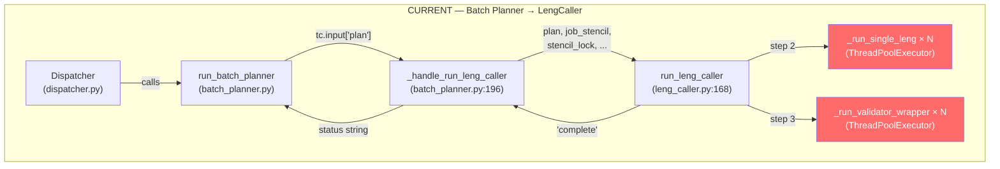
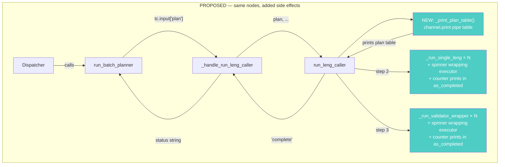

# Spec 20a: Phase 1 Terminal Visibility

## Frontmatter
- Write date: 20260728
- Update date:
- Codebase last changed date: 20260728
- Implemented Y/N: N
- During PMS2 Phase 1, user sees a dead terminal for minutes
  while hundreds of Leng/Validator calls run in parallel. Batch
  Planner reasoning is invisible. No spinners during Leng or
  Validator fan-out. Fix: spinners for every wait, channel.print
  the BP plan table, Leng/Validator completion counters.

## Problem space

### Problem definition

Phase 1 of PMS2 has three high-latency stages where the user
stares at a dead terminal with no spinner and no output:

1. **Leng fan-out — no spinner, no progress.** After BP
   returns its plan, `leng_caller.py` prints `"{N} chunks
   across {M} files. Firing Lengs..."` then runs 100-600
   parallel `structured_complete` calls inside a
   `ThreadPoolExecutor` (`leng_caller.py:276-293`). No spinner
   wraps this executor. No progress prints inside the
   `as_completed()` loop. User sees nothing for 30-120 seconds
   until the fan-out completes and the hit count prints.

2. **Validator fan-out — no spinner, no progress.** Same
   pattern. After Leng hits are collected, Validators fire in
   parallel (`leng_caller.py:344-371`). No spinner. No progress.
   Silence for 10-30 seconds until `"done: {N} cells found,
   {M} rejected."` prints.

3. **Batch Planner — has spinner, but plan is invisible.** BP
   already has a spinner (`PMS2-disp-{firm} thinking...`) via
   `batch_planner.py` calling `_router.start_spinner()` around
   each LLM turn. But its output — the structured plan
   (`[{file, cells}, ...]`) — is never printed. User has no
   idea which files were selected or which cells are being
   searched. The data is available as `tc.input["plan"]` but
   goes straight to `leng_caller` without display.

**Spinner infrastructure constraint:** `terminal_router.py`
has a single global `rich.Status` spinner. `start_spinner()`
kills the previous spinner. With 2 firms running in parallel,
spinners from LITE and Innolight compete — last `start_spinner`
wins. This is already the case for BP spinners (pre-existing).
Adding Leng/Validator spinners doesn't make this worse — the
same race applies. Acceptable because:
- Channel labels on the spinner text show which firm is active
- Spinner is visual reassurance ("something is running"), not
  precise state. Even if LITE's spinner overwrites Innolight's,
  the user sees motion instead of a dead terminal.
- The completion counter prints (via `channel.print`) are
  label-tagged and unambiguous regardless of spinner state.

**What currently has spinners vs not:**

| Stage | Spinner? | Where |
|-------|----------|-------|
| Sekei LLM turns | Yes | `sekei_loop.py:218` |
| Mapper LLM turns | Yes | `mapper.py` |
| FiscalCalResolver | Yes | `dispatcher.py:160` |
| Batch Planner LLM turns | Yes | `batch_planner.py` |
| Leng fan-out (100-600 calls) | **NO** | `leng_caller.py:276-293` |
| Validator fan-out (10-80 calls) | **NO** | `leng_caller.py:344-371` |

Together, a typical 2-firm extraction shows:

```
[PMS2-disp-LITE] iter 0: 18 null ans, 12 active
  (spinner: PMS2-disp-LITE thinking... — 5-30s)
  (spinner stops)
[PMS2-leng-LITE] 327 chunks across 20 files. Firing Lengs...
  (NO SPINNER — 30-120s dead terminal)
[PMS2-leng-LITE] 83 hits from 327 Leng calls. Spawning Validators...
  (NO SPINNER — 10-30s dead terminal)
[PMS2-leng-LITE] done: 12 cells found, 4 rejected.
```

### Failure instance

Demo 1 (2026-07-25): 2-firm annual extraction (LITE +
Innolight). Both dispatchers run in parallel.

- LITE: 327 Leng calls, 83 hits, 81 Validator calls. ~2 min
  of dead terminal during Leng fan-out. ~40s dead terminal
  during Validators. No spinner either time.
- Innolight: 289 Leng calls, 49 hits, 49 Validator calls.
  Similar dead windows.

User saw the dispatchers running interleaved (both firms'
channels print to the same terminal), but within each firm's
extraction, minutes of dead air with no spinner. No way to
know if the system was stuck or progressing. No way to know
that BP chose to search `Mizuho_report.md` for MktCap — which
is the file that caused Root Cause A (temporal mismatch) in
PMS2_FailureModes.md. If the BP plan had been visible, user
could have caught the questionable routing before 327 Leng
calls burned tokens.

### Points of failure

1. **`leng_caller.py:276-293`** — Leng `ThreadPoolExecutor`
   block. No `_router.start_spinner()` before the executor. No
   `_router.stop_spinner()` after. The `as_completed()` loop
   (line 286-293) only aggregates results — no
   `channel.print`, no spinner update.

2. **`leng_caller.py:344-371`** — Validator `ThreadPoolExecutor`
   block. Same: no spinner, no progress prints in the
   `as_completed()` loop (line 361-371).

3. **`batch_planner.py`** — `run_leng_caller` tool call
   handler dispatches to `leng_caller.run_leng_caller()`. The
   `plan` list is available as `tc.input["plan"]` but never
   printed. No `channel.print` of the plan between BP returning
   and Leng fan-out starting.

4. **`terminal_router.py`** — single global spinner means only
   one can be active. Not a new problem — already affects BP.
   Spinners for Leng/Validator don't need new infra, just
   `_router.start_spinner()` / `stop_spinner()` calls wrapping
   the executor blocks. Counters don't need new infra either —
   just `channel.print` inside `as_completed()` every N
   completions.

## Outcome imagination

### Target UX

```
[PMS2-disp-LITE] iter 0: 18 null ans, 12 active
  (spinner: PMS2-disp-LITE thinking... — 5-30s)

[PMS2-disp-LITE] Batch plan:
  | Metric       | Periods       | Files                                          |
  |--------------|---------------|------------------------------------------------|
  | Revenue      | FY2025 FY2026 | Q3-FY26-Results.md, Mizuho_LITE.md             |
  | Gross Profit | FY2025 FY2026 | Q3-FY26-Results.md                             |
  | MktCap       | FY2025 FY2026 | Mizuho_LITE.md, Jefferies_OFC.md               |
  | Net Debt     | FY2025 FY2026 | Q3-FY26-Results.md, Jefferies_OFC.md           |
  | EPS          | FY2025 FY2026 | Jefferies_OFC.md, Rosenblatt_Components.md     |
  | Share Price  | FY2025 FY2026 | Mizuho_LITE.md, 0 Optical/OFC_Recap.md         |

  (spinner: PMS2-leng-LITE thinking...)
[PMS2-leng-LITE] 327 chunks across 6 files. Firing Lengs...
[PMS2-leng-LITE] 50/327 Lengs done (3 hits)
[PMS2-leng-LITE] 100/327 Lengs done (12 hits)
[PMS2-leng-LITE] 200/327 Lengs done (47 hits)
[PMS2-leng-LITE] 327/327 Lengs done (83 hits)
  (spinner stops)

  (spinner: PMS2-val-LITE thinking...)
[PMS2-leng-LITE] Spawning Validators...
[PMS2-val-LITE] 20/83 Validators done (8 written, 3 rejected)
[PMS2-val-LITE] 50/83 Validators done (10 written, 6 rejected)
[PMS2-val-LITE] 83/83 Validators done
  (spinner stops)

[PMS2-leng-LITE] done: 12 cells written, 4 rejected.
```

**Plan table construction:** BP plan is file-centric
(`[{file, cells}, ...]`). Invert to metric-centric before
printing:
1. For each plan entry, resolve cell IDs (e.g. `A1`, `B1`)
   to `(metric, period)` via `job_stencil["rows"]` + column
   letter → period mapping from `job_stencil["col_letters"]`
   and `job_stencil["periods"]`.
2. Group: `{metric → {periods: set, files: list}}`.
3. Print as pipe table via `channel.print` (terminal_router
   already renders pipe tables as `rich.Table`).

### Wat was desired by user

- **Spinners everywhere there's a wait** — Leng fan-out gets
  a spinner (`PMS2-leng-{firm} thinking...`), Validator
  fan-out gets a spinner (`PMS2-val-{firm} thinking...`).
  BP already has a spinner (keep it). Spinner message is
  hardcoded as `"thinking..."` by `start_spinner` in
  `terminal_router.py` — not configurable without changing
  that API. Zero terminal_router changes in this spec.
- See the batch planner's extraction plan as a metric-centric
  table (metric × periods × files) before Lengs fire
- See Leng completion count tick up during fan-out (every N
  completions, not every single one — avoid flooding)
- See Validator completion count + write/reject running tally
- All via `channel.print` + existing `start_spinner` /
  `stop_spinner` — no `rich.Progress`, no `rich.Live`, no
  terminal_router refactor

# Solution space

## Idea

Add spinners + completion counters + plan table print to
`leng_caller.py`. One file changes. No new nodes, no contract
changes, no LLM behavior changes. Pure side-effect prints
using existing `_router.start_spinner`/`stop_spinner` and
`channel.print`.

Type: **patch** — additive prints, no breaking changes.

Points of chg:
- `leng_caller.py`: 3 additions (spinner, counters, plan table)
- No graph design affected (no node existential chg)
- No downstream nodes affected (no input/output contract chg)

---

## Graph Change

### Affected nodes only (+1 neighbor)



**Current I/O contracts (affected nodes only):**
```
_handle_run_leng_caller:
  IN:  params (plan), searched_files, job_stencil, stencil_lock,
       fiscal_calendar, docstore, file_path_index, config,
       channel, firm, debug_dir
  OUT: (result: str|None, status: str)
  SIDE EFFECTS: none between BP return and Leng start

run_leng_caller:
  IN:  plan, job_stencil, stencil_lock, searched_files,
       fiscal_calendar, docstore, file_path_index, config,
       channel, firm, debug_dir
  OUT: "complete"
  SIDE EFFECTS:
    - leng_ch.print("{N} chunks...Firing Lengs...")   [before Leng executor]
    - (NOTHING during Leng executor)                  ← GAP
    - leng_ch.print("{N} hits...Spawning Validators") [after Leng, before Val]
    - (NOTHING during Validator executor)             ← GAP
    - leng_ch.print("done: {N} found, {M} rejected") [after Val]
```

### PROPOSED



**Proposed I/O contracts (changes only):**
```
run_leng_caller:
  IN:  unchanged
  OUT: unchanged ("complete")
  SIDE EFFECTS (NEW):
    + _print_plan_table(plan, job_stencil, channel)   [before "Firing Lengs..."]
    + _router.start_spinner(f"PMS2-leng-{firm}")      [before Leng executor]
    + leng_ch.print(f"{done}/{total} Lengs done...")   [every _COUNTER_INTERVAL in as_completed]
    + _router.stop_spinner()                           [after Leng executor]
    + _router.start_spinner(f"PMS2-val-{firm}")        [before Validator executor]
    + val_ch.print(f"{done}/{total} Validators done...") [every _COUNTER_INTERVAL in as_completed]
    + _router.stop_spinner()                           [after Validator executor]

_print_plan_table (NEW helper):
  IN:  plan: list[dict], job_stencil: dict, channel: ToolChannel
  OUT: None (side effect only — channel.print of pipe table)
  Resolves cell IDs → (metric, period) via job_stencil.
  Groups by metric. Prints metric | periods | files table.
```

No contract changes on any existing function. All additions
are side-effect prints. `_print_plan_table` is a new private
helper, not exported, not called by anything outside
`run_leng_caller`.

---

## Hence File by file Change

### 1. `src/scripts/PMS2/leng_caller.py`

Only file that changes. Three additions:

**1a. Modify existing imports + add constant (module level)**

**DO NOT add a new import line. Modify the existing
`terminal_router` import line** (currently line 14):

```python
# BEFORE (line 14 in current file):
from src.harness.terminal_router import ToolChannel, register

# AFTER — add _router to the same line:
from src.harness.terminal_router import ToolChannel, register, _router
```

`_router` import is needed for `start_spinner`/`stop_spinner`.
`batch_planner.py:13` already imports `_router` the same way —
established pattern.

Also add the `_period_sort_key` import. Add it after the existing
`src.scripts.PMS2` imports (currently ending with
`from src.scripts.PMS2.validator_loop import run_validator`):

```python
from src.scripts.PMS2.sekei_loop import _period_sort_key
```

Then add the constant after the existing `_LENG_MALFORMED_RETRIES`
constant (currently line 51):

```python
_COUNTER_INTERVAL = 25  # print progress every N completions
```

Configurable throttle. 25 means for 327 Lengs: prints at
25, 50, 75, ..., 325, 327. 14 prints. For 83 Validators:
prints at 25, 50, 75, 83. 4 prints. Not flooding.

**1b. `_print_plan_table` — new private function**

Place after `_build_fiscal_calendar_text` (line ~92), before
`_run_single_leng` (line ~95).

```python
def _print_plan_table(
    plan: list[dict],
    job_stencil: dict,
    channel: ToolChannel,
) -> None:
    """Print metric-centric plan table via channel.print."""
    col_letters = job_stencil["col_letters"]
    periods = job_stencil["periods"]
    rows = job_stencil["rows"]

    # Invert: cell_id → (metric, period), then group by metric
    metric_info: dict[str, dict] = {}  # {metric: {periods: set, files: set}}

    for entry in plan:
        fp = entry["file"]
        for cell_id in entry["cells"]:
            row_num = cell_id.lstrip("ABCDEFGHIJKLMNOPQRSTUVWXYZ")
            col = cell_id[: len(cell_id) - len(row_num)]
            row = rows.get(row_num, {})
            metric = row.get("metric", "?")
            col_idx = col_letters.index(col) if col in col_letters else -1
            period = periods[col_idx] if 0 <= col_idx < len(periods) else "?"

            if metric not in metric_info:
                metric_info[metric] = {"periods": set(), "files": []}
            metric_info[metric]["periods"].add(period)
            if fp not in metric_info[metric]["files"]:
                metric_info[metric]["files"].append(fp)

    # Build pipe table
    lines = [
        "Batch plan:",
        "| Metric | Periods | Files |",
        "|--------|---------|-------|",
    ]
    for metric, info in metric_info.items():
        ps = " ".join(sorted(info["periods"], key=_period_sort_key))
        fs = ", ".join(info["files"])
        lines.append(f"| {metric} | {ps} | {fs} |")

    channel.print("\n".join(lines), markdown=True)
```

Uses `markdown=True` so `terminal_router._render_md` picks
up the pipe table and renders it as a `rich.Table`.

Period sort uses `_period_sort_key` (imported in 1a) for
chronological order. Naive `sorted()` would fail on
cross-year quarter boundaries (e.g. "Q4FY2025" vs
"Q1FY2026" — string sort puts Q1FY2026 first, wrong).

**1c. Spinners + counters in `run_leng_caller`**

**Leng executor block** (currently line 276-293):

```python
        # ── STEP 2: Leng x N (all parallel) ────────────────────────
        leng_results = []
        leng_errors_by_file: dict[str, list] = defaultdict(list)

        _router.start_spinner(f"PMS2-leng-{firm}")          # NEW
        try:                                                  # NEW
            with ThreadPoolExecutor(max_workers=config.pms2_leng_max_workers) as pool:
                leng_futures = {}
                for fp, nid, chunk_text, cells, cell_desc in leng_tasks:
                    fut = pool.submit(
                        with_trace(trace, _run_single_leng),
                        chunk_text, nid, cell_desc, fiscal_cal_text,
                        firm, leng_backend, leng_sys_prompt,
                    )
                    leng_futures[fut] = (fp, nid, chunk_text, cells)

                done_count = 0                                # NEW
                hit_count = 0                                 # NEW
                for fut in as_completed(leng_futures):
                    fp, nid, chunk_text, cells = leng_futures[fut]
                    try:
                        _, leng_output = fut.result()
                        leng_results.append((fp, nid, chunk_text, cells, leng_output))
                        if leng_output.get("cells"):          # NEW
                            hit_count += 1                    # NEW
                    except Exception as e:
                        leng_ch.print(f"⚠ Leng chunk {nid} crashed: {e}")
                        leng_errors_by_file[fp].append(f"{nid}: {e}")
                    done_count += 1                           # NEW
                    if done_count % _COUNTER_INTERVAL == 0 or done_count == len(leng_futures):  # NEW
                        leng_ch.print(                        # NEW
                            f"{done_count}/{len(leng_futures)} "  # NEW
                            f"Lengs done ({hit_count} hits)"  # NEW
                        )                                     # NEW
                    # NOTE: done_count is AFTER the try/except so crashed
                    # futures still advance the counter. hit_count is
                    # pre-filter (truthy cells dict). The final line
                    # "N hits from M Leng calls" uses len(hits) which is
                    # post-filtered — those two numbers may differ slightly.
                    # That's intentional: counter is a live approximation.
        finally:                                              # NEW
            _router.stop_spinner()                            # NEW
```

**Validator executor block** (currently line 344-371):

```python
        if hits:
            _router.start_spinner(f"PMS2-val-{firm}")        # NEW
            try:                                              # NEW
                with ThreadPoolExecutor(max_workers=config.pms2_validator_max_workers) as pool:
                    validator_futures = {}
                    for fp, nid, chunk_text, cells, leng_cells in hits:
                        val_cell_desc = _build_cell_descriptions(
                            list(leng_cells.keys()), job_stencil, firm,
                        )
                        fut = pool.submit(
                            with_trace(trace, _run_validator_wrapper),
                            fp, nid, chunk_text, leng_cells,
                            val_cell_desc, fiscal_cal_text,
                            firm, job_stencil, stencil_lock,
                            config, channel,
                        )
                        validator_futures[fut] = fp

                    done_count = 0                            # NEW
                    written_count = 0                         # NEW
                    rejected_count = 0                        # NEW
                    for fut in as_completed(validator_futures):
                        fp = validator_futures[fut]
                        try:
                            file_path, cell_outcomes = fut.result()
                            for cid, out, reason in cell_outcomes:
                                if out in ("written", "skipped"):
                                    this_run_found[file_path].append(cid)
                                    written_count += 1       # NEW
                                elif out == "rejected" and reason:
                                    this_run_rejections[file_path][cid] = reason
                                    rejected_count += 1      # NEW
                        except Exception as e:
                            val_ch.print(f"⚠ crashed: {e}")
                        done_count += 1                      # NEW
                        if done_count % _COUNTER_INTERVAL == 0 or done_count == len(validator_futures):  # NEW
                            val_ch.print(                    # NEW
                                f"{done_count}/{len(validator_futures)} "  # NEW
                                f"Validators done "          # NEW
                                f"({written_count} written, " # NEW
                                f"{rejected_count} rejected)" # NEW
                            )                                # NEW
                    # NOTE: written_count counts both "written" and
                    # "skipped" outcomes (matching this_run_found logic).
                    # Label says "written" which is an approximation —
                    # acceptable for a live counter.
            finally:                                         # NEW
                _router.stop_spinner()                       # NEW
```

**1d. Plan table call site**

In `run_leng_caller`, INSERT `_print_plan_table` BEFORE the
existing `leng_ch.print("...Firing Lengs...")` line
(currently line 267-269). The result should be:

```python
        _print_plan_table(plan, job_stencil, channel)   # NEW — insert here

        leng_ch.print(                                   # existing line 267
            f"{len(leng_tasks)} chunks across "
            f"{len(plan_entry_cells)} files. Firing Lengs..."
        )

        # ── STEP 2: Leng x N (all parallel) ────────────────────────
        leng_results = []
        leng_errors_by_file: dict[str, list] = defaultdict(list)

        _router.start_spinner(f"PMS2-leng-{firm}")       # NEW (from 1c)
        try:
            with ThreadPoolExecutor(...) as pool:
                ...
```

Order: plan table → "Firing Lengs" print → spinner starts →
executor runs → counters tick → spinner stops. The target UX
diagram shows spinner before "Firing Lengs" but that's a
diagram artifact — the spinner appears as a live overlay;
what matters is it's active during the 30-120s executor wait.

Use `channel` (the dispatcher-level ToolChannel passed into
`run_leng_caller`), NOT `leng_ch`. This prints with label
`[PMS2-disp-{firm}]` matching the target UX. `leng_ch` is
`register("PMS2-leng-{firm}")` — using it would print
`[PMS2-leng-{firm}] Batch plan:` which is wrong label
context for a BP routing decision.

---

## Failure modes

### FM-1: `_router` import — already a module-level singleton

Forensics: `_router` is the module-level `TerminalRouter`
singleton in `terminal_router.py:318`. Other files import it
(e.g. `batch_planner.py:13` already does
`from src.harness.terminal_router import ToolChannel, _router`).

Hypothesis: importing `_router` in `leng_caller.py` is safe.

Verify: `batch_planner.py:13` already does this exact import
and uses `_router.start_spinner` at line 312. Same pattern.

Doubt: is `_router` a private name that shouldn't be imported?
It's prefixed with `_` which conventionally means private. But
`batch_planner.py` already imports it — the convention is
already violated. And `_router` is the only way to access
spinners (no public function wraps it).

Failure mode: None — import is safe, pattern is established.

### FM-2: Spinner inside thread — race with parallel firms

Forensics: `run_leng_caller` is called from
`_handle_run_leng_caller` (batch_planner.py:221), which is
called from `_dispatch_tc` (batch_planner.py:370), which
runs inside a `ThreadPoolExecutor` (batch_planner.py:411).
The batch planner itself runs inside a dispatcher thread.
So `run_leng_caller` executes on a worker thread, not the
main thread.

`start_spinner` acquires `_lock` (terminal_router.py:220),
stops any existing spinner, starts a new one. Thread-safe
via the lock.

Hypothesis: two firms' Leng spinners will fight. LITE starts
`PMS2-leng-LITE extracting...`, then Innolight starts
`PMS2-leng-Innolight extracting...` which kills LITE's
spinner.

Verify: this is the pre-existing behavior for BP spinners
(both firms call `_router.start_spinner(f"PMS2-disp-{firm}")` 
at batch_planner.py:312). No bugs reported.

Doubt: is the race worse for Leng spinners because they run
longer (30-120s vs 5-30s for BP)?

Failure mode: user might see the spinner label switch between
firms mid-extraction. Not a correctness issue — just
cosmetic. The counter prints (via `channel.print`) are
label-tagged and always correct regardless of spinner state.
The spinner is reassurance ("something is running"), the
counters are information.

**No fix needed.** Same race already exists, accepted.

### FM-3: `_print_plan_table` with empty plan

Forensics: `_handle_run_leng_caller` (batch_planner.py:218)
already guards `if not plan: return None, "Error: plan is
empty."`. So `run_leng_caller` is never called with an empty
plan.

Hypothesis: `_print_plan_table` will never receive an empty
plan.

Verify: the guard at batch_planner.py:218 returns before
calling `run_leng_caller`. ✓

Doubt: could a plan have entries but all with empty `cells`
lists?

Failure mode: `_print_plan_table` would produce a table with
header only, no rows. Ugly but harmless. Not worth guarding.

### FM-4: Counter print flooding with small N

Forensics: `_COUNTER_INTERVAL = 25`. If total Lengs = 10,
the `done_count % 25 == 0` never fires, only the
`done_count == len(leng_futures)` final print fires. One
print for 10 Lengs. Fine.

If total = 1, one print. Fine.

Hypothesis: no flooding possible — interval guarantees
at most `ceil(N/25) + 1` prints.

Verify: 327 Lengs → 14 prints (at 25,50,...,325,327).
83 Validators → 4 prints (at 25,50,75,83). ✓

Doubt: should `_COUNTER_INTERVAL` be configurable via Config?

Failure mode: none from hardcoding. If someone wants to
change it, it's a one-line constant edit. Not worth
Config bloat.

### FM-5: `_period_sort_key` import from `sekei_loop.py`

Forensics: `_period_sort_key` is defined in
`sekei_loop.py` (Spec 19, S1). It's a pure function with
no side effects. Importing it creates a module-level
dependency: `leng_caller.py` → `sekei_loop.py`.

Hypothesis: this import is safe — `sekei_loop.py` doesn't
import from `leng_caller.py`, so no circular dependency.

Verify: `sekei_loop.py` imports from `terminal_router`,
`sysprompts`, `config`, `llm`, `stencil_topo`, `mapper`.
Does NOT import from `leng_caller`, `batch_planner`,
`dispatcher`, or `validator_loop`. No cycle.

Doubt: is coupling `leng_caller` to `sekei_loop` for a
cosmetic sort worth it? Alternative: duplicate the 5-line
function. Alternative 2: move `_period_sort_key` to
`stencil_topo.py` (a more natural home — it's stencil
infrastructure, used by both sekei and leng display).

Failure mode: if someone refactors `sekei_loop.py` and
removes `_period_sort_key`, `leng_caller.py` breaks on
import. Low risk — the function is also used by
`_handle_finalize` in the same file.

**Decision**: import from `sekei_loop.py` directly. Moving
to `stencil_topo.py` is cleaner but out of scope — that's
a refactor, this spec is additive patches. If it bothers
later, move it then.

### FM-6: `channel.print` inside `as_completed` — interleave with error prints

Forensics: the `as_completed` loop already has
`leng_ch.print(f"⚠ Leng chunk {nid} crashed: {e}")` for
errors. Adding counter prints means error prints and
counter prints interleave.

Hypothesis: interleaving is fine — both use the same
channel label, both go through `_router.print` which
acquires `_lock`, so they're serialized.

Verify: `_router.print` (terminal_router.py:198-203)
acquires `_lock` and either buffers or prints immediately.
Thread-safe. No garbled output.

Doubt: counter print might appear BETWEEN an error and
its context. E.g.: `⚠ crash` → `75/327 done` → next error.
Not confusing — errors have the `⚠` prefix, counters don't.

Failure mode: none.

### FM-7: `markdown=True` on plan table — `_render_md` parsing edge cases

Forensics: `_render_md` (terminal_router.py:60-94) splits
on `\n`, detects pipe-table lines, flushes to
`_pipe_table_to_rich`. The plan table is well-formed
(starts with `|`, ends with `|`, has separator row).

Hypothesis: renders correctly.

Doubt: what if a file path contains `|` (pipe character)?
e.g. `data/files_ingested/0 Optical|Reports/file.md`.

Verify: Unix allows `|` in filenames but it's extremely
rare. The ingested files in this repo use `/` and spaces,
not pipes. Not a practical risk.

Failure mode: if a file path has `|`, `_pipe_table_to_rich`
would split on it and misalign columns. Cosmetic only.

**No fix needed.** Theoretical edge case, not practical.

---

## Unit tests

No new unit tests. All changes are side-effect prints
(spinners + `channel.print`). The print content is
cosmetic, not contractual. Testing spinner start/stop
ordering or pipe-table formatting is test-the-framework
territory, not application logic.

**Regression**: `test_pms2_unit.py` (69 tests, $0) and
`test_spec19_unit.py` should still pass — no signatures
changed, no contracts changed. 

`pytest tests/test_pms2_unit.py tests/test_spec19_unit.py -x -v`

## LLM unit tests

None. No LLM behavior changes. No sysprompt changes.

## Execution

**Spec size**: ~1 file, ~50 lines of new code, 0 test
changes. Single session, oneshot.

| Session | Scope | Gate |
|---------|-------|------|
| S1 | All changes in `leng_caller.py`: modify terminal_router import to add `_router`, add `_period_sort_key` import from sekei_loop, add `_COUNTER_INTERVAL`, add `_print_plan_table`, add spinners + counters to both executor blocks, add plan table call site | `pytest tests/test_pms2_unit.py tests/test_spec19_unit.py -x -v` passes (regression) |

Smoke test: run the pipeline once (`python src/psoas.py "LITE Revenue FY2025"`) and visually confirm spinners + plan table + counters appear.
