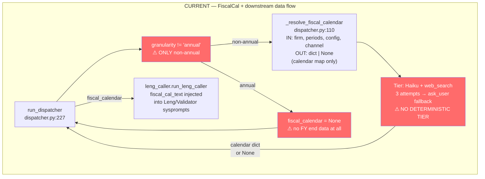
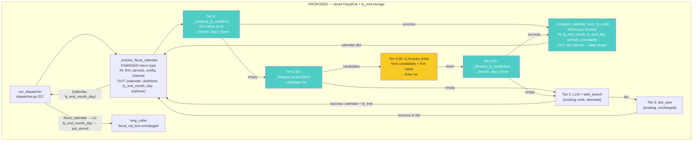
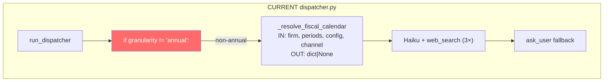
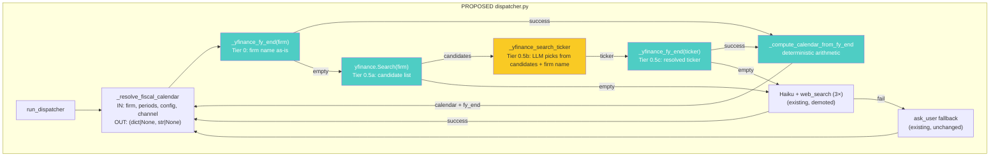

# Spec 20b: Reconcile かな — Leng Quality + FiscalCal + Chart Alignment

## Frontmatter
- Write date: 20260728
- Update date: 20260729
- Codebase last changed date: 20260728
- Implemented Y/N: N
- (3) FiscalCalResolver guesses FY end dates via
  Haiku + web_search, gets them wrong, shifts all quarterly
  period mappings; (4) charting ignores fiscal calendar
  alignment, misrepresenting temporal relationships in multi-firm
  comparisons.
- **Status**: 

## Problem space
### Problem 3: FiscalCalResolver — wrong FY end dates

#### Problem definition

`_resolve_fiscal_calendar` (`dispatcher.py:112-190`)
uses Haiku + `web_search=True` to look up a firm's
fiscal year end date, then computes calendar date ranges
for each period.

For LITE (Lumentum), it returned FY end = December 31.
LITE's actual FY end is **June 30**. This shifted every
quarterly period by 6 months:

```
Resolver said:                  Actual:
Q1FY2025 = Jan-Mar 2024        Q1FY2025 = Jul-Sep 2024
Q2FY2025 = Apr-Jun 2024        Q2FY2025 = Oct-Dec 2024
Q3FY2025 = Jul-Sep 2024        Q3FY2025 = Jan-Mar 2025
Q4FY2025 = Oct-Dec 2024        Q4FY2025 = Apr-Jun 2025
```

Downstream impact: Leng searched for "Q1FY2025 = Jan-Mar
2024" data — anything it found from that calendar window
got written. EPS values [2.51, 7.54, 11.63, 2.85] are
suspect: Q2=7.54 and Q3=11.63 look like annual or YTD
numbers, not single quarters.

Evidence: `PMS2_FailureModes.md` Root Cause D, Demo 2.

#### Why it fails

1. **One-shot LLM guess with no validation.** The
   resolver asks Haiku "What is LITE's fiscal year-end
   date? Search the web to confirm." Haiku returns a
   structured answer. No cross-check against:
   - The actual documents in `files_ingested/` (which
     contain fiscal year references in 10-K headers)
   - Known fiscal calendars of major companies
   - The user (who likely knows the FY end)

2. **web_search is unreliable.** Haiku's web_search
   tool may return stale, wrong, or ambiguous results.
   "Lumentum" might match an old entity or a subsidiary
   with a different FY end. The prompt gives an example
   ("if FY ends June 30, then Q1 = Jul-Sep") but Haiku
   can still get the FY end wrong and compute all date
   ranges from that wrong base.

3. **No fallback validation.** The resolver checks
   `if calendar:` (non-empty) and accepts. It doesn't
   sanity-check whether the returned FY end is
   plausible. It doesn't cross-reference against filing
   dates visible in the ingested documents (e.g. a 10-K
   filed in September likely has FY ending June 30, not
   December 31).

4. **Ask-user fallback is last resort.** The user
   fallback only triggers after 3 web_search failures
   (all returning empty). If Haiku confidently returns
   wrong data, the fallback never fires — wrong data
   passes validation because the dict is non-empty.

5. **Only fires for non-annual granularity.** Annual
   extractions skip FiscalCalResolver entirely
   (`dispatcher.py` only calls it when `granularity !=
   "annual"`). So the problem is invisible in annual
   demos and only surfaces when someone tries quarterly
   or half-yearly — the exact case where accuracy
   matters most.

#### Blast radius

FiscalCalResolver runs ONCE per firm, at the start of
each dispatcher. Its output (`fiscal_calendar` dict) is
injected into:
- Every Leng sysprompt for that firm (via
  `{{fiscal_calendar}}` template var)
- Every Validator sysprompt for that firm (same var)
- The Batch Planner's context (indirectly, via cell
  descriptions that reference periods)

If the FY end is wrong, EVERY Leng call for that firm
searches with wrong period-to-date mappings. EVERY
Validator checks against wrong dates. The error is
systematic, not random — it affects all cells for that
firm, all periods.

For annual granularity, the fiscal_calendar_text is
empty (no resolver call). So Leng gets no temporal
guidance at all — just "FY2025" with no date range.
This means Leng has to guess what FY2025 means from
chunk context alone. Usually fine (10-K headers say
"Fiscal Year Ended June 30, 2025"), but relies entirely
on the chunk containing the right header.

---

### Problem 4: Charting ignores fiscal calendar alignment

#### Problem definition

`stencil2chart.py:150` plots fiscal periods as categorical
x-axis labels:

```python
line, = ax.plot(periods, s["values"], label=s["metric"])
```

Where `periods = ["FY2021", "FY2022", "FY2023"]`. Every
firm's "FY2022" lands on the same x-tick. But different
firms have different fiscal year ends:

- **LITE** (Lumentum): FY ends June 30.
  FY2022 = Jul 2021 - Jun 2022. Midpoint: ~Jan 2022.
- **Innolight**: FY ends December 31.
  FY2022 = Jan 2022 - Dec 2022. Midpoint: ~Jul 2022.

When both are plotted on the same chart, LITE's FY2022
revenue sits on the same x-tick as Innolight's FY2022
revenue. But LITE's FY2022 ended 6 months BEFORE
Innolight's FY2022 started. The chart implies temporal
co-occurrence that doesn't exist.

At quarterly granularity it's worse:

```
LITE Q3FY2025 = Jan-Mar 2025    → calendar Q1 2025
Innolight Q1FY2025 = Jan-Mar 2025 → calendar Q1 2025
```

LITE's "Q3" and Innolight's "Q1" cover the SAME calendar
quarter but plot on different x-ticks (`Q3FY2025` vs
`Q1FY2025`). Comparing them on the current chart implies
they're 6 months apart when they're simultaneous.

#### Where the data is (and isn't)

The charting pipeline currently has NO access to fiscal
calendar data:

```
Phase 2 (merge_compute.py)
  → _serialize_to_display_stencils
    → display_stencil = {firm, periods: ["FY2025","FY2026"], rows: [...]}
      → PTECA (tool_pteca.py)
        → chart_input = {title, periods, series: [...]}
          → stencil2chart.py
            → ax.plot(periods, values)  ← periods are STRINGS
```

`periods` flows through the entire chain as opaque
strings. No FY end date attached. No calendar equivalent
computed. The display stencil doesn't carry
`fy_end_month_day`. The chart_input doesn't carry it.
`stencil2chart` couldn't normalize even if it wanted to.

The fiscal calendar data DOES exist upstream — it's
computed by `_resolve_fiscal_calendar` in `dispatcher.py`
and stored in the `fiscal_calendar` dict. But it's
consumed only by Leng/Validator sysprompts and never
propagated to the stencil, the display stencil, or the
charting layer.

#### What correct charting looks like

For a multi-firm chart comparing LITE and Innolight
revenue FY2021-FY2023:

**Current (wrong):**
```
x-axis:  FY2021    FY2022    FY2023
LITE:    ●─────────●─────────●
Inno:    ●─────────●─────────●
         ↑ same x-tick but 6 months apart in reality
```

**Correct (calendar-normalized):**
```
x-axis:  Q1'21  Q3'21  Q1'22  Q3'22  Q1'23  Q3'23
LITE:       ●─────────────●─────────────●
            ↑ Jul'20-Jun'21  Jul'21-Jun'22  Jul'22-Jun'23
            midpoint: Jan'21  midpoint: Jan'22  midpoint: Jan'23

Inno:              ●─────────────●─────────────●
                   ↑ Jan-Dec'21    Jan-Dec'22    Jan-Dec'23
                   midpoint: Jul'21  midpoint: Jul'22  midpoint: Jul'23
```

The x-axis becomes a CONTINUOUS calendar timeline, not
categorical fiscal period labels. Each datapoint is
plotted at its fiscal period midpoint (or end-date).
Firms with different FY ends naturally offset on the
x-axis, reflecting real temporal relationships.

For single-firm charts, this doesn't matter much —
the offset is consistent so trends are preserved. But
for multi-firm comparisons, it's the difference between
a correct and misleading visualization.

#### Points of failure

1. **`stencil2chart.py:150`** — `ax.plot(periods, values)`
   treats periods as categorical. matplotlib places them
   as equally-spaced string ticks. No temporal meaning.

2. **Display stencil contract** — `{firm, periods, rows}`
   has no FY end date, no calendar mapping. Can't
   normalize downstream without upstream data.

3. **`_serialize_to_display_stencils`** (`merge_compute.py`)
   — builds display stencils from work_stencil. Copies
   `periods` as-is. Doesn't attach fiscal calendar data
   even though it's available in the pipeline context.

4. **PTECA** (`tool_pteca.py`) — builds `chart_input`
   from display stencils. Passes `periods` through as
   strings. No normalization step.

5. **No calendar normalization function exists anywhere.**
   Converting "FY2022 with FY end June 30" →
   "midpoint = January 2022" or "end = June 2022" is a
   simple date computation, but nothing in the codebase
   does it.

---

### Coupling between Problems 1, 3, and 4

```
Problem 3 (FiscalCal wrong)
    ↓ wrong date ranges injected into all Leng/Validator calls
Problem 1 (Leng dumb)
    ↓ extracts wrong values (temporal, semantic, GAAP)
    ↓ first-write-wins locks in wrong values

Problem 3 (FiscalCal) ──also──→ Problem 4 (charting)
    ↓ FY end data never propagated to stencil/chart layer
    ↓ multi-firm charts misalign temporally
```

Problem 4 depends on Problem 3 being CORRECT (need
accurate FY end dates to normalize), but Problem 4 also
requires the data to be PROPAGATED through the pipeline
even when Problem 3 is correct — the plumbing doesn't
exist regardless of accuracy.

Fixing Problem 1 (smarter Leng) without fixing Problem 3
(correct fiscal calendar) means Leng is smart but
operating on wrong temporal context. Fixing Problem 4
(charting) without fixing Problem 3 means normalizing
against wrong FY end dates. All three need addressing,
but they can be built incrementally because they touch
different pipeline stages.

Problems 2 (divergence reconciliation) and 5 (stencil
misdesign) moved to Spec 20c.

---

## Outcome imagination

### Problem 3: FiscalCalResolver

#### Target UX

```
[PMS2-disp-LITE] Resolving fiscal calendar...
[PMS2-fiscal-LITE] yfinance: LITE FY ends June 30
[PMS2-fiscal-LITE] FY2025 = Jul 1 2024 - Jun 30 2025
[PMS2-fiscal-LITE] Q1FY2025 = Jul 1 2024 - Sep 30 2024
[PMS2-fiscal-LITE] Q2FY2025 = Oct 1 2024 - Dec 31 2024
[PMS2-fiscal-LITE] Q3FY2025 = Jan 1 2025 - Mar 31 2025
[PMS2-fiscal-LITE] Q4FY2025 = Apr 1 2025 - Jun 30 2025
```

If yfinance fails (private company, no ticker, API down):

```
[PMS2-fiscal-LITE] yfinance: no data for LITE
[PMS2-fiscal-LITE] Falling back to LLM + web_search...
[PMS2-fiscal-LITE] FY ends June 30 (web_search). 5 periods resolved.
```

If both fail:

```
[PMS2-fiscal-LITE] yfinance: failed
[PMS2-fiscal-LITE] LLM web_search: failed (3 attempts)
[PMS2-fiscal-LITE] what is LITE's fiscal year-end? > June 30
[PMS2-fiscal-LITE] 5 periods resolved from user input.
```

#### What's desired

- Deterministic first: yfinance `.financials.columns` →
  derive FY end month/day. $0, <2s, correct for all
  tested tickers (LITE, AAPL, 300308.SZ).
- LLM web_search as fallback only, not primary.
- FY end date persists beyond FiscalCalResolver — stored
  in job_stencil for downstream use.

---

# Solution space

**NOTE**: Only Problem 3 has approved solutions below.
Problems 1 and 4 are problem-space only — outcomes and
solutions to be designed in a future session.

## Problem 3: FiscalCalResolver — tiered resolution

### Idea

Replace single-tier LLM+web_search with four-tier
fallback chain. Tiers 0 and 0.5 are deterministic
(yfinance), Tier 2 is existing LLM+web_search demoted,
Tier 3 is existing ask_user.

### Type: patch (additive tiers, existing code preserved as tier 2)

### Tiers

**Tier 0: yfinance `.financials.columns` — firm name
as-is (deterministic, no LLM)**

```python
import yfinance
t = yfinance.Ticker(firm_name)  # e.g. "LITE"
cols = t.financials.columns
# cols = [Timestamp('2025-06-30'), Timestamp('2024-06-30'), ...]
fy_end = cols[0]  # most recent
fy_end_month = fy_end.month  # 6
fy_end_day = fy_end.day      # 30
```

Works when firm name IS a valid ticker (LITE, AAPL,
MSFT, TSM). Returns empty DataFrame when firm name
is not a ticker ("Innolight", "Lumentum") — no crash.

From `(fy_end_month, fy_end_day)`, all period-to-
calendar mappings are deterministic `relativedelta`
arithmetic. $0, <2s.

Verified working (2026-07-29):
- LITE → June 30 ✓
- AAPL → September 30 ✓
- 300308.SZ → December 31 ✓
- `.info` endpoint is DEAD (401 Unauthorized), but
  `.financials` works.
- `yfinance.Search` is ALIVE (tested 2026-07-29).

Falls through to Tier 0.5 if `.financials` empty.

**Tier 0.5: yfinance.Search + LLM ticker pick
(deterministic data, LLM disambiguation)**

When firm name ≠ valid ticker, search for candidates
then let LLM pick:

```
yfinance.Search("Innolight")
  → [{symbol: "300308.SZ", longname: "Zhongji Innolight Co., Ltd.",
      exchange: "Shenzhen", sector: "Technology"}, ...]
  → LLM picks best match given firm_name
  → _yfinance_fy_end("300308.SZ")
```

LLM is needed because candidate list can be ambiguous:
- "Apple" → AAPL (Apple Inc) vs APLE (Apple Hospitality
  REIT). Score ranking works here but not guaranteed.
- Multi-exchange duplicates: LITE (NASDAQ) vs 1LITE.MI
  (Milan) vs LU2.DE (XETRA).
- "Mercury" → Mercury Systems vs Mercury General vs ...

LLM gets: firm name (from Sekei-confirmed stencil) +
candidate longnames/exchanges. Picks from a SHORT
deterministic list — not hallucinating a ticker from
nothing. Firm name is specific enough (Sekei + user
confirmation) to disambiguate without the original query.

Cost: ~$0.001 Haiku structured_complete. Only fires
when Tier 0 returns empty (firm name ≠ ticker).

Falls through to Tier 2 if Search returns empty or
LLM-picked ticker's `.financials` also empty.

**Tier 2: LLM + web_search (current code, demoted)**

Existing `_resolve_fiscal_calendar` logic. 3 attempts
via Haiku `structured_complete(web_search=True)`.

No code changes to Tier 2 logic — just demoted from
primary to fallback.

NOTE: Tier 2 currently unreliable — returns wrong FY
end dates (e.g. Dec 31 for LITE whose actual FY end
is June 30). Known issue, to be troubleshot separately.

**Tier 3: ask_user (existing, unchanged)**

Already implemented as fallback after Tier 2 exhausts.
No changes.

### Points of chg

**Graph (pipeline) design affected:**
- `_resolve_fiscal_calendar` node: gains Tier 0
  (yfinance direct) and Tier 0.5 (yfinance.Search +
  LLM ticker pick) before existing web_search logic
  (Tier 2). No new params — firm name (already passed)
  is sufficient for Tier 0.5 disambiguation. Output
  contract grows: returns `(calendar_dict,
  fy_end_month_day)` tuple instead of just
  `calendar_dict`.
- `run_dispatcher`: unpacks tuple, stores
  `fy_end_month_day` in job_stencil.

## Graph Change

### BEFORE (current pipeline — affected nodes only)



**Current I/O contracts (affected nodes):**
```
_resolve_fiscal_calendar:
  IN:  firm: str, periods: list[str], config: Config, channel: ToolChannel
  OUT: dict | None
       dict = {"Q1FY2025": "Jul 1 2024 - Sep 30 2024", ...}
       None = total failure
  SIDE EFFECTS: fiscal_ch.print status, _router spinner,
                fiscal_ch.input (ask_user fallback)

run_dispatcher:
  IN:  firm, job_stencil, file_inventory, channel, config, ...
  INTERNAL: fiscal_calendar = None if annual, else _resolve(...)
  OUT: dict (job_stencil with status)
  NOTE: fiscal_calendar NOT stored in job_stencil — ephemeral local var
```

### AFTER (proposed)



**Proposed I/O contracts (changes only):**
```
_yfinance_fy_end (NEW):
  IN:  firm: str
  OUT: tuple[int, int] | None
       (month, day) e.g. (6, 30) for June 30
       None if yfinance has no data or raises
  PURE: network call only, no LLM

_yfinance_search_ticker (NEW):
  IN:  firm: str, config: Config
  OUT: str | None
       ticker symbol e.g. "300308.SZ"
       None if Search returns empty or LLM fails
  SIDE EFFECTS: yfinance.Search network call,
                Haiku structured_complete (~$0.001)
  NOTE: LLM picks from deterministic candidate list
        using firm name only (Sekei-confirmed, specific
        enough to disambiguate)

_compute_calendar_from_fy_end (NEW):
  IN:  fy_end_month: int, fy_end_day: int,
       periods: list[str], granularity: str
  OUT: dict  (period label → "MonthName Day Year - MonthName Day Year")
  PURE: no LLM, no I/O, deterministic arithmetic

_resolve_fiscal_calendar:
  IN:  firm, periods, config, channel                 ← unchanged
  OUT: tuple[dict | None, str | None]                 ← was dict | None
       (calendar_dict, fy_end_month_day)
       fy_end_month_day = "June 30" | None
  SIDE EFFECTS: unchanged + yfinance network calls (Tier 0/0.5)
                + optional Haiku call (Tier 0.5 ticker pick)

run_dispatcher:
  IN:  unchanged
  INTERNAL: (fiscal_calendar, fy_end_month_day) = _resolve(...)
            job_stencil["fy_end_month_day"] = fy_end_month_day   ← NEW
  OUT: dict (job_stencil with status + fy_end_month_day)
```

---

## Hence File by file Change

### 1. `src/scripts/PMS2/dispatcher.py`

**Contract**: `_resolve_fiscal_calendar` gains Tier 0
(yfinance direct), Tier 0.5 (yfinance.Search + LLM
ticker pick), + deterministic calendar computation.
Signature unchanged (firm name already passed). Return
type changes from `dict | None` to
`tuple[dict | None, str | None]`.

**Internal function graph (current → proposed):**





**New module-level imports:**
```python
import yfinance               # Tier 0/0.5 fiscal calendar
from datetime import date      # calendar computation
from dateutil.relativedelta import relativedelta  # quarter arithmetic
```

**New functions** (place before `_resolve_fiscal_calendar`):

```python
def _yfinance_fy_end(firm: str) -> tuple[int, int] | None:
    """Tier 0: deterministic FY end from yfinance.

    Returns (month, day) or None.
    """
    try:
        t = yfinance.Ticker(firm)
        cols = t.financials.columns
        if cols is None or cols.empty:
            return None
        fy_end = cols[0]  # pandas Timestamp
        return (fy_end.month, fy_end.day)
    except Exception:
        return None


def _yfinance_search_ticker(
    firm: str,
    config,
) -> str | None:
    """Tier 0.5: search yfinance for ticker candidates,
    then LLM picks the best match using firm name.

    Returns ticker symbol str or None.
    """
    try:
        results = yfinance.Search(firm)
        candidates = results.quotes[:5]  # top 5 by score
        if not candidates:
            return None
    except Exception:
        return None

    # Format candidates for LLM
    options = "\n".join(
        f"  {i+1}. {c['symbol']} — {c.get('longname', '?')} "
        f"({c.get('exchDisp', '?')}, {c.get('sector', '?')})"
        for i, c in enumerate(candidates)
    )

    backend = get_pms2_fiscal_cal_llm(config)
    result = backend.structured_complete(
        system=(
            "You are picking the correct stock ticker for a "
            "company. Pick the ticker number (1-5) that best "
            "matches the company name. If none match, "
            "respond 0."
        ),
        prompt=(
            f"Company name: {firm}\n\n"
            f"Candidates:\n{options}"
        ),
        schema={
            "type": "object",
            "properties": {
                "pick": {
                    "type": "integer",
                    "description": "1-5 for best match, 0 if none"
                }
            },
            "required": ["pick"]
        },
    )
    pick = result.get("pick", 0)
    if 1 <= pick <= len(candidates):
        return candidates[pick - 1]["symbol"]
    return None


def _compute_calendar_from_fy_end(
    fy_end_month: int,
    fy_end_day: int,
    periods: list[str],
    granularity: str,
) -> dict:
    """Deterministic period→date-range mapping from FY end.

    Returns {period_label: "MonthName Day Year - MonthName Day Year"}.
    """
    import re as _re
    calendar = {}
    for p in periods:
        m = _re.match(r"^(Q[1-4]|H[12])?FY(\d{4})$", p)
        if not m:
            continue
        prefix, year_str = m.group(1), int(m.group(2))
        fy_end = date(year_str, fy_end_month, fy_end_day)
        fy_start = fy_end - relativedelta(years=1) + relativedelta(days=1)

        if prefix is None:
            calendar[p] = (
                f"{fy_start.strftime('%b %d %Y')} - "
                f"{fy_end.strftime('%b %d %Y')}"
            )
        elif prefix.startswith("Q"):
            q = int(prefix[1])
            q_start = fy_start + relativedelta(months=3 * (q - 1))
            q_end = fy_start + relativedelta(months=3 * q) - relativedelta(days=1)
            calendar[p] = (
                f"{q_start.strftime('%b %d %Y')} - "
                f"{q_end.strftime('%b %d %Y')}"
            )
        elif prefix.startswith("H"):
            h = int(prefix[1])
            h_start = fy_start + relativedelta(months=6 * (h - 1))
            h_end = fy_start + relativedelta(months=6 * h) - relativedelta(days=1)
            calendar[p] = (
                f"{h_start.strftime('%b %d %Y')} - "
                f"{h_end.strftime('%b %d %Y')}"
            )
    return calendar
```

**`_resolve_fiscal_calendar` changes:**

- Signature: unchanged (firm already passed)
- Return type: `tuple[dict | None, str | None]`
  (calendar, fy_end_month_day)
- Insert Tier 0 + Tier 0.5 BEFORE existing web_search
  loop:
  ```python
  # --- Tier 0: yfinance direct (firm name as ticker) ---
  fy = _yfinance_fy_end(firm)

  # --- Tier 0.5: yfinance.Search + LLM ticker pick ---
  if fy is None:
      fiscal_ch.print(f"yfinance: {firm} not a ticker, searching...")
      ticker = _yfinance_search_ticker(firm, config)
      if ticker:
          fiscal_ch.print(f"yfinance: resolved {firm} → {ticker}")
          fy = _yfinance_fy_end(ticker)

  # --- Deterministic calendar from FY end ---
  if fy is not None:
      fy_month, fy_day = fy
      fy_end_str = f"{date(2000, fy_month, fy_day).strftime('%B')} {fy_day}"
      fiscal_ch.print(f"yfinance: FY ends {fy_end_str}")
      calendar = _compute_calendar_from_fy_end(
          fy_month, fy_day, periods, granularity
      )
      if calendar:
          fiscal_ch.print(f"{len(calendar)} periods resolved.")
          return calendar, fy_end_str
  ```
- Existing web_search loop: extract `fy_end_month_day`
  from result (already in schema: `result.get("fy_end_month_day")`).
  Change `return calendar` → `return calendar, result.get("fy_end_month_day")`
- ask_user fallback: same change to return tuple
- Total failure: change `return None` →
  `return None, None`

**`run_dispatcher` changes:**

- Unpack tuple: `fiscal_calendar, fy_end_month_day = _resolve_fiscal_calendar(...)`
- Store: `job_stencil["fy_end_month_day"] = fy_end_month_day`
- `state.fiscal_calendar = fiscal_calendar` (unchanged)
- No signature change to `run_dispatcher` — no new params needed.

```python
# PROPOSED (replacing lines 252-260)
fiscal_calendar, fy_end_month_day = _resolve_fiscal_calendar(
    firm=firm,
    periods=periods,
    config=config,
    channel=channel,
)
job_stencil["fy_end_month_day"] = fy_end_month_day
```

---

## Failure modes

### FM-1: yfinance rate limit / auth failure

Forensics: yfinance endpoint status (tested 2026-07-29):
- `.financials` — ALIVE
- `.info` — DEAD (401 Unauthorized)
- `Search()` — ALIVE (was getting 502 proxy error
  from sandbox, works fine outside sandbox)

Yahoo has been tightening API access.

Hypothesis: `.financials` or `Search()` could start
returning 401/timeout at any time.

Verify: `try/except` in `_yfinance_fy_end` catches all
exceptions → returns None. `try/except` in
`_yfinance_search_ticker` catches Search exceptions →
returns None. Both fall through to Tier 2. No crash.

Doubt: if yfinance blocks ALL endpoints, Tiers 0 and
0.5 are permanently dead. Pipeline degrades to Tier 2
(current behavior) — no worse than today.

Failure mode: graceful degradation. No crash, no wrong
data. Just slower + less reliable (back to LLM guessing).

**No fix needed.** Tiers 0/0.5 are best-effort by design.

### FM-2: Firm name ≠ valid yfinance ticker

Forensics: stencil firm names come from Sekei + user
confirmation. User confirms "LITE" — which happens to be
a valid NYSE ticker. But "Innolight" is NOT a valid
ticker — the ticker is "300308.SZ".

Hypothesis: `yfinance.Ticker("Innolight").financials`
returns empty DataFrame. `_yfinance_fy_end` returns None.

Verify: tested — empty. Falls through to Tier 0.5.

Tier 0.5 resolution:
1. `yfinance.Search("Innolight")` → candidates including
   `{symbol: "300308.SZ", longname: "Zhongji Innolight
   Co., Ltd."}` (tested, works).
2. LLM picks "300308.SZ" from candidate list.
3. `_yfinance_fy_end("300308.SZ")` → (12, 31). ✓

Doubt: what if Search returns candidates but LLM picks
wrong one? See FM-2b.

Failure mode: **resolved by Tier 0.5**. Tier 0 fails
silently (~1s wasted), Tier 0.5 handles it.

### FM-2b: LLM picks wrong ticker from candidates

Forensics: `_yfinance_search_ticker` presents top 5
candidates to Haiku. LLM picks based on firm name +
candidate longnames/exchanges.

Hypothesis: ambiguous names could cause wrong pick.
"Mercury" → Mercury Systems or Mercury General?

Verify: firm name comes from Sekei + user confirmation,
so it's typically specific ("Mercury Systems", not
"Mercury"). Candidate longnames provide additional
signal. Haiku is competent at matching a specific firm
name to a short deterministic list.

Doubt: if LLM picks wrong ticker → wrong FY end →
`_compute_calendar_from_fy_end` produces wrong date
ranges → same failure as current Tier 2 (wrong
calendar). But this is DETECTABLE: the computed dates
would be wrong for all Leng calls for that firm.

Failure mode: wrong FY end from wrong ticker. Same
blast radius as current Tier 2 failure (Root Cause D).
Falls through to Tier 2 only if picked ticker's
`.financials` is EMPTY — not if it returns wrong data.

**Mitigation**: LLM wrong pick produces valid-looking
FY end from wrong company. No automatic detection.
User would see wrong period mappings in terminal
output. Could add a sanity-check: compare LLM-picked
ticker's `longname` against firm name and reject if
similarity is too low. **Deferred** — edge case,
most firm names are unambiguous enough.

### FM-3: `_compute_calendar_from_fy_end` off-by-one

Forensics: quarter boundaries depend on `relativedelta`
arithmetic. FY end June 30 → FY start July 1 → Q1 = Jul
1 - Sep 30. If `relativedelta(months=3)` from Jul 1
gives Oct 1, then `- relativedelta(days=1)` = Sep 30. ✓

Hypothesis: `relativedelta` handles month-end dates
correctly (Feb 28/29, months with 30/31 days).

Verify: edge case — FY end Feb 28 (rare, but some
companies). FY start = Mar 1. Q1 = Mar 1 - May 31.
`date(2025,3,1) + relativedelta(months=3)` = Jun 1.
`Jun 1 - 1 day` = May 31. ✓

Doubt: FY end Jan 31 (e.g. Walmart). FY start = Feb 1.
Q1 = Feb 1 - Apr 30. `date(2025,2,1) + relativedelta
(months=3)` = May 1. `May 1 - 1 day` = Apr 30. ✓

Failure mode: none found. `dateutil.relativedelta` is
well-tested for this pattern.

**Guard**: unit test with edge case FY ends (U3).

### FM-4: `_resolve_fiscal_calendar` return type change breaks callers

Forensics: currently returns `dict | None`. Proposed
returns `tuple[dict | None, str | None]`. The ONLY
caller is `run_dispatcher` (dispatcher.py:255). No
other file imports or calls `_resolve_fiscal_calendar`.

Hypothesis: updating the caller in the same file is
safe. No external callers to break.

Verify: `grep -r "_resolve_fiscal_calendar" src/` →
only `dispatcher.py`. ✓

Doubt: tests? No existing test calls the resolver
directly. `test_pms2_unit.py` tests downstream merge/
compute functions, not the dispatcher or resolver.

Failure mode: none if caller updated in lockstep.

### FM-5: `dateutil` not installed

Forensics: `dateutil` (python-dateutil) is a dependency
of `pandas` which is a dependency of `yfinance`. If
yfinance is installed, dateutil is present.

Verify: `pip show python-dateutil` — installed as
transitive dep.

Failure mode: `ImportError` at module load time. Caught
by pre-flight test.

**Guard**: add `python-dateutil` to `requirements.txt`
explicitly.

### FM-6: `fy_end_month_day` key missing in job_stencil

Forensics: `run_dispatcher` sets
`job_stencil["fy_end_month_day"] = fy_end_month_day`.
If resolver returns `(None, None)`, value is None.
Downstream reads via `.get("fy_end_month_day")` — None
is fine, chart normalization skips.

Failure mode: if `run_dispatcher` forgets to set the
key entirely, `job.get("fy_end_month_day")` in
`pms2.py` returns None. `fy_end_by_firm` dict stays
empty. Chart normalization doesn't fire. No crash,
just no normalization.

**Guard**: unit test asserting key exists (U1).

---

## Unit tests

**File: `tests/test_spec20b_unit.py`** — SEPARATE file.

### New tests

| ID | Test | Description | Built | Ran |
|----|------|-------------|-------|-----|
| U0 | `TestYfinanceFyEnd::test_returns_none_on_invalid_ticker` | `_yfinance_fy_end("NOTAREALTICKER")` → None | N | N |
| U1 | `TestYfinanceFyEnd::test_returns_tuple_on_valid_ticker` | `_yfinance_fy_end("AAPL")` → (9, 30) (requires network) | N | N |
| U2 | `TestComputeCalendar::test_annual_fy_end_june` | `_compute_calendar_from_fy_end(6, 30, ["FY2025"], "annual")` → `{"FY2025": "Jul 01 2024 - Jun 30 2025"}` | N | N |
| U3 | `TestComputeCalendar::test_quarterly_fy_end_june` | `_compute_calendar_from_fy_end(6, 30, ["Q1FY2025","Q2FY2025","Q3FY2025","Q4FY2025"], "quarterly")` → 4 correct ranges (Jul-Sep, Oct-Dec, Jan-Mar, Apr-Jun) | N | N |
| U4 | `TestComputeCalendar::test_quarterly_fy_end_december` | `_compute_calendar_from_fy_end(12, 31, ["Q1FY2025"], "quarterly")` → `{"Q1FY2025": "Jan 01 2025 - Mar 31 2025"}` (standard calendar-aligned) | N | N |
| U5 | `TestComputeCalendar::test_half_fy_end_september` | `_compute_calendar_from_fy_end(9, 30, ["H1FY2025","H2FY2025"], "half")` → correct 6-month ranges | N | N |
| U6 | `TestComputeCalendar::test_edge_case_fy_end_january` | FY end Jan 31 (Walmart). Q1 = Feb 1 - Apr 30. | N | N |
| U7 | `TestSearchTicker::test_search_returns_ticker` | Mock `yfinance.Search` with Innolight candidates, mock `structured_complete` picking 1 → returns "300308.SZ" | N | N |
| U8 | `TestSearchTicker::test_search_empty_returns_none` | Mock `yfinance.Search` returning empty quotes → returns None | N | N |
| U9 | `TestSearchTicker::test_search_llm_picks_zero_returns_none` | Mock Search with candidates but LLM picks 0 (no match) → returns None | N | N |
| U10 | `TestSearchTicker::test_search_network_error_returns_none` | Mock `yfinance.Search` raising exception → returns None, no crash | N | N |
| U13 | `TestResolverReturnType::test_returns_tuple` | Mock yfinance, verify `_resolve_fiscal_calendar` returns `(dict, str)` not bare dict | N | N |
| U14 | `TestFyEndPropagation::test_job_stencil_has_key` | After `run_dispatcher` (mocked), `job_stencil["fy_end_month_day"]` exists | N | N |
| U15 | `TestResolverTierFallthrough::test_tier0_fail_triggers_tier05` | Mock `_yfinance_fy_end` returning None on firm name, then success on resolved ticker. Verify `_yfinance_search_ticker` called. | N | N |
| U16 | `TestResolverTierFallthrough::test_tier05_fail_triggers_tier2` | Mock both `_yfinance_fy_end` and `_yfinance_search_ticker` returning None. Verify existing web_search loop entered. | N | N |

**Run:** `python -m pytest tests/test_spec20b_unit.py -x -v`
**Regression:** `python -m pytest tests/test_pms2_unit.py -x -v`

U0, U7-U10 are pure mock. U1 requires network (mark
`@pytest.mark.network`). U2-U6 are pure deterministic.
U13-U16 require mocking yfinance + LLM backends.

**Regression note**: `test_spec19_unit.py` tests
`_PERIOD_RE`, `_period_sort_key`, `_assign_structure`
from `sekei_loop.py` / `stencil_topo.py`. None touched
by this spec — no regression risk. `test_pms2_unit.py`
tests `_safe_math_eval`, `_handle_submit_verdicts`,
merge functions — also not touched, but run anyway as
sanity since it imports from the same package.

### Existing test updates

No existing tests call `_resolve_fiscal_calendar`
directly. `_resolve_fiscal_calendar` signature is
unchanged (no new params), so no existing callers
break. Only the return type changes (`dict | None` →
`tuple`), and the sole caller (`run_dispatcher`) is
updated in the same file.

---

## LLM unit tests

### L0: Haiku ticker pick from yfinance.Search candidates

**What**: single Haiku `structured_complete` call with
real yfinance.Search output for "Innolight". Verify it
picks `300308.SZ` (index 1) and returns valid schema
`{"pick": 1}`.

**Why**: Tier 0.5 relies on Haiku to disambiguate
ticker candidates. If Haiku can't reliably pick the
right ticker from a short list, the entire tier is
unreliable.

**Setup**: use actual yfinance.Search output captured
from test (2026-07-29) for each firm in
`data/files_ingested/`. Single Haiku call per test,
no loop, no retry.

**Call**: `backend.structured_complete(system=<ticker
pick prompt>, prompt=<firm + candidates>,
schema={"pick": int})`.

**Assert**:
- `result["pick"]` matches expected index
- Return type is dict with "pick" key
- pick is int in range [0, len(candidates)]

**Cost**: ~$0.001 per call, ~$0.004 total.

**Test vectors** (all from real yfinance.Search output):

| ID | Firm | Query context | Candidates (top 3) | Expected | Why hard |
|----|------|---------------|---------------------|----------|----------|
| L0a | "Innolight" | "optical transceiver revenue" | 300308.SZ (Shenzhen), ZJINNO80.BK (SET) | 1 (300308.SZ) | Non-obvious ticker, secondary listing noise |
| L0b | "Hanwha Solution" | "solar panel revenue Korea" | 009830.KS (common), 009835.KS (preferred), 0098301G.KS | 1 (009830.KS) | Common vs preferred shares, Korean market |
| L0c | "Lumentum" | "photonics gross margin" | LITE (NASDAQ), 1LITE.MI (Milan), LU2.DE (XETRA) | 1 (LITE) | Multi-exchange, must pick primary US listing |
| L0d | "Ciena" | "optical networking equipment" | CIEN (NYSE), CIE1.DE (XETRA), CIE1.HA (Hanover) | 1 (CIEN) | Full name → ticker, multi-exchange |

| ID | Test | Description | Built | Ran |
|----|------|-------------|-------|-----|
| L0a | `TestHaikuTickerPick::test_innolight` | Haiku picks 300308.SZ from Innolight candidates | N | N |
| L0b | `TestHaikuTickerPick::test_hanwha` | Haiku picks 009830.KS (common) not 009835.KS (preferred) | N | N |
| L0c | `TestHaikuTickerPick::test_lumentum` | Haiku picks LITE (NASDAQ) not Milan/XETRA duplicates | N | N |
| L0d | `TestHaikuTickerPick::test_ciena` | Haiku picks CIEN from full name "Ciena" | N | N |

### Calendar dict format compatibility

`_compute_calendar_from_fy_end` output must match the
format consumed by `_build_fiscal_calendar_text`
(`leng_caller.py:88`). Verified:

```
_build_fiscal_calendar_text iterates:
  for period, date_range in fiscal_calendar.items():
      lines.append(f"  {period} = {date_range}")

_compute_calendar_from_fy_end returns:
  {"Q1FY2025": "Jul 01 2024 - Sep 30 2024", ...}

→ produces: "  Q1FY2025 = Jul 01 2024 - Sep 30 2024"
```

Format is compatible. The text is then injected into
Leng/Validator sysprompts via `{{fiscal_calendar}}`
template variable in `leng_caller.py:155` and
`validator_loop.py:296`. No contract break.

---

## Execution

**Spec size**: 1 file changed (`dispatcher.py`), ~120
lines new code, 14 unit tests + 4 LLM tests. One session.

| Session | Scope | Gate |
|---------|-------|------|
| S1 | Problem 3: (1) new pure functions (`_yfinance_fy_end`, `_compute_calendar_from_fy_end`) + unit tests U0-U6. (2) new LLM-dependent function (`_yfinance_search_ticker`) + unit tests U7-U10. (3) LLM tests L0a-L0d (Haiku ticker pick). (4) Wire: `_resolve_fiscal_calendar` return type change, tier 0 → 0.5 → 2 fallthrough. (5) `run_dispatcher` tuple unpack + fy_end storage in job_stencil. (6) Integration tests U13-U16. (7) Regression `test_pms2_unit.py`. | `pytest tests/test_spec20b_unit.py -x -v` all pass. `pytest tests/test_pms2_unit.py -x -v` regression pass. L0a-L0d pass. |

**Session execution instruction:**
```
Read Specs/20b_ReconcileKana.md thoroughly.
Oneshot slowly you monkey. At any point of design/execution
ambiguity, think in cycles (Forensics, hypothesize, verify,
doubt, failure mode, hypothesize, repeat) to solve
responsibly, then note in Specs/20b_S{N}Discretion.md.
Only log "what I discretionarily decided about the design,"
not "how I did it." Understand?
```
