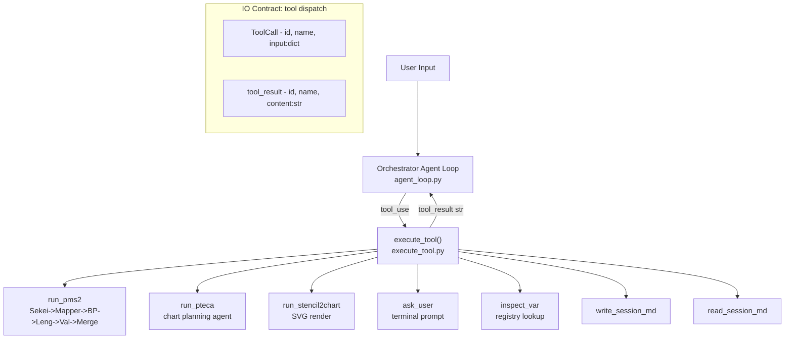
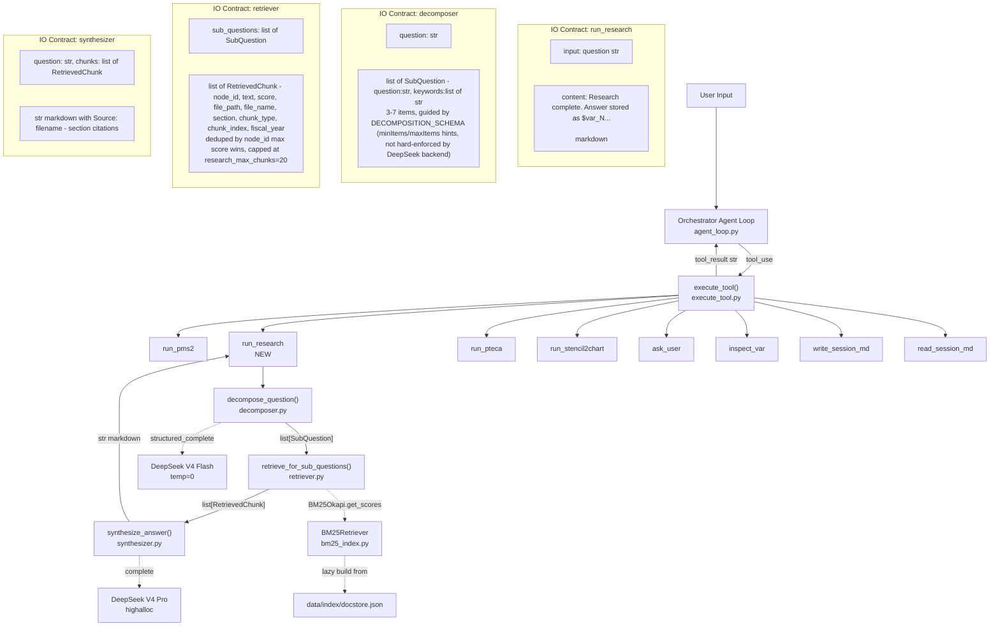
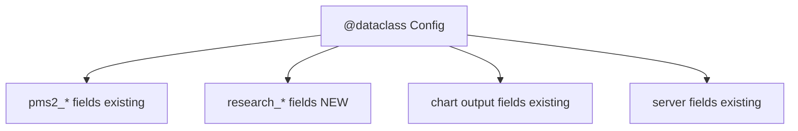
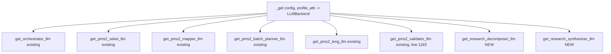
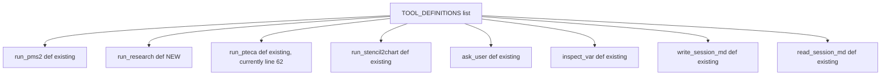
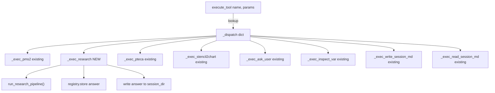
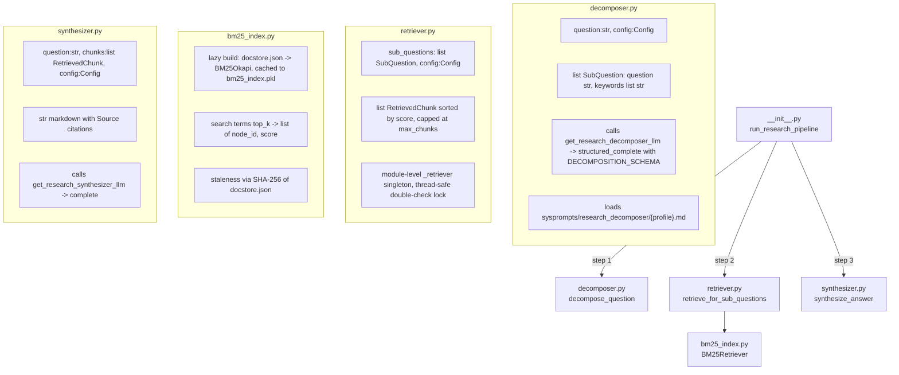

## Frontmatter
- Write date: 20260729
- Update date: 20260729
- Codebase last changed date: 20260729
- Implemented: N
- Port `run_research` tool from wagasyanohimitunaLAG-osha branch into PSOAS_Jul20 harness. Research = open-ended QA via query decomposition -> BM25 retrieval -> cited synthesis. No plumbing changes at the tool-calling/tool-result contract level -- contracts are identical across both codebases. Mostly additive (new tool definition, new handler, new module, new config fields, new sysprompts) plus one existing file modification (orchestrator sysprompt gets routing guidance).
- Source branch path: `../wagasyanohimitunaLAG-osha` (sibling directory at same level as PSOAS_Jul20, i.e. `HVCPipeline/KTQuery/Omaya/wagasyanohimitunaLAG-osha`)

## Problem space
- Problem definition: PSOAS_Jul20 has no open-ended QA capability. The `run_research` tool exists only in the osha branch. Today's demo needs both `run_pms2` (structured extraction) and `run_research` (qualitative QA) in the same REPL session.
- Failure instance: User asks "What is LITE's competitive outlook?" in PSOAS_Jul20 harness -> orchestrator has no tool to route to -> falls back to hallucinated answer from its own weights (no grounding).
- Points of failure:
  - Missing tool definition -> orchestrator doesn't know `run_research` exists
  - Missing handler -> `execute_tool` returns "unknown tool" error string
  - Missing config fields -> `Config` dataclass has no `research_*` attrs -> `AttributeError` at runtime
  - Missing LLM factory functions -> `ImportError` when decomposer/synthesizer try to instantiate backends
  - Missing sysprompt .md files -> `load_sysprompt` raises `FileNotFoundError`
  - Missing orchestrator sysprompt routing guidance -> orchestrator LLM has tool schema but no behavioral heuristics for when to pick `run_research` vs `run_pms2` -> routing misfires on qualitative questions
  - Missing `rank-bm25` in requirements.txt -> already installed in env but undeclared

## Outcome imagination
- Target UX: User types "What is LITE's competitive outlook?" -> orchestrator routes to `run_research` -> terminal shows decomposition + retrieval progress -> cited markdown answer printed + saved to session dir + stored as `$var_N` handle. Existing tools (`run_pms2`, `run_pteca`, etc.) unaffected.
- Wat was desired by user: Same REPL, same harness, both quantitative extraction and qualitative research available as orchestrator tools.

# Solution space
- Idea of solving: Mostly additive port -- copy module, add config, add tool def, add handler, add dispatch entry, add sysprompts, add dep. One existing file modified: orchestrator sysprompt gets `run_research` tool listing + routing guidance.
- Type: patch (additive, non-breaking)
- Points of chg:
  - Graph (pipeline) design affected: One new leaf node (`run_research`) hanging off the orchestrator's dispatch table. One existing node touched: orchestrator sysprompt (add tool description + routing guidance).
  - Downstream nodes affected: None. `run_research` output is a plain string that enters the existing `tool_results` message flow identically to every other tool.

## Graph Change

### Current pipeline (PSOAS_Jul20)



### Proposed pipeline (with run_research)



### IO contract diff between original and proposed: NONE at the harness level

The `tool_use` -> `execute_tool()` -> `tool_result` contract is unchanged:
- `ToolCall{id:str, name:str, input:dict}` in
- `{id:str, name:str, content:str}` out
- Wrapped as `{"role":"tool_results", "content":[...]}` in messages array
- Translated per-provider identically (Anthropic -> `user` role with `tool_result` blocks, OpenAI -> `tool` role messages, Gemini -> `FunctionResponse` parts)

`run_research` is just another entry in `_dispatch` that returns a string. No new message types, no new content block types, no changes to `LLMResponse` or `ToolCall`.

## Hence File by file Change

### F1: `requirements.txt`
- Current: no `rank-bm25` line
- Proposed: add `rank-bm25>=0.2.2`
- No function graph -- it's a flat dep list

### F2: `src/scripts/config.py`



- Current: `Config` dataclass ends at line 83 (`pms2_validator_max_workers`) then jumps to chart output at line 85.
- Proposed: Insert 4 fields between lines 83 and 85:
  ```python
  # ── Research (open-ended QA) LLM role → profile mapping ──────────
  research_decomposer_profile: str = "deepseek_v4flash_temp0"
  research_synthesizer_profile: str = "deepseek_v4pro_highalloc"

  # ── Research retrieval parameters ───────────────────────────────
  research_bm25_top_k: int = 5
  research_max_chunks: int = 20
  ```
- Input: nothing (default-valued dataclass fields)
- Output: consumed by `_get(config, "research_decomposer_profile")` in llm.py factories and by `retriever.py` for BM25 top_k/cap

### F3: `src/scripts/llm.py`



- Current: ends at line 1183 with `get_pms2_validator_llm`.
- Proposed: Append after line 1183:
  ```python
  # ── Research factories ──────────────────────────────────────────────────

  def get_research_decomposer_llm(config: Config) -> LLMBackend:
      """Research decomposer LLM — splits open-ended question into sub-questions."""
      return _get(config, "research_decomposer_profile")

  def get_research_synthesizer_llm(config: Config) -> LLMBackend:
      """Research synthesizer LLM — cites retrieved chunks into coherent answer."""
      return _get(config, "research_synthesizer_profile")
  ```
- Input: `Config` with `research_decomposer_profile` / `research_synthesizer_profile` fields
- Output: `LLMBackend` instance (either `OpenAICompatibleLLM` for DeepSeek or `AnthropicLLM` etc depending on profile's provider)

### F4: `src/harness/system_prompt.py`



- Current: `TOOL_DEFINITIONS` has commented-out PMS1 block then jumps to `run_pteca` at line 62.
- Proposed: Insert `run_research` tool dict before `run_pteca` (between the commented PMS1 block and the PTECA block). WARNING: Do NOT copy this entire file from osha branch — the osha branch's system_prompt.py has different `run_pms2` input_schema (adds firms/periods/granularity fields) that must NOT be ported. Only insert the `run_research` block below:
  ```python
  # research (open-ended QA)
  {
      "name": "run_research",
      "description": (
          "Answer an open-ended qualitative question by searching ingested "
          "documents. Decomposes the question into sub-questions, retrieves "
          "relevant chunks via BM25 keyword search, and synthesizes a cited "
          "answer. Use for questions like 'What is LITE's competitive "
          "outlook?', 'Summarize the bull case for Coherent', or 'How does "
          "Furukawa Electric view the optical fiber market?'. Do NOT use "
          "for tabular data extraction — use run_pms2 for metrics like "
          "revenue, EPS, margins with specific periods."
      ),
      "input_schema": {
          "type": "object",
          "properties": {
              "question": {
                  "type": "string",
                  "description": (
                      "The open-ended question to research. Pass the user's "
                      "query as-is — the research pipeline handles "
                      "decomposition internally."
                  ),
              },
          },
          "required": ["question"],
      },
  },
  ```
- Input contract (to the LLM): `{"question": str}` -- single required field
- Output: this dict is passed to `messages.create(tools=...)` or equivalent per-provider

### F5: `src/harness/execute_tool.py`



- Current: `_exec_inspect_var` at line 278, dispatch table at line 301.
- Proposed (two changes). WARNING: Do NOT copy this entire file from osha branch — the osha branch's execute_tool.py has different `_exec_pms2` signature (adds firms/periods/granularity params) that must NOT be ported. Only make the two targeted additions below:
  1. Insert `_exec_research` function before `_exec_inspect_var` (before line 278):
     ```python
     def _exec_research(params: dict) -> str:
         from src.scripts.research import run_research_pipeline

         if _session_dir is None:
             return "Error: no active session (run_research called outside harness)."

         question = params["question"]
         channel = register("RESEARCH")

         answer = run_research_pipeline(
             question=question,
             config=_config,
             session_dir=_session_dir,
             channel=channel,
             debug_dir=_debug_dir,
         )

         handle = registry.store(answer, f"Research: {question[:80]}")

         safe_name = re.sub(r"[^\w\s\-]", "", question[:50]).strip().replace(" ", "_")
         answer_path = _session_dir / f"research_{safe_name}.md"
         answer_path.write_text(answer, encoding="utf-8")

         return (
             f"Research complete. Answer stored as {handle}. "
             f"Saved to: {answer_path}\n\n{answer}"
         )
     ```
  2. Add `"run_research": _exec_research,` to `_dispatch` dict (after `"run_pms2"` entry).
- Handler input: `params = {"question": str}`
- Handler output: `str` -- `"Research complete. Answer stored as $var_N. Saved to: <path>\n\n<markdown>"`
- Dependencies within execute_tool.py: `_session_dir`, `_config`, `_debug_dir` (module-level state, already exist), `registry` (OpaqueRegistry singleton, already imported), `register` (from `terminal_router`, already imported), `re` (already imported at line 15 -- verified)

### F6: `src/scripts/research/` (new directory, 5 files -- copy verbatim)



Files to copy verbatim from `../wagasyanohimitunaLAG-osha/src/scripts/research/`:
1. `__init__.py` — pipeline entry point (`run_research_pipeline`)
2. `decomposer.py` — LLM query decomposition (`decompose_question`, `SubQuestion`, `DECOMPOSITION_SCHEMA`)
3. `retriever.py` — BM25 chunk retrieval (`retrieve_for_sub_questions`, `RetrievedChunk`)
4. `synthesizer.py` — LLM answer synthesis (`synthesize_answer`)
5. `bm25_index.py` — BM25Okapi index (`BM25Retriever`)

No modifications needed -- import paths are compatible (`from src.config`, `from src.scripts.research.*`, `from src.scripts.llm`, `from src.harness.sysprompts`, `from src.harness.terminal_router`).

### F7: `sysprompts/research_decomposer/deepseek_v4flash_temp0.md` (new file, 20 lines)
- Copy verbatim from `wagasyanohimitunaLAG-osha/sysprompts/research_decomposer/deepseek_v4flash_temp0.md`
- Instructions for query decomposition LLM
- No template vars, plain text

### F8: `sysprompts/research_synthesizer/deepseek_v4pro_highalloc.md` (new file, 30 lines)
- Copy verbatim from `wagasyanohimitunaLAG-osha/sysprompts/research_synthesizer/deepseek_v4pro_highalloc.md`
- Instructions for synthesis LLM: citation format, answer structure, style
- No template vars, plain text

### F9: `sysprompts/orchestrator/deepseek_v4pro_orchestrator.md` (existing file, modify)
- Current: No mention of `run_research` in tool list or routing guidance.
- Proposed (two changes):
  1. In "## Your tools" section, insert `run_research` entry after `run_pms2` (after the line ending "...one opaque handle per firm.", before the `run_pteca` entry):
     ```markdown
     - run_research: Answer open-ended qualitative questions by searching
       ingested documents. Decomposes the question into sub-questions,
       retrieves relevant chunks via BM25 keyword search, and synthesizes
       a cited answer. Use for questions like "What is LITE's competitive
       outlook?" or "Summarize the bull case for Coherent." Single call
       handles the full question — no pre-processing needed.
     ```
  2. Insert new section "## When to use run_research vs run_pms2" after "Pass all resulting handles to a single run_pteca call." and before "## Opaque variable handles":
     ```markdown
     ## When to use run_research vs run_pms2

     - Use run_pms2 when the user asks for specific financial metrics
       (revenue, EPS, margins, etc.) with explicit periods (FY2025, Q3, etc.).
       run_pms2 takes a query string — pass the full request as-is.

     - Use run_research when the user asks open-ended qualitative questions
       about competitive positioning, strategy, market outlook, bull/bear
       cases, management commentary, risk factors, or industry analysis.
       run_research only requires the question text — no firms/periods needed.
     ```
- Why this matters: TOOL_DEFINITIONS gives the LLM the schema, but the orchestrator sysprompt drives routing quality. Without explicit routing guidance, the LLM may default to `run_pms2` for qualitative questions (especially since `run_pms2` is listed first and the model has strong priors toward structured extraction from training context).
- WARNING: Do NOT overwrite this file with the osha branch version. The osha branch's orchestrator sysprompt has a different "## PMS2 extraction parameters" section that describes `run_pms2` with firms/periods/granularity params (matching the osha branch's expanded `run_pms2` input_schema). PSOAS_Jul20's `run_pms2` only takes `query` — overwriting would cause the orchestrator to pass firms/periods/granularity to a tool that doesn't accept them. Make the two targeted insertions described above instead.

## Failure modes

1. **`rank-bm25` not installed** -> `ImportError` on first `run_research` call, at `bm25_index.py:126`. Blast radius: research tool only, rest of harness unaffected. Currently installed in env but not pinned in requirements.txt.

2. **`docstore.json` is empty or has no usable chunks** (all chunks <10 tokens) -> `ValueError("docstore contains no usable chunks")` at `bm25_index.py:167`. Blast radius: research tool only. Propagation: `__init__.py` catches via `except Exception`, logs, re-raises -> `execute_tool` catches via `except Exception as e` and returns `f"Error: {e}"` as tool_result string. Orchestrator sees error, can inform user.

3. **Decomposer LLM returns malformed JSON** -> `structured_complete` retries internally (existing retry logic in `llm.py`). If all retries fail -> exception propagates -> `_exec_research` crashes -> `execute_tool` catches via `except Exception as e` and returns `f"Error: {e}"` as tool_result (error message only, no traceback — traceback is swallowed, only the trace flush captures details). Orchestrator sees error, can retry or inform user. Blast radius: single tool call.

4. **Synthesizer LLM returns empty/garbage** -> `complete()` returns whatever the model said. No validation on output. Worst case: user sees a bad answer. No crash path.

5. **`_session_dir is None`** -> `_exec_research` returns error string immediately. Can happen if `run_research` is called outside the harness (e.g., from a test without `init_session()`). Blast radius: none, graceful.

6. **`re` not imported in `execute_tool.py`** -> RESOLVED: `re` IS already imported at line 15 of `execute_tool.py`. No action needed. Kept for audit trail.

7. **BM25 pickle cache corruption** -> `_load()` catches `pickle.UnpicklingError`, returns `False`, triggers rebuild. Self-healing.

8. **No new nondeterministic nodes introduced to existing tools.** The 2 new LLM calls (decomposer, synthesizer) are fully contained within the research pipeline. PMS2, PTECA, stencil2chart paths are untouched.

9. **Orchestrator routes qualitative question to `run_pms2` instead of `run_research`** -> Without routing guidance in the orchestrator sysprompt, the LLM may pick `run_pms2` for open-ended questions (especially since it's listed first and the model has priors toward structured extraction). `run_pms2` would then attempt structured metric extraction on a qualitative query — Sekei would fail to decompose "What is LITE's competitive outlook?" into extractable metrics, producing garbage or crashing. Mitigation: F9 adds explicit routing guidance to the orchestrator sysprompt.

## Unit tests

- U0: `Config` has `research_*` fields with correct defaults -- built: N, ran: N
- U1: `get_research_decomposer_llm(config)` returns an `LLMBackend` without error -- built: N, ran: N
- U2: `get_research_synthesizer_llm(config)` returns an `LLMBackend` without error -- built: N, ran: N
- U3: `BM25Retriever._build()` from existing `docstore.json` produces non-empty `_node_ids` -- built: N, ran: N
- U4: `BM25Retriever._load()` round-trips: build -> save pickle -> load -> same `_node_ids` length -- built: N, ran: N
- U5: `BM25Retriever.search(["LITE", "revenue"], top_k=5)` returns non-empty results from existing docstore -- built: N, ran: N
- U6: `BM25Retriever` staleness detection: mutate docstore hash -> `_load()` returns `False` -- built: N, ran: N
- U7: `DECOMPOSITION_SCHEMA` is valid JSON Schema (jsonschema.validate doesn't raise on a sample conforming dict) -- built: N, ran: N
- U8: `_exec_research` returns error string when `_session_dir is None` -- built: N, ran: N
- U9: `execute_tool("run_research", ...)` routes to `_exec_research` (dispatch table wiring) -- built: N, ran: N
- U10: `run_research` present in `TOOL_DEFINITIONS` with correct `input_schema` shape -- built: N, ran: N
- U11: `re` is imported in `execute_tool.py` -- RESOLVED (already imported at line 15, verified). Keep as assertion test.  -- built: N, ran: N
- U12: `load_sysprompt("research_decomposer", "deepseek_v4flash_temp0")` returns non-empty string -- built: N, ran: N
- U13: `load_sysprompt("research_synthesizer", "deepseek_v4pro_highalloc")` returns non-empty string -- built: N, ran: N
- U14: Orchestrator sysprompt (`sysprompts/orchestrator/deepseek_v4pro_orchestrator.md`) contains "run_research" and "When to use run_research" -- built: N, ran: N

Test file location: `tests/test_21_osha_research.py`

## LLM unit tests

- L0: Decomposer structured_complete produces conforming `{"sub_questions": [...]}` for "What is LITE's competitive outlook?" -- built: N, ran: N
- L1: Synthesizer complete() returns non-empty markdown string with at least one `[Source:` citation given mock chunks -- built: N, ran: N
- L2: Full pipeline E2E: `run_research_pipeline("What is LITE's competitive outlook?", ...)` returns non-empty string without raising -- built: N, ran: N
- L3: Orchestrator `call_with_tools` with `TOOL_DEFINITIONS` including `run_research` -> model can select `run_research` given a qualitative question (not `run_pms2`) -- built: N, ran: N

Test file location: `tests/test_21_osha_research_llm.py`

## Execution
- Spec size: ~450 lines. This is a small mostly-additive port with one existing file modification (orchestrator sysprompt). Feasible for a single session oneshot.
- Execution order:
  1. F1 (requirements.txt) + F2 (config.py) + F3 (llm.py) -- no deps between these
  2. F6 (copy research module) + F7 + F8 (sysprompts) -- no deps on step 1 at file level, but runtime deps exist
  3. F4 (system_prompt.py) + F5 (execute_tool.py) + F9 (orchestrator sysprompt) -- wiring
  4. Run U0-U14 deterministic tests
  5. Run L0-L3 LLM tests
- Discretion log: `Specs/21_S1Discretion.md` if needed during execution
