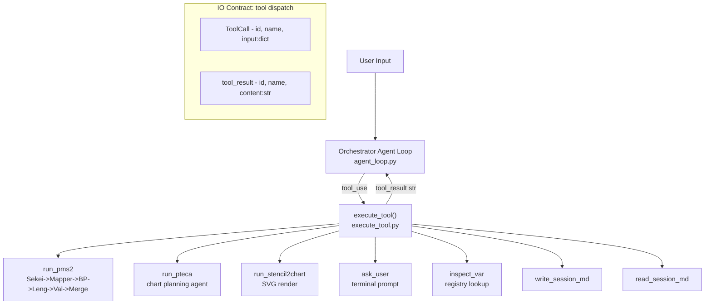
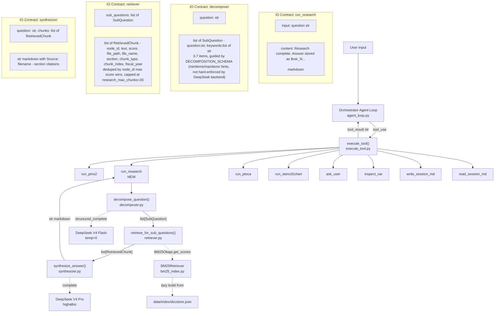
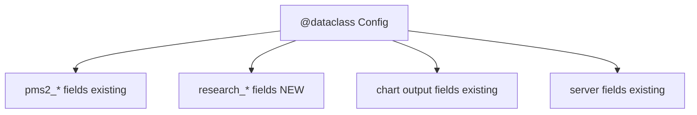
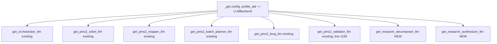
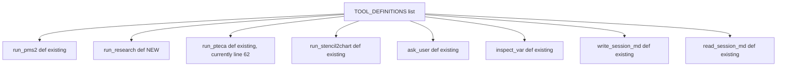
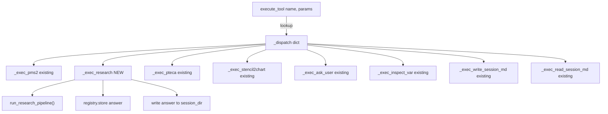
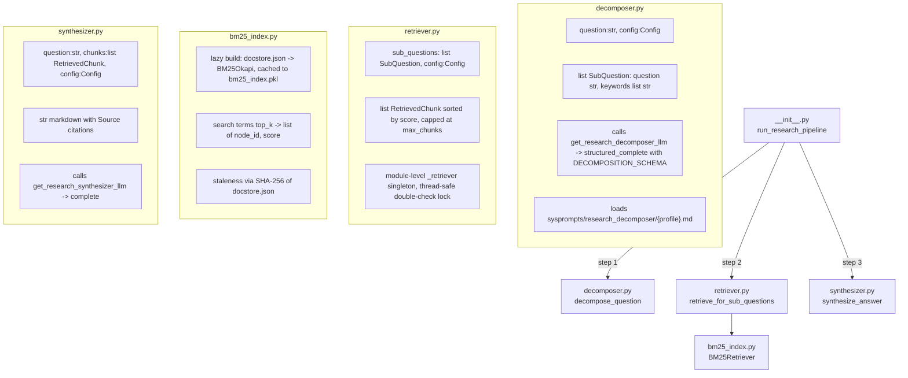

## Frontmatter
- Write date: 20260729
- Update date: 20260801
- Codebase last changed date: 20260801 (all line anchors below re-verified against HEAD 84c0290 on 20260801 — all accurate)
- Implemented: N
- Port `run_research` tool from wagasyanohimitunaLAG-osha branch into PSOAS_Jul20 harness. Research = open-ended QA via query decomposition -> BM25 retrieval -> cited synthesis. No plumbing changes at the tool-calling/tool-result contract level -- contracts are identical across both codebases. Mostly additive (new tool definition, new handler, new module, new config fields, new sysprompts) plus existing-file modifications (orchestrator sysprompt gets routing guidance). One deliberate behavioural divergence from the osha branch: `_exec_research` intercepts the module's empty-retrieval sentinels and surfaces them as `BUMMER retrieval empty` rather than storing them as an answer (F5, failure mode 10). The copied module itself stays verbatim.
- Source branch path: `../wagasyanohimitunaLAG-osha` (sibling directory at same level as PSOAS_Jul20, i.e. `HVCPipeline/KTQuery/Omaya/wagasyanohimitunaLAG-osha`)

## Problem space
- Problem definition: PSOAS_Jul20 has no open-ended QA capability. The `run_research` tool exists only in the osha branch. Today's demo needs both `run_pms2` (structured extraction) and `run_research` (qualitative QA) in the same REPL session.
- Failure instance: User asks "What is LITE's competitive outlook?" in PSOAS_Jul20 harness -> orchestrator has no tool to route to -> falls back to hallucinated answer from its own weights (no grounding).
- Points of failure:
  - Missing tool definition -> orchestrator doesn't know `run_research` exists
  - Missing handler -> `execute_tool` returns "unknown tool" error string
  - Missing config fields -> `Config` dataclass has no `research_*` attrs -> `AttributeError` at runtime
  - Missing LLM factory functions -> `ImportError` when decomposer/synthesizer try to instantiate backends
  - Missing sysprompt .md files -> `load_sysprompt` raises `FileNotFoundError`
  - Missing orchestrator sysprompt routing guidance -> orchestrator LLM has tool schema but no behavioral heuristics for when to pick `run_research` vs `run_pms2` -> routing misfires on qualitative questions
  - Missing `rank-bm25` in requirements.txt -> already installed in env but undeclared

## Outcome imagination
- Target UX: User types "What is LITE's competitive outlook?" -> orchestrator routes to `run_research` -> terminal shows decomposition + retrieval progress -> cited markdown answer printed + saved to session dir + stored as `$var_N` handle. Existing tools (`run_pms2`, `run_pteca`, etc.) unaffected.
- COLD START (measured 20260801): the **first** `run_research` call in a fresh checkout builds the BM25 index — `BM25Retriever._build()` (`bm25_index.py:124`) over all 1524 docstore nodes, writing `data/index/bm25_index.pkl`. The osha branch ships that pickle; PSOAS_Jul20 does **not** (`ls data/index/` -> `docstore.json`, `file_hashes.json`, `file_path_index.json` only). **Measured cost: 1.12s.** Subsequent calls `_load()` in 0.14s. No user-visible impact; see failure mode 9.
- Wat was desired by user: Same REPL, same harness, both quantitative extraction and qualitative research available as orchestrator tools.

# Solution space
- Idea of solving: Mostly additive port -- copy module, add config, add tool def, add handler, add dispatch entry, add sysprompts, add dep. One existing file modified: orchestrator sysprompt gets `run_research` tool listing + routing guidance.
- Type: patch (additive, non-breaking)
- Points of chg:
  - Graph (pipeline) design affected: One new leaf node (`run_research`) hanging off the orchestrator's dispatch table. One existing node touched: orchestrator sysprompt (add tool description + routing guidance).
  - Downstream nodes affected: None. `run_research` output is a plain string that enters the existing `tool_results` message flow identically to every other tool.

## Graph Change

### Current pipeline (PSOAS_Jul20)



### Proposed pipeline (with run_research)



### IO contract diff between original and proposed: NONE at the harness level

The `tool_use` -> `execute_tool()` -> `tool_result` contract is unchanged:
- `ToolCall{id:str, name:str, input:dict}` in
- `{id:str, name:str, content:str}` out
- Wrapped as `{"role":"tool_results", "content":[...]}` in messages array
- Translated per-provider identically (Anthropic -> `user` role with `tool_result` blocks, OpenAI -> `tool` role messages, Gemini -> `FunctionResponse` parts)

`run_research` is just another entry in `_dispatch` that returns a string. No new message types, no new content block types, no changes to `LLMResponse` or `ToolCall`.

## Hence File by file Change

### F1: `requirements.txt`
- Current: no `rank-bm25` line
- Proposed: add `rank-bm25>=0.2.2`
- No function graph -- it's a flat dep list

Produced by: `grep -in "bm25" requirements.txt` -> no hits.

Note `llama-index-core>=0.11.0` is already at `requirements.txt:8`, which covers `bm25_index.py:129`'s `SimpleDocumentStore` import. No change needed there.

### F2: `src/scripts/config.py`



- Current: `Config` dataclass ends at line 83 (`pms2_validator_max_workers`) then jumps to chart output at line 85.
- Proposed: Insert 4 fields between lines 83 and 85:
  ```python
  # ── Research (open-ended QA) LLM role → profile mapping ──────────
  research_decomposer_profile: str = "deepseek_v4flash_temp0"
  research_synthesizer_profile: str = "deepseek_v4pro_highalloc"

  # ── Research retrieval parameters ───────────────────────────────
  research_bm25_top_k: int = 5
  research_max_chunks: int = 20
  ```
- Input: nothing (default-valued dataclass fields)
- Output: consumed by `_get(config, "research_decomposer_profile")` in llm.py factories and by `retriever.py` for BM25 top_k/cap

#### F2b: EXISTING Config fields the research module reads (NO change needed — declared here so the contract is not invisible)

Produced by: `grep -rn "config\." ../wagasyanohimitunaLAG-osha/src/scripts/research/*.py`

| Field read | Read at | Present in PSOAS_Jul20? | Resolves to |
|---|---|---|---|
| `config.pms2_index_dir` | `retriever.py:57`, `retriever.py:64` | YES — `src/scripts/config.py:74` | `_PSOAS_ROOT / "data" / "index"` |
| `config.research_bm25_top_k` | `retriever.py:101` | NO — added by F2 | `5` |
| `config.research_max_chunks` | `retriever.py:111`, `__init__.py:85` | NO — added by F2 | `20` |
| `config.research_decomposer_profile` | `decomposer.py:80` | NO — added by F2 | `deepseek_v4flash_temp0` |
| `config.research_synthesizer_profile` | `synthesizer.py:52` | NO — added by F2 | `deepseek_v4pro_highalloc` |

`pms2_index_dir` is the load-bearing one and it is **not** added by this spec — it already exists and already points at the right directory. `retriever.py:57` raises `FileNotFoundError(f"docstore.json not found at {docstore_path}. Run 01_Chunk.py first.")` if it is wrong. Verified present: `grep -n "index_dir" src/scripts/config.py` -> `74: pms2_index_dir: Path = field(default_factory=lambda: _PSOAS_ROOT / "data" / "index")`.

Note: `config.py:37` also defines a *different* `index_dir` (PMS1 root). The research module does **not** use it. Do not conflate.

### F3: `src/scripts/llm.py`



- Current: ends at line 1183 with `get_pms2_validator_llm`.
- Proposed: Append after line 1183:
  ```python
  # ── Research factories ──────────────────────────────────────────────────

  def get_research_decomposer_llm(config: Config) -> LLMBackend:
      """Research decomposer LLM — splits open-ended question into sub-questions."""
      return _get(config, "research_decomposer_profile")

  def get_research_synthesizer_llm(config: Config) -> LLMBackend:
      """Research synthesizer LLM — cites retrieved chunks into coherent answer."""
      return _get(config, "research_synthesizer_profile")
  ```
- Input: `Config` with `research_decomposer_profile` / `research_synthesizer_profile` fields
- Output: `LLMBackend` instance (either `OpenAICompatibleLLM` for DeepSeek or `AnthropicLLM` etc depending on profile's provider)

### F4: `src/harness/system_prompt.py`



- Current: `TOOL_DEFINITIONS` has commented-out PMS1 block then jumps to `run_pteca` at line 62.
- Proposed: Insert `run_research` tool dict before `run_pteca` (between the commented PMS1 block and the PTECA block). WARNING: Do NOT copy this entire file from osha branch — the osha branch's system_prompt.py has different `run_pms2` input_schema (adds firms/periods/granularity fields) that must NOT be ported. Only insert the `run_research` block below:
  ```python
  # research (open-ended QA)
  {
      "name": "run_research",
      "description": (
          "Answer an open-ended qualitative question by searching ingested "
          "documents. Decomposes the question into sub-questions, retrieves "
          "relevant chunks via BM25 keyword search, and synthesizes a cited "
          "answer. Use for questions like 'What is LITE's competitive "
          "outlook?', 'Summarize the bull case for Coherent', or 'How does "
          "Furukawa Electric view the optical fiber market?'. Do NOT use "
          "for tabular data extraction — use run_pms2 for metrics like "
          "revenue, EPS, margins with specific periods."
      ),
      "input_schema": {
          "type": "object",
          "properties": {
              "question": {
                  "type": "string",
                  "description": (
                      "The open-ended question to research. Pass the user's "
                      "query as-is — the research pipeline handles "
                      "decomposition internally."
                  ),
              },
          },
          "required": ["question"],
      },
  },
  ```
- Input contract (to the LLM): `{"question": str}` -- single required field
- Output: this dict is passed to `messages.create(tools=...)` or equivalent per-provider

### F5: `src/harness/execute_tool.py`



- Current: `_exec_inspect_var` at line 278, dispatch table at line 301.
- Proposed (two changes). WARNING: Do NOT copy this entire file from osha branch — the osha branch's execute_tool.py has different `_exec_pms2` signature (adds firms/periods/granularity params) that must NOT be ported. Only make the two targeted additions below:
  1. Insert `_exec_research` function before `_exec_inspect_var` (before line 278):
     ```python
     # Both empty-result sentinels in the research module start with this.
     # Verified against the copied source:
     #   research/__init__.py:90  "**No relevant chunks found.** ..."
     #   research/synthesizer.py:45 "**No relevant documents found.** ..."
     _RESEARCH_EMPTY_PREFIX = "**No relevant "


     def _exec_research(params: dict) -> str:
         from src.scripts.research import run_research_pipeline

         if _session_dir is None:
             return "Error: no active session (run_research called outside harness)."

         question = params["question"]
         channel = register("RESEARCH")

         answer = run_research_pipeline(
             question=question,
             config=_config,
             session_dir=_session_dir,
             channel=channel,
             debug_dir=_debug_dir,
         )

         if answer.startswith(_RESEARCH_EMPTY_PREFIX):
             return (
                 "BUMMER retrieval empty — no documents matched this question. "
                 "No handle was stored and no file was written. Do not present "
                 "this as an answer; tell the user the corpus had nothing, or "
                 "retry with a more specific question.\n\n"
                 f"{answer}"
             )

         handle = registry.store(answer, f"Research: {question[:80]}")

         safe_name = re.sub(r"[^\w\s\-]", "", question[:50]).strip().replace(" ", "_")
         answer_path = _session_dir / f"research_{safe_name}.md"
         answer_path.write_text(answer, encoding="utf-8")

         return (
             f"Research complete. Answer stored as {handle}. "
             f"Saved to: {answer_path}\n\n{answer}"
         )
     ```
  2. Add `"run_research": _exec_research,` to `_dispatch` dict (after `"run_pms2"` entry).
- Handler input: `params = {"question": str}` — note handlers receive **resolved** params: `execute_tool` runs `_resolve_handles(params)` at `execute_tool.py:326` before dispatch, which substitutes any value that `startswith("$var_")` (`:81`). A research question never does, so this is a no-op here — recorded so the contract is not a surprise. `run_research` is not in the `inspect_var` bypass at `:323`.
- Error contract, verified: `execute_tool` wraps the handler in `try/except Exception` (`:327-329`), flushes the trace, and returns `f"Error: {e}"` (`:342`). This is what failure modes 2 and 3 rely on.
- Handler output: `str`, one of three shapes:
  - success -- `"Research complete. Answer stored as $var_N. Saved to: <path>\n\n<markdown>"`
  - empty retrieval -- `"BUMMER retrieval empty — ...\n\n<sentinel text>"`, **no handle, no file**
  - no session -- `"Error: no active session ..."`
- **Why the empty case is intercepted here and not in the module:** F6 is a verbatim copy (F6d), so the module keeps returning its own sentinels. The divergence lives in hand-written code. Cost: detection is a string-prefix match on a literal owned by another branch — if a future re-copy reworded it, detection would silently stop and empty results would again look like answers. U10 is the guard against exactly that.
- Dependencies within execute_tool.py: `_session_dir`, `_config`, `_debug_dir` (module-level state, already exist), `registry` (OpaqueRegistry singleton, already imported), `register` (from `terminal_router`, already imported), `re` (already imported at line 15 -- verified)

### F6: `src/scripts/research/` (new directory, 5 files -- copy verbatim)



Files to copy verbatim from `../wagasyanohimitunaLAG-osha/src/scripts/research/`.

Produced by: `wc -l ../wagasyanohimitunaLAG-osha/src/scripts/research/*.py`

| File | LOC | Public surface |
|---|---|---|
| `__init__.py` | 105 | `run_research_pipeline` |
| `bm25_index.py` | 229 | `BM25Retriever` |
| `decomposer.py` | 102 | `decompose_question`, `SubQuestion`, `DECOMPOSITION_SCHEMA` |
| `retriever.py` | 135 | `retrieve_for_sub_questions`, `RetrievedChunk` |
| `synthesizer.py` | 87 | `synthesize_answer` |
| **total** | **658** | |

Do NOT copy `.DS_Store` or `__pycache__/` (both present in the source dir).

#### F6a: Function-level API (source line anchors are in the OSHA branch, pre-copy)

Produced by: `grep -n "^def \|^class \|^DECOMPOSITION_SCHEMA\|    def " ../wagasyanohimitunaLAG-osha/src/scripts/research/*.py`

| Symbol | Anchor | Signature / shape |
|---|---|---|
| `run_research_pipeline` | `__init__.py:20` | `(question: str, config: Config, session_dir: Path, channel: ToolChannel, debug_dir: Path \| None = None) -> str` |
| `SubQuestion` | `decomposer.py:26` | dataclass: `question: str`, `keywords: list[str]` |
| `DECOMPOSITION_SCHEMA` | `decomposer.py:34` | `{"sub_questions": [{"question": str, "keywords": [str]}]}`, `minItems:3 / maxItems:7`, `required:["sub_questions"]` |
| `decompose_question` | `decomposer.py:62` | `(question: str, config: Config) -> list[SubQuestion]` |
| `RetrievedChunk` | `retriever.py:22` | dataclass: `node_id:str`, `text:str`, `score:float`, `file_path:str`, `file_name:str`, `section:str=""`, `chunk_type:str="text"`, `chunk_index:int=0`, `fiscal_year:str=""` |
| `_get_retriever` | `retriever.py:42` | `(config: Config) -> BM25Retriever` — module singleton `_retriever` (`:38`) + double-check lock (`:46-55`) |
| `retrieve_for_sub_questions` | `retriever.py:68` | `(sub_questions: list, config: Config) -> list[RetrievedChunk]` — dedup by `node_id` max-score (`:103`), sort desc (`:108`), cap at `research_max_chunks` (`:111`) |
| `synthesize_answer` | `synthesizer.py:20` | `(question: str, chunks: list, config: Config) -> str` — early-returns a fixed "No relevant documents found" string when `chunks` is empty (`:32-38`) |
| `BM25Retriever` | `bm25_index.py:26` | class |
| `BM25Retriever.__init__` | `bm25_index.py:41` | `(index_dir: Path, docstore_path: Path)` — pickle target is `index_dir / "bm25_index.pkl"` |
| `BM25Retriever.ensure_ready` | `bm25_index.py:56` | `() -> None` — `_load()` else `_build()` |
| `BM25Retriever.search` | `bm25_index.py:69` | `(terms: list[str], top_k: int = 5) -> list[tuple[str, float]]` — `terms` must be **pre-tokenized, lowercased**; caller does this at `retriever.py:97` |
| `BM25Retriever.get_text` | `bm25_index.py:101` | `(node_id: str) -> str` — `""` on miss |
| `BM25Retriever.get_metadata` | `bm25_index.py:106` | `(node_id: str) -> dict` — `{}` on miss |
| `BM25Retriever._get_docstore_hash` | `bm25_index.py:113` | `() -> str` — SHA-256 of docstore.json, staleness key |
| `BM25Retriever._build` | `bm25_index.py:124` | `() -> None` — raises `ValueError` at `:167` if no usable chunks |
| `BM25Retriever._load` | `bm25_index.py:195` | `() -> bool` — `False` on hash mismatch (`:209`) or unpickling failure |

Pipeline control flow inside `__init__.py`: decompose (`:47-68`) -> retrieve (`:70-88`) -> **early return** of a fixed "No relevant chunks found" string if retrieval is empty (`:88-93`) -> synthesize (`:95-101`) -> return answer (`:105`). Every stage wraps in `try/except Exception`, prints `[RESEARCH] <stage> failed: {exc}` to the channel, then **re-raises** — so `_exec_research` never sees a swallowed error.

#### F6b: Import compatibility — verified, not assumed

Produced by: `grep -n "^from\|^import\|    from \|    import " ../wagasyanohimitunaLAG-osha/src/scripts/research/*.py`

| Import | Sites | Resolves in PSOAS_Jul20? |
|---|---|---|
| `from src.config import Config` | `__init__.py:16`, `decomposer.py:21`, `retriever.py:18`, `synthesizer.py:16` | YES — via `src/__init__.py:6-11`, which appends `src/scripts/` to `__path__`, so `src.config` -> `src/scripts/config.py`. Already relied on by `execute_tool.py:23`, `llm.py:30`, `agent_loop.py:31` |
| `from src.harness.terminal_router import ToolChannel` | `__init__.py:17` | YES — `terminal_router.py:166` (class), `:172` `print(msg, markdown=False)`, `:327` `register(label) -> ToolChannel` |
| `from src.harness.sysprompts import load_sysprompt` | `decomposer.py:22`, `synthesizer.py:17` | YES — `sysprompts.py:20` `load_sysprompt(role, profile, **template_vars)` |
| `from src.scripts.llm import get_research_*_llm` | `decomposer.py:77`, `synthesizer.py:41` (lazy, in-function) | AFTER F3 only — these two factories do not exist yet |
| `from src.scripts.research.*` | `retriever.py:19`, `__init__.py:47-49` | YES once F6 lands |
| `from rank_bm25 import BM25Okapi` | `bm25_index.py:126`, `:212` | Installed in env; **undeclared** — F1 fixes |
| `from llama_index.core.storage.docstore import SimpleDocumentStore` | `bm25_index.py:129` | YES — `llama-index-core>=0.11.0` already at `requirements.txt:8` |

LLM backend call contracts, verified against PSOAS's `LLMBackend` base class:

| Call | Made at | PSOAS signature |
|---|---|---|
| `backend.structured_complete(prompt=, schema=, system_prompt=, label=)` | `decomposer.py:83` | `llm.py:159` — `(prompt, schema, system_prompt=None, label="", web_search=False) -> dict`. MATCH |
| `backend.complete(prompt=, system_prompt=, label=)` | `synthesizer.py:83` | `llm.py:123` — `(prompt, system_prompt=None, label="") -> str`. MATCH |

Profile strings both resolve through the existing `_get()` profile table — `deepseek_v4flash_temp0` is already in live use at `config.py:59` (`pto_hyde_profile`), `deepseek_v4pro_highalloc` at `config.py:58` (`sekei_profile`).

#### F6c: docstore.json dependency — PSOAS's own file, schema verified

The retriever indexes **PSOAS_Jul20's** `data/index/docstore.json`, not the osha branch's. The two files are the same byte size (7820518) but have **different md5** (`c2671530…` vs `e9c46990…`) — do not copy osha's over, and do not copy osha's prebuilt `bm25_index.pkl` either (its `docstore_hash` would mismatch and `_load()` would rebuild anyway).

Metadata fields read by `bm25_index.py:158-163` and `retriever.py:116-127`, checked against PSOAS's docstore:

Produced by: `python3 -c` over `json.load(open("data/index/docstore.json"))["docstore/data"]`, counting `__data__.metadata` keys across all nodes.

| Field | Read at | Present in PSOAS docstore | Note |
|---|---|---|---|
| `file_name` | `bm25_index.py:159` | 1524 / 1524 | |
| `file_path` | `bm25_index.py:158` | 1524 / 1524 | |
| `section` | `bm25_index.py:160` | 1524 / 1524 | used in citation lines |
| `chunk_type` | `bm25_index.py:161` | 1524 / 1524 | |
| `chunk_index` | `bm25_index.py:162` | 1524 / 1524 | **stored as str** — see below |
| `fiscal_year` | `bm25_index.py:163` | 1524 / 1524 | often `""` |

All reads are `.get(key, default)`, so a missing field degrades a citation rather than crashing.

**Type mismatch (accepted, not fixed):** docstore stores `chunk_index` as a string (`'chunk_index': '0'`). `RetrievedChunk.chunk_index` is annotated `int` (`retriever.py:33`). Dataclasses do not coerce, so the field holds a `str` at runtime. Harmless today — `synthesizer.py:56-64` builds citation lines from `file_name`/`section`/`fiscal_year` only and never reads `chunk_index`. Documented so a future consumer does not do arithmetic on it.

#### F6d: "Verbatim" means verbatim — two smells you must NOT clean up

1. `retriever.py:135` has a module-**bottom** `from pathlib import Path`, consumed at `retriever.py:123` inside the function body. This is legal (the function runs after module import completes) but looks like a mistake. Moving it to the top is safe; deleting it is not. Leave it.
2. `retriever.py:16` imports `field` from `dataclasses` and never uses it. Dead import. Leave it — removing it is a gratuitous diff against the source branch.

Neither is worth a divergence from the osha original. If they are ever cleaned up, do it in a separate commit so the port itself stays a pure copy.

### F7: `sysprompts/research_decomposer/deepseek_v4flash_temp0.md` (new file, 19 lines — `wc -l`)
- Copy verbatim from `wagasyanohimitunaLAG-osha/sysprompts/research_decomposer/deepseek_v4flash_temp0.md`
- Instructions for query decomposition LLM
- No template vars, plain text

### F8: `sysprompts/research_synthesizer/deepseek_v4pro_highalloc.md` (new file, 29 lines — `wc -l`)
- Copy verbatim from `wagasyanohimitunaLAG-osha/sysprompts/research_synthesizer/deepseek_v4pro_highalloc.md`
- Instructions for synthesis LLM: citation format, answer structure, style
- No template vars, plain text

### F9: `sysprompts/orchestrator/deepseek_v4pro_orchestrator.md` (existing file, modify)
- Current: No mention of `run_research` in tool list or routing guidance.
- Proposed (two changes):
  1. In "## Your tools" section, insert `run_research` entry after `run_pms2` (after the line ending "...one opaque handle per firm.", before the `run_pteca` entry):
     ```markdown
     - run_research: Answer open-ended qualitative questions by searching
       ingested documents. Decomposes the question into sub-questions,
       retrieves relevant chunks via BM25 keyword search, and synthesizes
       a cited answer. Use for questions like "What is LITE's competitive
       outlook?" or "Summarize the bull case for Coherent." Single call
       handles the full question — no pre-processing needed.
     ```
  2. Insert new section "## When to use run_research vs run_pms2" after "Pass all resulting handles to a single run_pteca call." and before "## Opaque variable handles":
     ```markdown
     ## When to use run_research vs run_pms2

     - Use run_pms2 when the user asks for specific financial metrics
       (revenue, EPS, margins, etc.) with explicit periods (FY2025, Q3, etc.).
       run_pms2 takes a query string — pass the full request as-is.

     - Use run_research when the user asks open-ended qualitative questions
       about competitive positioning, strategy, market outlook, bull/bear
       cases, management commentary, risk factors, or industry analysis.
       run_research only requires the question text — no firms/periods needed.
     ```
- Why this matters: TOOL_DEFINITIONS gives the LLM the schema, but the orchestrator sysprompt drives routing quality. Without explicit routing guidance, the LLM may default to `run_pms2` for qualitative questions (especially since `run_pms2` is listed first and the model has strong priors toward structured extraction from training context).
- WARNING: Do NOT overwrite this file with the osha branch version. The osha branch's orchestrator sysprompt has a different "## PMS2 extraction parameters" section that describes `run_pms2` with firms/periods/granularity params (matching the osha branch's expanded `run_pms2` input_schema). PSOAS_Jul20's `run_pms2` only takes `query` — overwriting would cause the orchestrator to pass firms/periods/granularity to a tool that doesn't accept them. Make the two targeted insertions described above instead.

## Failure modes

1. **`rank-bm25` not installed** -> `ImportError` on first `run_research` call, at `bm25_index.py:126`. Blast radius: research tool only, rest of harness unaffected. Currently installed in env but not pinned in requirements.txt.

2. **`docstore.json` is empty or has no usable chunks** (all chunks <10 tokens) -> `ValueError("docstore contains no usable chunks")` at `bm25_index.py:167`. Blast radius: research tool only. Propagation: `__init__.py` catches via `except Exception`, logs, re-raises -> `execute_tool` catches via `except Exception as e` and returns `f"Error: {e}"` as tool_result string. Orchestrator sees error, can inform user.

3. **Decomposer LLM returns malformed JSON** -> `structured_complete` retries internally (existing retry logic in `llm.py`). If all retries fail -> exception propagates -> `_exec_research` crashes -> `execute_tool` catches via `except Exception as e` and returns `f"Error: {e}"` as tool_result (error message only, no traceback — traceback is swallowed, only the trace flush captures details). Orchestrator sees error, can retry or inform user. Blast radius: single tool call.

4. **Synthesizer LLM returns empty/garbage** -> `complete()` returns whatever the model said. No validation on output. Worst case: user sees a bad answer. No crash path.

5. **`_session_dir is None`** -> `_exec_research` returns error string immediately. Can happen if `run_research` is called outside the harness (e.g., from a test without `init_session()`). Blast radius: none, graceful.

6. **BM25 pickle cache corruption** -> `_load()` catches `pickle.UnpicklingError`, returns `False`, triggers rebuild. Self-healing.

7. **No new nondeterministic nodes introduced to existing tools.** The 2 new LLM calls (decomposer, synthesizer) are fully contained within the research pipeline. PMS2, PTECA, stencil2chart paths are untouched.

8. **Orchestrator routes qualitative question to `run_pms2` instead of `run_research`** -> Without routing guidance in the orchestrator sysprompt, the LLM may pick `run_pms2` for open-ended questions (especially since it's listed first and the model has priors toward structured extraction). `run_pms2` would then attempt structured metric extraction on a qualitative query — Sekei would fail to decompose "What is LITE's competitive outlook?" into extractable metrics, producing garbage or crashing. Mitigation: F9 adds explicit routing guidance to the orchestrator sysprompt.

9. **Cold-start BM25 build — measured 20260801, a non-issue.** `data/index/bm25_index.pkl` does not exist in PSOAS_Jul20, so the first `run_research` call runs `_build()` (`bm25_index.py:124`). Measured against the real 7.8 MB docstore: **build 1.12s**, producing a 5.8 MB pickle; warm `_load()` **0.14s**; one `search()` **0.16s**. A one-second pause, not a hang. No mitigation needed; step 7 of the execution order is a convenience, not a requirement.

    Reproduce: `scratchpad/time_bm25.py` — instantiate `BM25Retriever(<tmp dir>, <PSOAS docstore.json>)`, time `_build()`, then a fresh instance's `_load()`.

10. **Empty retrieval — handled, but by string matching.** If BM25 matches nothing, the module returns a fixed sentinel rather than raising: `__init__.py:88-93` `"**No relevant chunks found.** ..."`, and `synthesizer.py:43-48` `"**No relevant documents found.** ..."` for the direct-call path. Both are normal `str` returns. `_exec_research` intercepts them on the shared `"**No relevant "` prefix (F5) and returns a `BUMMER retrieval empty` line instead, storing no handle and writing no file, so the orchestrator cannot mistake a non-answer for an answer.

    Residual fragility: the check is a prefix match on a literal owned by the osha branch. A re-copy that reworded either sentinel would silently disable interception and restore the original defect — an empty result presented as `"Research complete."`. U10 pins the two literals against the constant; if it fails, fix the constant, not the test.

11. **`chunk_index` is a str where the dataclass says int** (`retriever.py:33` vs docstore `'chunk_index': '0'`). No crash — dataclasses do not coerce, and nothing downstream reads the field (`synthesizer.py:56-64` uses `file_name`/`section`/`fiscal_year` only). Latent: any future consumer doing arithmetic or sorting on `chunk_index` gets string semantics. Documented in F6c.

12. **No source diversity in retrieval — measured 20260801.** A real search of the live index for `["lumentum", "lite", "optical", "revenue"]` at `top_k=5` returned **all 5 hits from the same document** (`20251125_Mizuho_Securities_LITE...`, scores 11.05 / 10.82 / 10.64 / 10.28 / 10.04). BM25 has no per-document cap, so a long report that repeats the query terms sweeps the whole top-k. Dedup at `retriever.py:103` is by `node_id`, not by `file_path`, so it does not counteract this.

    Consequence: with `research_bm25_top_k=5` over 3-7 sub-questions, and sub-questions sharing vocabulary (which F7's sysprompt actively encourages — "pair them with specifics like *LITE optical revenue outlook*"), the capped 20-chunk context handed to the synthesizer can be dominated by one or two documents. The answer will be confidently cited and narrowly sourced — the citation format hides this, since every line carries a `[Source: ...]` and the reader must notice they are all the same file.

    Not fixed here. This is retrieval-quality, not a port defect — the osha branch has the same behaviour. Cheapest mitigation if the demo looks thin: raise `research_bm25_top_k` so more documents clear the bar, or add a per-`file_path` cap in the dedup loop at `retriever.py:102-105`. Both are post-port changes.

## Unit tests

Test file location: `tests/test_21_osha_research.py`

Eleven tests, all offline — no API key, no network, no LLM call. The whole file must be green before any LLM test runs.

The port is mostly verbatim-copied code that already runs on the osha branch, so these do not re-test it. They cover what is genuinely new: PSOAS's own corpus matching the shape the copied retriever assumes, the seams where hand-written code calls copied code, the empty-retrieval interception, and the two edits that leave no runtime trace if you skip them.

### Harness convention (project has no conftest.py / pytest.ini / pyproject.toml — verified by `ls`)

Follow `tests/test_spec19_unit.py:6-14` exactly — pytest + hand-rolled sys.path bootstrap:

```python
import sys
from pathlib import Path

import pytest

_project_root = Path(__file__).resolve().parent.parent
if str(_project_root) not in sys.path:
    sys.path.insert(0, str(_project_root))
```

Run command, from project root: `python -m pytest tests/test_21_osha_research.py -v`

### HARD RULE: no test may write to `data/index/`

`BM25Retriever.__init__` sets `self._index_path = index_dir / "bm25_index.pkl"` (`bm25_index.py:42`) and `_build()` writes it (`bm25_index.py:176-187`). Passing `config.pms2_index_dir` into a test therefore **writes a 1524-node pickle into the live corpus directory**, and any test that mutates `docstore.json` to exercise staleness would corrupt the real 7.8 MB index.

Every test that builds an index constructs `BM25Retriever(tmp_path, <a docstore under tmp_path>)`. U0/U1 read `config.pms2_index_dir` but only stat and `json.load` it. U6 needs the *real* corpus, so it copies `docstore.json` into `tmp_path` first and builds there (see `live_corpus_config` below) — 7.8 MB and ~1.1s, the price of keeping this rule absolute.

If `git status` shows `data/index/bm25_index.pkl` after a test run, a test broke this rule. Delete the file and fix the test.

### Fixtures

```python
@pytest.fixture
def tmp_docstore(tmp_path):
    """Synthetic llama-index docstore — 3 nodes, each >=10 tokens.

    _build() reads via SimpleDocumentStore.from_persist_path (bm25_index.py:137)
    and drops any chunk whose text has <10 whitespace tokens (bm25_index.py:151),
    so fixture text must clear that bar.
    """
    from llama_index.core.schema import TextNode
    from llama_index.core.storage.docstore import SimpleDocumentStore

    nodes = [
        TextNode(
            id_=f"n{i}",
            text=(f"Lumentum LITE optical revenue outlook datacom transceivers "
                  f"grew in fiscal year twenty twenty six segment {i}"),
            metadata={
                "file_name": f"doc{i}.md", "file_path": f"LITE/doc{i}.md",
                "section": f"Section {i}", "chunk_type": "text",
                "chunk_index": str(i), "fiscal_year": "FY2026",
            },
        )
        for i in range(3)
    ]
    ds = SimpleDocumentStore()
    ds.add_documents(nodes)
    path = tmp_path / "docstore.json"
    ds.persist(str(path))
    return path


@pytest.fixture
def live_corpus_config(tmp_path):
    """Config pointed at a throwaway copy of the REAL docstore.

    U6 must retrieve against real documents, but the HARD RULE forbids
    building an index inside data/index/. Copy out, repoint, build there.
    """
    import shutil
    from dataclasses import replace
    from src.scripts.config import Config

    config = Config()
    shutil.copy(config.pms2_index_dir / "docstore.json", tmp_path / "docstore.json")
    return replace(config, pms2_index_dir=tmp_path)


@pytest.fixture(autouse=True)
def reset_research_singleton():
    """retriever.py:38 caches _retriever process-globally. U6 populates it;
    without a reset, test order changes outcomes."""
    import src.scripts.research.retriever as r
    r._retriever = None
    yield
    r._retriever = None
```

### Deterministic tests

Grouped by concern, so IDs are not in numeric order. Full set is U0-U10.

**The corpus — the copied module was written against a different one**

- U0: `config.pms2_index_dir` exists, is a directory, and contains `docstore.json`. Locks the F2b dependency — the one pre-existing config field the whole retriever hangs off. **Read-only** -- built: Y, ran: Y
- U1: every node in `data/index/docstore.json` carries all 6 metadata fields the retriever reads (`file_name`, `file_path`, `section`, `chunk_type`, `chunk_index`, `fiscal_year`). Currently 1524/1524; locks F6c. **Read-only — `json.load` and assert, never persist back.** The failure this catches is silent: reads are `.get(key, default)`, so a missing `section` or `file_name` produces blank citations in every answer without raising anything -- built: Y, ran: Y
- U6: real retrieval — build over `live_corpus_config`, then `retrieve_for_sub_questions([SubQuestion("LITE optical revenue outlook", ["lumentum","lite","optical","revenue"])], live_corpus_config)` returns a non-empty `list[RetrievedChunk]` whose `file_name` and `section` are non-empty. Hardcoded sub-questions, so no LLM. The only test proving your corpus can actually answer a question -- built: Y, ran: Y

**Index cache invalidation — where this class of code rots**

- U2: staleness — build on `tmp_path`, rewrite `tmp_docstore` (persist a 4th node) so its SHA-256 changes (`bm25_index.py:113-122`), then a fresh retriever's `_load()` returns `False` (`bm25_index.py:209`). Without this, an ingest that adds documents leaves research silently answering from the old corpus. Exercises `_build()` and the pickle persist as its precondition -- built: Y, ran: Y
- U3: corruption — truncate `tmp_path / "bm25_index.pkl"` to 10 bytes -> `_load()` returns `False` via the `except (KeyError, EOFError, pickle.UnpicklingError, ImportError)` at `bm25_index.py:228`, i.e. rebuilds rather than crashing. Locks failure mode 6 -- built: Y, ran: Y

**Seams — hand-written code calling copied code**

- U4: `run_research_pipeline` is importable and its signature is `(question, config, session_dir, channel, debug_dir=None)` via `inspect.signature`. Locks the F6a contract that `_exec_research` (F5) invokes by keyword — the only such call site -- built: Y, ran: Y
- U5: dispatch symmetry — `set(_dispatch.keys()) == {d["name"] for d in TOOL_DEFINITIONS}`. Catches F4 landing without F5 or vice versa, which makes the orchestrator call a tool that resolves to "unknown tool" — a confusing failure rather than an obvious one. The commented-out `run_pms1` entries in both files must stay commented for this to hold -- built: Y, ran: Y

**Empty-retrieval interception (F5) — hand-written, and the only behavioural divergence from the osha branch**

- U9: monkeypatch `run_research_pipeline` to return `"**No relevant chunks found.** ..."`, call `_exec_research({"question": "x"})` with `_session_dir` set to `tmp_path`, and assert the result starts with `"BUMMER retrieval empty"`, that `tmp_path` gained no `research_*.md`, and that no new handle was stored. Locks failure mode 10 -- built: Y, ran: Y
- U10: the copied module's literals still match the constant — read `src/scripts/research/__init__.py` and `src/scripts/research/synthesizer.py` and assert both contain a `"**No relevant "` string, i.e. `_RESEARCH_EMPTY_PREFIX` is still a valid prefix for each. This is the guard on the fragile seam: a re-copy that reworded either sentinel would silently un-fix failure mode 10, and nothing else would notice -- built: Y, ran: Y

**Edits that leave no runtime trace**

Every other edit in this spec announces itself on the first `run_research` call — a missing config field raises `AttributeError`, a missing sysprompt raises `FileNotFoundError`, a missing module raises `ImportError`. These two do not, so they need tests.

- U7: `requirements.txt` contains a `rank-bm25` line (locks F1). `rank_bm25` is already installed in this env and nothing at runtime reads `requirements.txt`, so the demo passes whether or not F1 was applied. The breakage lands on a fresh clone, weeks later -- built: Y, ran: Y
- U8: `sysprompts/orchestrator/deepseek_v4pro_orchestrator.md` contains `"run_research"` and the `"When to use run_research"` heading (locks F9). Otherwise only L2/L3 cover it, and they are nondeterministic — a missing sysprompt edit plus a lucky model pick is a green test over a latent bug -- built: Y, ran: Y

## LLM unit tests

Test file location: `tests/test_21_osha_research_llm.py`

One test per LLM call site. There are three in the changed system — decomposer, synthesizer, orchestrator — and each is tested in isolation, so a failure names the node. No end-to-end test: an E2E failure tells you the pipeline broke, not which stage, and its retrieval leg is already covered deterministically by U6.

| ID | Node | Call site |
|---|---|---|
| L0 | decomposer | `decomposer.py:83` `structured_complete` |
| L1 | synthesizer | `synthesizer.py:83` `complete` |
| L2, L3 | orchestrator | `call_with_tools` with `TOOL_DEFINITIONS` |

Preconditions, stated so a runner does not misread cost as a bug:
- Requires `DEEPSEEK_API_KEY`. Gate the whole module with `pytestmark = pytest.mark.skipif(not os.getenv("DEEPSEEK_API_KEY"), reason=...)`. L2/L3 additionally require whatever provider `orchestrator_profile` resolves to.
- **These cost money.** One API call each, four total.
- Requires `tests/test_21_osha_research.py` green first.

- L0: `decompose_question("What is LITE's competitive outlook?", config)` returns 3-7 `SubQuestion`s, each with a non-empty `question` and a non-empty `keywords` list. Note `minItems`/`maxItems` in `DECOMPOSITION_SCHEMA` are hints the DeepSeek backend does not hard-enforce (F6a), so the count assertion tests the model, not the schema -- built: N, ran: N
- L1: `synthesize_answer(question, chunks, config)` over 3 hand-built `RetrievedChunk`s returns non-empty markdown containing at least one `[Source:`. Assert the **prefix only** — F8's sysprompt mandates `[Source: {file_name} — {section}]` but the em-dash is model-discretionary -- built: N, ran: N
- L2: orchestrator selects `run_research` for a qualitative question ("What is LITE's competitive outlook?"). **The highest-value test in this spec.** Everything else is copied code that already runs on the osha branch; F9's routing guidance is new, is prose in a sysprompt, and is the only thing standing between a qualitative question and `run_pms2` attempting metric extraction on it (failure mode 8) -- built: N, ran: N
- L3: orchestrator still selects `run_pms2` for a quantitative question ("LITE revenue FY2025"). The regression half of L2 — F9 adds text that could pull structured requests toward `run_research` as easily as the reverse. Mirrors acceptance step 4 -- built: N, ran: N

### Not tested, deliberately

Failure mode 12 (no source diversity — a live search returned all 5 hits from one document) has **no test**. It is retrieval quality, not a port defect, and the osha branch behaves identically. It cannot fail a build; it can only make the demo answer look narrow. Watch for it by eye at acceptance step 3 — if every `[Source:` line names the same file, raise `research_bm25_top_k` or add a per-`file_path` cap at `retriever.py:102-105`. Both are post-port changes.

## Execution

- Spec size: ~700 lines. Small mostly-additive port: **7 new source files** (5 `src/scripts/research/*.py` + 2 sysprompt `.md`), **6 existing files modified** (`requirements.txt`, `config.py`, `llm.py`, `system_prompt.py`, `execute_tool.py`, orchestrator sysprompt), plus 2 new test files. Feasible as a single-session oneshot.
- Branch: work on `PSOAS` (current). One commit per numbered step below, so a routing regression can be reverted at step 7 without losing the module.

### Order

1. **Deps.** Apply F1. Then `pip install -r requirements.txt`. Locally a no-op — `rank_bm25` is already importable — but a fresh clone breaks without it. This is the edit with no runtime symptom; U7 is what catches skipping it.

2. **Config + factories.** F2 (`config.py`, 4 new fields between lines 83 and 85) + F3 (`llm.py`, append after line 1183). No interdependency. Do NOT add `pms2_index_dir` — it already exists at `config.py:74` (F2b).

3. **Copy the module.** F6:
   ```bash
   cp ../wagasyanohimitunaLAG-osha/src/scripts/research/*.py src/scripts/research/   # mkdir -p first
   ```
   `mkdir -p src/scripts/research` first. Copy `*.py` only — the source dir also contains `.DS_Store` and `__pycache__/`. `__init__.py` is among the 5 files, so the package initialises itself; no extra file to author. Do not "fix" the two smells in F6d.

4. **Sysprompts.** F7 + F8. Both target directories are absent in PSOAS_Jul20 and must be created:
   ```bash
   mkdir -p sysprompts/research_decomposer sysprompts/research_synthesizer
   cp ../wagasyanohimitunaLAG-osha/sysprompts/research_decomposer/deepseek_v4flash_temp0.md sysprompts/research_decomposer/
   cp ../wagasyanohimitunaLAG-osha/sysprompts/research_synthesizer/deepseek_v4pro_highalloc.md sysprompts/research_synthesizer/
   ```

5. **Wiring.** F4 (`system_prompt.py`) + F5 (`execute_tool.py`) + F9 (orchestrator sysprompt). All three are targeted insertions — re-read the WARNING in each before touching the file; none of these three files may be copied wholesale from the osha branch.

6. **Deterministic tests.** Build `tests/test_21_osha_research.py` per the harness convention, then `python -m pytest tests/test_21_osha_research.py -v`. All of U0-U10 must pass — no skips, none is env-gated. No test writes to `data/index/` — if `git status` shows `data/index/bm25_index.pkl` after this step, a test violated the HARD RULE; delete it and fix the test.

7. **OPTIONAL — warm the index out-of-band.** Measured at 1.12s (failure mode 9), so this buys almost nothing; keep it only if you want the artifact on disk before the demo:
   ```bash
   python -c "from src.scripts.config import Config; from src.scripts.research.bm25_index import BM25Retriever; c=Config(); r=BM25Retriever(c.pms2_index_dir, c.pms2_index_dir/'docstore.json'); r.ensure_ready(); print(len(r._node_ids), 'nodes indexed')"
   ```
   Expect **1524 nodes** — measured 20260801, the `<10`-token filter at `bm25_index.py:151` drops **zero** chunks from this corpus. Any other number means the docstore changed. This writes `data/index/bm25_index.pkl` (**5.8 MB**) intentionally; it is a build artifact, not source, and it regenerates in ~1s from `docstore.json`. Gitignore it.

8. **LLM tests.** `python -m pytest tests/test_21_osha_research_llm.py -v`. L0-L3, 4 API calls total. These cost money; see the preconditions in the LLM unit tests section. L2/L3 are the pair that can fail on an otherwise-correct port — if they do, the fault is F9's sysprompt wording, not the module.

### Acceptance criterion

Tests passing is not the deliverable — the demo is. Final step, in the real harness:

1. Launch the REPL.
2. Ask a qualitative question: `What is LITE's competitive outlook?`
3. Confirm, in order: orchestrator selects `run_research` (not `run_pms2`); `[RESEARCH] Decomposing:` then 3-7 sub-questions with keywords print to the channel; a chunk count prints; a cited markdown answer prints containing at least one `[Source:` line; the result is **not** a `BUMMER retrieval empty` line; a `$var_N` handle is reported and `research_<slug>.md` exists in the session dir.
4. Regression check in the same session: ask a quantitative question (`LITE revenue FY2025`) and confirm it still routes to `run_pms2`. F9's routing guidance is the only thing preventing cross-talk, and it is prose in a sysprompt — it is the least reliable part of this port.

### Rollback

Steps 1-4 are purely additive; nothing existing depends on them, so they can be left in place. If routing regresses, revert only the step-5 commit — `run_research` disappears from the orchestrator's tool list and the harness returns to its current behaviour with the module dormant on disk.

- Discretion log: `Specs/21_OSHAnoDiscretion.md` if needed during execution (matches the sibling convention: `17b_PMS2noDiscretion.md`, `18b_CheapLengnoDiscretion.md`, `20a_QOLnoDiscretion.md`).
