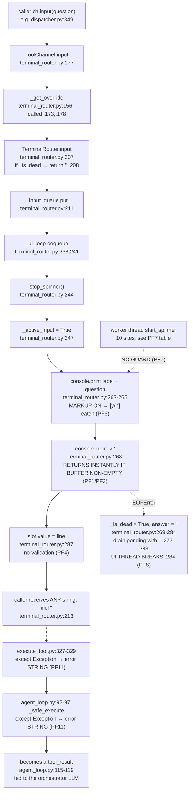
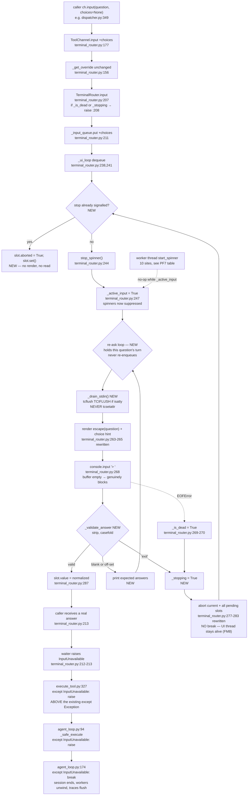
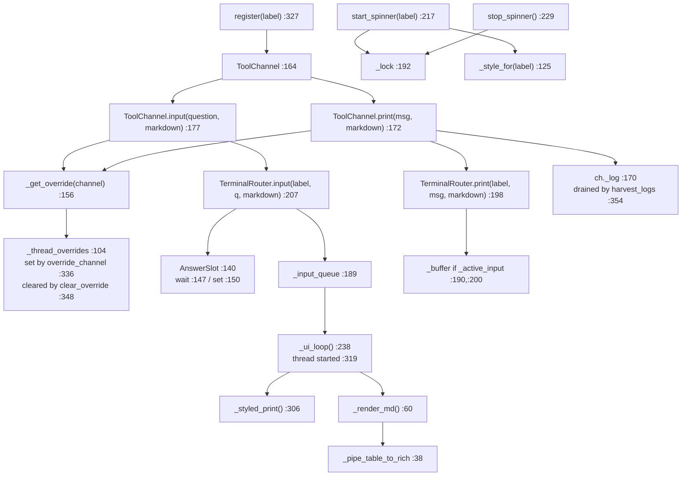
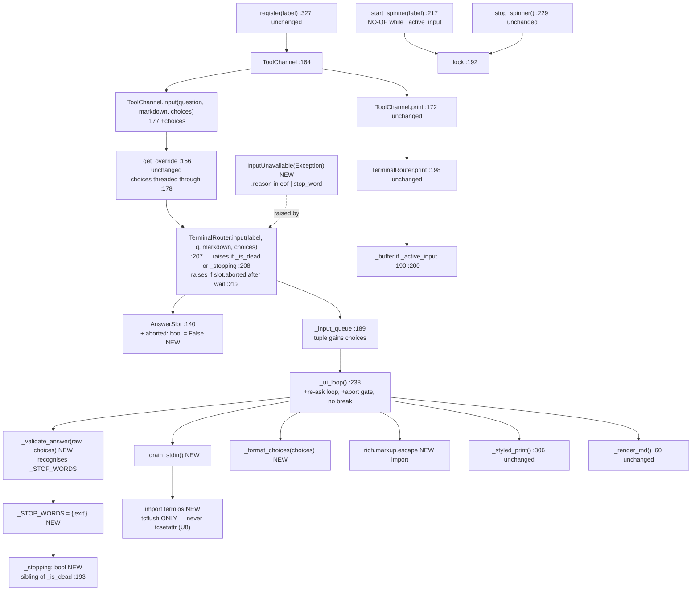

# Spec 22a: CLI Input Block

## Frontmatter
- Write date: 20260731
- Update date: 20260731
- Codebase last changed date: 20260731
- Implemented: N
- **STATUS: Problem space + solution space written, graph/sites audited
  against t0. Not implemented.** U-series defined, none built, none run.
- Audit pass 20260731 (stage gates 5–6): every `file:line` in this
  document was re-verified against the tree and all resolve. `graphify-out/`
  is not stale (`find src -name "*.py" -newer graphify-out/graph.json`
  returns nothing). Corrections made: PF7's site count, the exception
  routing gap (new section), FM2, FM8, FM9, the `exit` stop word.
- 3 sentence summary: `TerminalRouter` has no binding between a question
  and the answer it receives — keystrokes typed while no question is open
  are held by the kernel tty buffer and handed to whichever question is
  dequeued next, so a stray Enter typed minutes earlier can silently
  answer a later confirmation gate. This was reproduced four ways under a
  pty and is the root cause of the 20260730 PMS2 runaway in which CIEN was
  killed by a phantom abort and COHR was resumed by a `y` the human never
  aimed at it. The defect is in the input layer, not in any caller, and it
  is currently untestable by construction because every test monkeypatches
  `register` and never exercises the router's stdin path.

Related: `22b_DisBatchPatch.md` (the dispatcher-side defects exposed by
the same failure instance). **22a is load-bearing for 22b** — see
Dependency at the end.

---

## Problem space

### Problem definition

A question asked through `ToolChannel.input()` and the string returned to
the caller are related by nothing except arrival order at fd 0.

The router owns a FIFO of **questions**. It does not own, buffer, gate,
or timestamp **answers**. Answers come from the kernel's tty line
discipline, which:

- buffers keystrokes whether or not any process is reading,
- echoes them to the screen immediately, so the terminal *looks* like the
  user answered something,
- holds completed lines indefinitely, with no timestamp,
- hands the oldest complete line to the next `read()` on fd 0, instantly.

Therefore `python`'s `input()` — reached via `rich.Console.input()` at
`terminal_router.py:268` — **returns immediately if anything is already
buffered.** The question that happens to be on screen at that moment is
irrelevant to which line it gets.

Consequences, stated as invariants the system does not hold:

- An answer is not guaranteed to postdate the prompt it answers.
- An answer is not guaranteed to have been typed by a human who saw the
  question.
- An answer is not guaranteed to belong to the asker that receives it.
- The absence of an answer is not distinguishable from an answer.

### Failure instance

PSOAS run, 20260730, `run_pms2` over LITE / CIEN / COHR. Verbatim
terminal excerpt supplied by the user:

```
[PMS2-disp-CIEN] 3 iterations for CIEN, 2 found nothing. Still missing:
A9 (Optical Revenue %), B9 (Optical Revenue %), C9 (Optical Revenue %). continue?
> [PMS2-disp-CIEN] done: user_aborted after 3 iteration(s)
[PMS2] CIEN: dispatcher user_aborted
y
 then [PMS2-disp-COHR] 3 iterations for COHR, 2 found nothing. Still missing:
A6 (Optical Revenue %), B6 (Optical Revenue %), C6 (Optical Revenue %). continue?
> [PMS2-disp-COHR] iter 3: 3 null ans, 6 active
[PMS2-leng-LITE] 475/477 Lengs done (8 hits)
[PMS2-leng-LITE] ⚠ Leng chunk da99b427-... crashed: structured_complete: no
valid tool call after 3 attempts (model: deepseek-v4-flash)
[PMS2-disp-COHR]
Batch plan:
┏━━━━━━━━━━━┳━━━━━━━━━━━┳━━━━━━━━━━━┓
┃ Metric    ...
```

Reading it line by line:

1. CIEN's gate rendered, `> ` rendered, and `input()` **had already
   returned** a non-`y` string — the very next line is `user_aborted`.
   The human typed nothing.
2. The lone `y` on its own line is the **tty echo** of a keystroke made
   while no reader was attached. It is not an answer to anything visible.
   It went into the kernel buffer.
3. COHR's gate rendered and `input()` returned that buffered `y`
   instantly — the loop continued.
4. COHR's prompt was then buried under `[PMS2-leng-LITE]` progress lines
   and a full batch-plan table printed by other threads.

Human intent that run: stop. Machine outcome: CIEN aborted (recorded as a
*user decision*), COHR resumed for a further ≥2 iterations. Session ended
by Ctrl-C, which also destroyed the debug traces (see PF9).

Note the rendered questions end in `continue? ` — **the `[y/n]` is
absent from the user's own transcript.** That is PF6 below, and it means
the human was never told what the gate would accept.

### Points of failure

| ID | Point | Location |
|---|---|---|
| PF1 | No buffer drain before a question is rendered. Nothing calls `termios.tcflush(fd, TCIFLUSH)`. Pre-existing lines are consumed as answers. | `terminal_router.py:238-268` |
| PF2 | No arrival-time check. The router never records when the prompt rendered, so it cannot reject a line that predates it. | `terminal_router.py:268` |
| PF3 | No echo control. Typing while unprompted is echoed into the scrollback, so the screen shows an answer the program never received — and the line is silently queued for the next asker. | tty default (`ECHO` on, canonical mode) |
| PF4 | No answer validation at the router. `input()` returns any string, including `""`. Every caller invents its own parse, and none has a "not a valid answer, re-ask" branch. | all 11 call sites |
| PF5 | One FIFO shared by concurrent askers. With N firms in flight, M pre-typed lines answer the first M questions **in completion order** — an order the user cannot predict or see. | `terminal_router.py:189,241` |
| PF6 | The question string is rendered through rich markup, which **eats bracketed text**. `continue? [y/n]` displays as `continue? `. Confirmed in the user transcript and in repro raw capture. Affects all three y/n gates in the system — `dispatcher.py:352`, `agent_loop.py:321`, `sekei_loop.py:350` — plus `stencil2chart.py:102`'s `[1/2/3]`. Every gate in PSOAS displays without its hint. | `terminal_router.py:264` |
| PF7 | Spinners repaint over a live prompt. `_active_input` buffers `print()` while a question is open but does not guard `start_spinner`, which is called from **10 sites across 6 files** (enumerated below). | `terminal_router.py:200` vs `:217` |
| PF8 | EOF is terminal and silent. One `EOFError` sets `_is_dead=True` forever; every pending question is drained with `""` and every future `input()` returns `""` **without rendering anything**. Callers cannot distinguish this from a human answering. | `terminal_router.py:208,272-284` |
| PF9 | Untestable by construction. Every test monkeypatches `register` (`test_spec19_live.py:182-184`), replacing the `ToolChannel` — i.e. stubbing *above* the broken layer. No test can currently fail on answer misbinding. Compounded by traces flushing only on clean exit, so Ctrl-C (the only escape from a runaway) destroys the evidence. | `tests/` |

| PF10 | No working escape from a prompt. Nothing handles `KeyboardInterrupt`; during a run Ctrl-C joins worker threads that are themselves parked on a prompt, and hangs. Also explains PF9's lost traces. **Added 20260731.** | `src/psoas.py:21-23`, `agent_loop.py:107` |
| PF11 | A stop signal cannot reach `main()`. Two catch-all handlers convert any exception into a string that becomes LLM tool-result content. **Added 20260731.** | `execute_tool.py:327-329`, `agent_loop.py:92-97` |

PF10 and PF11 were found during the 20260731 stage-5/6 audit, after the
solution space had been written. Both are detailed below, under
"Failure mechanism" — they are t0 facts, not consequences of the change,
but they invalidate the draft's assumption that raising an exception is
sufficient to stop anything.

### PF7 enumeration — every `start_spinner` site

Produced by:

```bash
grep -rn "start_spinner" src/ --include="*.py"
```

| File:line | Label | Thread |
|---|---|---|
| `agent_loop.py:202` | `ORCHESTRATOR` | main |
| `agent_loop.py:302` | `ORCHESTRATOR` | main |
| `tool_pteca.py:152` | PTECA channel | tool-dispatch worker (`agent_loop.py:107`) |
| `sekei_loop.py:277` | `PMS2-Sekei` | Phase 0 |
| `mapper.py:164` | `PMS2-map-{firm}` | Phase 0, pool at `sekei_loop.py:399` |
| `dispatcher.py:160` | `PMS2-fiscal-{firm}` | Phase 1 worker (`pms2.py:191`) |
| `dispatcher.py:197` | `PMS2-fiscal-{firm}` | Phase 1 worker |
| `batch_planner.py:312` | `PMS2-disp-{firm}` | Phase 1 worker |
| `leng_caller.py:321` | `PMS2-leng-{firm}` | Phase 1 worker |
| `leng_caller.py:404` | `PMS2-val-{firm}` | Phase 1 worker |

`terminal_router.py:244` (`_ui_loop`'s own `stop_spinner`) is router-internal
and excluded. The earlier figure of "5 worker sites" in this document was
wrong; the guard's blast radius is twice that, and 8 of the 10 sites are
on threads that can fire *while another thread's question is open*.

---

## Failure mechanism

### The data path

```
  keystrokes
      │
      ▼
┌─────────────────────────────────────────────────────────────┐
│ KERNEL tty line discipline (canonical mode)                 │
│   • buffers chars until Enter                               │
│   • ECHOES to screen immediately          ── PF3            │
│   • holds complete lines indefinitely, reader or not ── PF1 │
│   • no timestamps, no association with any prompt ── PF2    │
└─────────────────────────────────────────────────────────────┘
      │  read(fd 0) → oldest complete line, INSTANT if buffered
      ▼
  rich Console.input()  → prints "> " → builtin input()
      │
      ▼
┌─────────────────────────────────────────────────────────────┐
│ TerminalRouter._ui_loop   (one thread, terminal_router:238) │
│   _input_queue : FIFO of QUESTIONS, never of answers        │
│     get() → stop_spinner → render question ── PF6           │
│           → console.input("> ")  ← blocks ONLY IF EMPTY     │
│           → slot.value = line ; slot.set()                  │
└─────────────────────────────────────────────────────────────┘
      │  ── PF5: Nth question dequeued gets Nth line delivered
      ▼
  AnswerSlot unblocks the asking worker thread
```

The entire binding rule is the arrow marked PF5: *the Nth question
dequeued receives the Nth line the kernel hands over.* Nothing else.

### The CIEN/COHR cascade, as a timeline

```
t0   nothing is reading fd 0
     human presses Enter (stray)            → kernel buffer: ["" ]
     human presses y, Enter                 → kernel buffer: ["", "y"]
     both echoed to screen, no reader       ── PF3

t1   CIEN dispatcher hits 2/2 dry runs → channel.input("... continue? [y/n]")
     UI thread renders "continue? "         ── PF6 ate the [y/n]
     renders "> "
     console.input() → read() → returns ""  INSTANTLY   ── PF1/PF2
     "".startswith("y") is False
     → status = "user_aborted"              ← a decision no human made

t2   COHR dispatcher hits 2/2 dry runs → channel.input(...)
     renders "continue? " / "> "
     console.input() → returns "y" INSTANTLY            ── PF5
     → dry_run_count = 0, loop continues for ≥2 more iterations

t3   LITE's Leng workers call start_spinner + print progress
     → COHR's prompt line is repainted over ── PF7
     → the human sees a batch-plan table where a question used to be
```

### Reproduction — `tests/repro_stdin_typeahead.py`

Forensic probe, not a regression test. Drives a child process over a
`pty` and writes bytes into the master **before** the child renders its
prompt — byte-for-byte what type-ahead does on a real terminal. Touches
no production code.

```
python tests/repro_stdin_typeahead.py          # automated, pty-driven
python tests/repro_stdin_typeahead.py manual   # real keyboard
```

Result, 20260731, all four scenarios:

| # | Scenario | Injected | Answer received | Elapsed | Verdict |
|---|---|---|---|---|---|
| A | `typeahead_y` — typed while nothing was reading | `y\n` | `'y'` | 0.012s | CONFIRMED |
| B | `stale_newline` — one stray Enter (the CIEN kill) | `\n` | `''` | 0.003s | CONFIRMED |
| C | `control` — typed only *after* the prompt rendered | `n\n` | `'n'` | 1.215s | CONFIRMED (blocks correctly when the buffer is empty) |
| D | `cascade` — two firms, one stray Enter + one stray `y` | `\ny\n` | CIEN `''`, COHR `'y'` | 0.006s / 0.001s | CONFIRMED |

Scenario C is the control: with an empty buffer `input()` does block, so
the defect is specifically *pre-existing buffered input*, not a spurious
return.

Scenario D raw pty capture (ANSI stripped) — compare to the user
transcript above:

```
###WINDOW-OPEN
                                   <- stray Enter, echoed, no reader
y                                  <- stray y, echoed, no reader
[PMS2-disp-CIEN] 3 iterations for CIEN, 2 found nothing. continue?
>
[PMS2-disp-COHR] 3 iterations for COHR, 2 found nothing. continue?
> ###RESULT|CIEN|0.006|''
###RESULT|COHR|0.001|'y'
```

Note `continue?` with no `[y/n]` in both — PF6, reproduced independently
of the user's session.

### Blast radius — every caller inherits this

Produced by:

```bash
grep -rn "\.input(" src/ --include="*.py" | grep -v "def input"
```

(minus `terminal_router.py:11,165,179,268` — the module docstring, a
class docstring, the router's own pass-through, and the `console.input`
that *is* the read.) Re-run to detect staleness; the table below is the
complete production set as of 20260731.

| Call site | Question | Parse of the answer |
|---|---|---|
| `agent_loop.py:174` | outer REPL, empty prompt | free text → becomes an LLM turn |
| `agent_loop.py:321` | `Continue? [y/n]` checkpoint | `in ("y","yes")` |
| `execute_tool.py:187` | orchestrator `ask_user` | free text → LLM |
| `sekei_loop.py:322,350` | Sekei `ask_user` + finalize gate | free text / gate |
| `mapper.py:200` | Mapper `ask_user` | free text |
| `batch_planner.py:352` | BP `ask_user` | free text → LLM |
| `dispatcher.py:184` | fiscal calendar fallback | free text → LLM parse |
| `dispatcher.py:349` | **the dry-run gate** | `startswith("y")` |
| `stencil2chart.py:102` | `Choice [1/2/3]:` | index |
| `tool_pteca.py:197` | PTECA always-ask | free text → LLM |
| `Poony_.../pumba.py:716,736` | legacy PMS1 | free text |

Also latent: `Poony_Multiretrieval_S1/src/stencil2chart.py:64` calls raw
`input()` directly, bypassing the router entirely. Dead today (PMS1
dispatch commented out); a second competing reader on fd 0 if revived.

The free-text sites are the quiet ones: a misbound line there does not
abort anything, it becomes *content* — a stale phrase enters an LLM's
context as though the user had said it, at that point in the
conversation. No log records that it was misattributed.

### PF10 — there is no path out of a prompt

This is a t0 fact, discovered during the 20260731 audit, and it is the
constraint that shapes everything in the solution space below.

**Nothing in PSOAS handles `KeyboardInterrupt`.** Produced by:

```bash
grep -rn "KeyboardInterrupt\|import signal\|SIGINT" src/ --include="*.py"
# → no matches
```

`src/psoas.py:21-23` is a bare `main()` with no handler. Consequently:

- **At the REPL** (`agent_loop.py:174`) the main thread is the waiter, so
  Ctrl-C reaches it and the process dies — with an uncaught traceback.
- **During a PMS2 run Ctrl-C hangs.** The main thread is inside
  `with ThreadPoolExecutor(...)` at `agent_loop.py:107`. `KeyboardInterrupt`
  is delivered to the main thread only; the `with` block's exit calls
  `shutdown(wait=True)` and joins the workers, which are themselves parked
  in `AnswerSlot.wait()` (`terminal_router.py:212`) and never receive the
  signal. The join never returns. Four further nested pools have the same
  shape: `pms2.py:191`, `sekei_loop.py:399`, `batch_planner.py:411`,
  `leng_caller.py:323,406`.
- **This is why the 20260730 traces were lost.** The `flush_to_disk` calls
  live in `finally` blocks inside the *worker* frames — `dispatcher.py:369-374`,
  `sekei_loop.py:432-438`, `batch_planner.py:445-451`. A worker that never
  unwinds never runs them. PF9's second clause is explained by PF10.

So the escape route this spec's re-ask loop assumes ("mitigation is Ctrl-C")
does not exist at the moment it is needed.

### PF11 — a stop signal cannot reach the top of the program

Two catch-all handlers sit between any `.input()` site and `main()`.
Produced by:

```bash
grep -rn "except Exception\|except BaseException\|except:" \
  src/harness/agent_loop.py src/harness/execute_tool.py \
  src/tools/tool_pteca.py src/scripts/stencil2chart.py \
  src/scripts/PMS2/{dispatcher,mapper,batch_planner,sekei_loop,pms2}.py
```

Most hits are `finally: try: trace.flush_to_disk() except Exception: pass`
(`dispatcher.py:373`, `mapper.py:281`, `batch_planner.py:449`,
`sekei_loop.py:436`) and do **not** intercept a propagating exception.
Two do:

| Net | Effect |
|---|---|
| `execute_tool.py:327-329` | wraps the entire tool handler; converts any exception into a "BUMMER" console line and an error **string** |
| `agent_loop.py:92-97` (`_safe_execute`) | wraps `execute_tool`; returns `f"Error in {tc.name}: ..."` as a **string** |

That string becomes a `tool_result` in the orchestrator's message list.
An exception is therefore not a stop — it is **content fed to an LLM**.

Thread topology decides who is affected. Produced by:

```bash
grep -n "Phase 0\|Phase 1\|run_sekei\|_run_dispatcher" src/scripts/PMS2/pms2.py
```

| Ask site | Runs in | Exception lands at |
|---|---|---|
| `dispatcher.py:184` (fiscal) | Phase 1 worker (`pms2.py:191`) | `pms2.py:202` `fut.result()` — **catchable by the planned patch** |
| `batch_planner.py:352` | Phase 1 worker (via `dispatcher.py:309`) | `pms2.py:202` — catchable |
| `dispatcher.py:349` (dry-run gate) | Phase 1 worker | `pms2.py:202` — catchable |
| `sekei_loop.py:322,350` | **Phase 0** (`pms2.py:137`), outside the pool | `execute_tool.py:329` → `agent_loop.py:96` — **swallowed** |
| `mapper.py:200` | **Phase 0** (pool at `sekei_loop.py:399`) | same — **swallowed** |
| `execute_tool.py:187` (orchestrator `ask_user`) | main | its own `try` at `:327` — **swallowed** |
| `tool_pteca.py:197` | tool-dispatch worker | `agent_loop.py:96` — **swallowed** |
| `stencil2chart.py:102` | tool-dispatch worker | `agent_loop.py:96` — **swallowed** |

Five of the eight live ask sites cannot signal a stop under the design as
originally written. Worse, the swallow is self-amplifying: once the router
has marked the stream unusable, every subsequent question raises
immediately, so the orchestrator loops at full speed with the human unable
to intervene — a second runaway of exactly the class this spec exists to
kill.

---

## Outcome imagination

Settled with the user 20260731. Target UX and the decisions behind it;
**not** a design — no mechanism, no file changes, no API shape.

### Target UX

**While no question is open** (PMS2 grinding, orchestrator thinking): the
input buffer is discarded. You can mash the keyboard; the characters
still echo (see "accepted costs"), but nothing is retained. There is no
buffer left to autofeed a later prompt, because nothing was ever kept.

**When a channel opens a question**: the buffer is drained again
immediately before the question renders. Anything typed from that instant
belongs to *that* question. You cannot answer a question that isn't on
screen, and no earlier keystroke can answer it for you.

**The router owns the answer contract.** The caller declares one of two
shapes:

- **choice set** (e.g. y/n) — the router renders the options itself, so
  they cannot be swallowed by markup. Anything not in the set, including
  blank and whitespace-only, is re-asked. The router never hands the
  caller a string it has to guess about.
- **freeform** — string passed through, but blank and whitespace-only are
  still re-asked.

**EOF is never an answer.** The router does not fabricate a string from
it; it signals stop (see "Boundary with 22b").

**`exit` typed at any prompt is a stop.** Settled with the user 20260731,
after PF10/PF11 established that no working escape exists. Ctrl-C hangs
during a run; Ctrl-D is swallowed. A typed word is the only signal that
travels the same path as a normal answer — through the router, which is
the one component that is being made trustworthy by this spec. `exit`
was chosen over `quit` because `agent_loop.py:184` already uses it at
the REPL; that private branch is deleted and the word becomes universal
rather than REPL-only.

Its reach is honest and limited: **`exit` only works while a question is
on screen.** During a promptless stretch — the `475/477 Lengs` phase of
the 20260730 transcript — there is nothing to type into and the buffer is
being discarded anyway. That gap is FM9, and it belongs to 22b.

Consequence accepted: you cannot pre-type your next query while
`run_pms2` runs. The REPL is not asking during a tool call, so the
keyboard does nothing until it is.

### Decisions taken, and what each kills

| Decision | Kills |
|---|---|
| Flush the input buffer immediately before every prompt | PF1, and moots PF2 — the buffer is empty when the question renders, so there is nothing whose arrival time could be wrong |
| No type-ahead of any kind. Not even a visible "queued next message" slot | the whole class. Nothing is retained, so nothing can be misrouted |
| **Flush-only — never change termios modes** (no `ECHO` off, no raw mode) | the risk of leaving the user's shell mute after a crash. The terminal is never altered, so there is no state to restore |
| Router-level answer contract: choice set or freeform, declared by the caller | PF4, and 22b/PF1 at the layer where it belongs — once, instead of in eleven call sites |
| Router renders the choice set itself rather than trusting a caller's embedded `[y/n]` | PF6 by construction, not by escaping |
| Blank / whitespace-only → re-ask, indefinitely, **freeform included** | `""` stops being a vote anywhere in the system |
| `exit` at any prompt raises the same stop as EOF | PF11's "no reachable stop", at the one layer that is being made trustworthy |
| The stop aborts **every** pending and future question, not just the asker's | one `exit` ends a 3-firm run; without this you would type it once per firm |
| EOF signals stop, never returns a string | PF8 |

The blank-everywhere decision was re-put to the user on 20260731 with the
freeform cost named explicitly — `tool_pteca.py:197` is an always-ask
prompt where Enter currently means "nothing to add, carry on", and after
this change it means nothing at all, so PTECA requires typed filler to
advance. Same shape at `execute_tool.py:187`, `mapper.py:200`,
`batch_planner.py:352`, `sekei_loop.py:322`. User chose uniformity:
one rule, no per-site exemption. Recorded so it is not re-opened as a
discovery.

Structurally surviving but harmless: PF5 (one FIFO across concurrent
askers). Cross-firm misattribution required a stale line to misroute;
with no stale lines, serialized delivery is correct.

### Deliberately rejected — do not re-litigate

- **Claude-Code-style input box** (raw/cbreak mode, program-owned
  editable line, keystrokes always captured and visible). This is the UX
  the user prefers in the abstract. Rejected for now on risk: it requires
  the router to own the entire screen — `rich` permits **one** Live
  display at a time (`rich/console.py:835`, "Only one live display may be
  active at once") and spinners already use it — plus a full line editor
  (backspace, arrows, paste, unicode, SIGWINCH) and a bulletproof termios
  restore path. A stable prompt region needs the same screen ownership,
  so the intermediate option is most of the cost for a fraction of the
  benefit. It is T1 or the full rewrite; T1 first.
- **`ECHO` off while idle.** Would give the true "keyboard is dead" feel
  instead of junk that appears and vanishes. Rejected: a hard crash
  before restore leaves the user's zsh mute until a blind `stty sane`.
  Not worth it for a cosmetic gain.
- **Ctrl-D as a local "no answer for you" signal** handled per caller.
  Rejected as duplicative — if the dispatcher gate asks and `n` is
  available, Ctrl-D adds a second way to say the same thing, and makes
  every caller grow a branch. EOF instead routes into the single stop
  path.

### Accepted costs

- **Echoed-then-vanished junk.** PF3 is *not* fixed. Mashing while idle
  still paints characters on screen; they are then discarded. Visually
  worse than an input box, functionally safe. Chosen over `ECHO` off to
  protect the terminal.
- **Re-ask blocks forever.** With nobody at the keyboard, a re-asked
  question parks the run indefinitely. Accepted knowingly. The mitigation
  is the `exit` stop word, which is why it was pulled into 22a rather than
  left to 22b — PF10 shows Ctrl-C is not a mitigation at all during a run.
  Note the automation case is separately safe: piped/non-tty stdin hits
  EOF on first read and stops cleanly.
- **No escape during a promptless stretch.** `exit` needs a prompt to be
  typed into. A run that is grinding without asking anything still has no
  exit but killing the terminal. Unchanged from today, not made worse by
  this spec, and owned by 22b. See FM9.

### Still open

- **PF7 is not addressed by any of the above.** Flush-only guarantees the
  answer reaches the right question; it does nothing to stop a worker's
  spinner from repainting over the prompt, so "see clearly what is being
  answered" is only half solved. A cheap containment exists that does not
  require screen ownership — `start_spinner` could no-op or defer while
  `_active_input` is set — but it has not been decided.
- Question-queue visibility stays as-is for now: the existing
  `[N questions pending — answering 1 of N]` count, with no listing of
  which firms are waiting and no skip. Accepted as sufficient, revisit
  later.
- Whether a queued question can go stale and be withdrawn (BP asks
  "which file for X", another thread fills X while the human types).
  No mechanism exists; not decided.
- PF9 (untestable by construction) is now *addressable* —
  `tests/repro_stdin_typeahead.py` proves the pty harness works, so a
  tier-2 regression test against the real router is writable. The test
  design itself is build-time work.
- **`sekei_loop.py:327` is an undeclared second gate.** The `ask_user`
  handler runs `re.match(r"^\s*(y|yes|ok|confirm|lgtm)\b", answer, re.I)`
  on a *freeform* answer to set `user_confirmed`, which is what the
  `:350` hard gate then consults. So Sekei has two gates with different
  accept-sets — a wide alias regex on freeform, and `startswith("y")` on
  the declared gate — and this spec only touches the second. Flagged, not
  resolved: converting `:322` to a choice set would break its purpose
  (it is genuinely open-ended), so the fix is probably to stop inferring
  consent from prose at all. Out of scope for 22a; raise in 22b or later.
- **Does `exit` end the session or only the current tool?** As specced it
  ends the session, matching Ctrl-D. The alternative — abort the running
  tool and return to the REPL prompt — is arguably what you want after a
  bad `run_pms2`, and the design deliberately leaves room for it: the stop
  word sets `_stopping`, *not* `_is_dead`, so a future revision can clear
  it and resume. Not decided.

### Boundary with 22b

22a ends at the string, plus **the minimum plumbing required for a stop
to be reachable at all** — which the 20260731 audit showed is two
`except` clauses, not zero (PF11). It flushes, renders, validates,
re-asks, signals stop, and guarantees that signal arrives at the REPL.

What *stopping does beyond ending the session* — two-stage Ctrl-C,
cooperative cancellation, per-firm granularity, workers unwinding
mid-LLM-call, stopping a run that is not asking anything (FM9) — is 22b.
EOF, `exit`, and the first Ctrl-C converge on that same path.

The boundary moved during the audit. It was drawn at "22a ends at the
string" on the assumption that an exception propagates for free. It does
not, and a spec that raises an exception nobody can catch has not
signalled anything.

---

## Dependency on 22b

22b's tentative outcome ("the gate only accepts y/n") **does not fix the
failure instance on its own.** A stale `y` from the kernel buffer is a
perfectly valid `y`. Strict parsing kills scenario B (the CIEN phantom
abort); scenario D's COHR half — the actual runaway — survives untouched.

22a is load-bearing. If the two are built separately, 22a lands first or
22b's gate remains forgeable.

**The reverse dependency weakened during the 20260731 audit.** The
original text held that 22b's Ctrl-C work was what made 22a's re-ask
loop survivable. PF10 shows Ctrl-C does not work today in the case that
matters — during a run it joins worker threads that are themselves parked
on a prompt, and hangs. So 22a could not have leaned on it. The `exit`
stop word replaces that dependency: 22a is now self-sufficient for
"escape a prompt", and 22b is needed for "escape a run that isn't
prompting" (FM9) and "stop one firm, not all of them" (FM11).

---

# Solution space

## Idea of solving

Move two responsibilities the callers never should have had into the
router: **when the buffer is clean**, and **what counts as an answer**.

1. The buffer is drained immediately before every prompt renders, so an
   answer cannot predate the question it answers.
2. `input()` gains an optional `choices` parameter. The router renders
   the options itself and re-asks until it gets one. Blank and
   whitespace-only are never answers, choice-set or freeform.
3. EOF stops being a string. It raises.
4. Spinners are suppressed while a question is open, so the prompt
   cannot be repainted over.
5. `exit` typed at any prompt raises the same stop as EOF, and aborts
   every other pending and future question along with it.
6. The stop must **survive the two catch-all nets** (PF11). Both
   `execute_tool.py:327` and `agent_loop.py:94` re-raise it instead of
   converting it to a tool-result string. Without this, points 3 and 5
   are decorative for five of the eight live ask sites.
7. The UI thread **never exits** after a stop. It keeps dequeuing and
   aborting, so a question enqueued after the drain cannot park forever
   (FM8).

Nothing else about the router changes. **No termios mode is ever
altered** — no `ECHO` off, no raw mode, no `tcsetattr` anywhere in the
file. That is the invariant protecting the user's shell, and U8 exists
to enforce it.

Points 1–5 and 7 are `terminal_router.py`. Point 6 is the only reason
this spec touches the harness at all, and it is not optional: it is what
makes the difference between a stop signal and a log line.

## Type

Patch, with one breaking contract change.

- **Additive:** `choices=` parameter, `_drain_stdin()`, re-ask loop,
  spinner guard, `exit` stop word.
- **Breaking:** `input()` may now raise `InputUnavailable` where it
  previously returned `""`. Call sites must either handle it or be on a
  path where it reaches the REPL — and **two catch-all handlers must be
  narrowed so that path exists at all** (`execute_tool.py:327`,
  `agent_loop.py:94`). This is the audit's main correction to the
  original draft, which assumed propagation was free.
- **Behavioural:** blank input no longer returns to any caller. Three
  call sites that hand-rolled their own re-ask loops
  (`agent_loop.py:176`, `stencil2chart.py:101-105`, and the implicit one
  in `_prompt_gaps`) become redundant and are deleted. The REPL's private
  `exit` branch (`agent_loop.py:184`) is deleted in favour of the
  router-level word.

Note the pattern that justifies centralising this: of the four gates in
PSOAS, three hand-rolled a re-ask loop, each differently, and the one
that didn't — `dispatcher.py:349` — is the one that killed CIEN.

**Scope grew during the 20260731 audit** from 6 files to 8. The two added
(`execute_tool.py`, `agent_loop.py`'s `_safe_execute`) are 1–2 line edits
each — an `except InputUnavailable: raise` placed above an existing
`except Exception`. Small in diff, load-bearing in effect.

## Points of change

**Pipeline design affected.** No node is created or destroyed. One node
— `TerminalRouter._ui_loop` (`terminal_router.py:238`) — gains an internal
loop and a validation step. The question FIFO is unchanged. Two existing
error handlers (`execute_tool.py:327`, `agent_loop.py:94`) become
selective rather than total.

**Downstream nodes affected (I/O contract).** The contract of
`ToolChannel.input` (`terminal_router.py:177`) changes for every caller:

| | Before | After |
|---|---|---|
| Returns | any `str`, including `""` | a non-blank `str`; if `choices` given, exactly one of them, lowercased |
| On EOF | `""`, forever, silently | raises `InputUnavailable(reason="eof")` |
| On `exit` typed | returned as the literal string `"exit"` | raises `InputUnavailable(reason="stop_word")`; every other pending question aborts too |
| Question rendering | caller's string, markup-interpreted | caller's string escaped, plus a router-rendered choice hint |
| Blank input | returned to caller | re-asked, never returned |
| Exception reaching `main()` | impossible — two catch-alls convert it to LLM content | `InputUnavailable` alone passes through; every other exception behaves exactly as today |

The last row is the one that changes the *harness*, not the router. It is
narrow by construction: only this one exception type is let through, so
no existing error-handling behaviour is altered.

## Graph change

### Current

Every node carries `file:line`. A node without an anchor is either
missing or fabricated.



The dotted `RET -.-> NET1` edge is not part of the answer path — it is
the path any *exception* raised at a call site would take today, and it
is why "just raise" was not sufficient as originally drafted.

### Proposed

Anchors are the *current* line of the code being changed, so the diff
target is locatable. `NEW` marks elements with no t0 anchor.



I/O contract highlighted: two edges change shape.

1. `slot → caller` carried "any string or silence"; it now carries
   "a validated answer, or an exception."
2. `caller → main()` did not exist as an exception path at all — it was
   severed at `execute_tool.py:327` and again at `agent_loop.py:94`. It
   now exists for exactly one exception type.

The `DRAINQ → GATE` back-edge is the FM8 fix: the UI thread does not
`break` (t0 `terminal_router.py:284`), so a question enqueued after the
drain is dequeued and aborted rather than parking forever.

## File-by-file change

### `src/harness/terminal_router.py`

Current function graph:



`_get_override` matters to this change because it sits directly on the
`ToolChannel.input → TerminalRouter.input` edge (`:178`): the label the
router renders may not be the label of the channel the caller holds. The
`choices` argument must be threaded through it. It was absent from the
first draft of this graph.

Proposed:



Per-element contracts:

| Element | Change | Contract |
|---|---|---|
| `InputUnavailable(Exception)` | new | raised when no answer can be obtained. Carries `reason: "eof" \| "stop_word"` for logging only — **both mean stop**, no caller may branch on it. Carries no value; it is not an answer |
| `_STOP_WORDS` | new, module constant | `frozenset({"exit"})`. Matched after `strip().lower()`. Applies to freeform **and** choice-set prompts, so a gate cannot trap you. Reserved: a caller can no longer receive the literal string `"exit"` |
| `_stopping: bool` | new, sibling of `_is_dead` (`:193`) | set by a stop word. Distinct from `_is_dead` (stream physically gone) so a future "return to REPL instead of exiting" revision can clear it. Both are checked at `:208` and by the `_ui_loop` abort gate |
| `AnswerSlot` | `aborted: bool = False` added (`:140-151`) | `wait()` unchanged; caller checks `aborted` and raises |
| `ToolChannel.input` | `choices: list[str] \| None = None` added (`:177`) | passes through `_get_override` to the router; unchanged otherwise |
| `TerminalRouter.input` | `if self._is_dead or self._stopping: raise InputUnavailable` replaces `return ""` (`:208-209`); enqueues `choices`; raises if slot came back `aborted` | in: `(label, question, markdown, choices)`. out: validated `str`, or raises |
| `_drain_stdin()` | new | discards pending stdin. `sys.stdin.isatty()` guard, `termios.tcflush(fd, TCIFLUSH)`, whole body wrapped — any failure (not a tty, closed, unsupported) is skipped silently. **Reads no bytes, changes no modes** |
| `_format_choices(choices)` | new | `["y","n"] → " [y/n]"`. `None → ""`. Rendered by the router as literal text, never markup |
| `_validate_answer(raw, choices)` | new | `raw.strip()`; blank → invalid. **Stop word checked first**, before any choice matching. If `choices`: `raw.strip().lower()` must equal a choice, lowercased — exact match, **no prefix, no aliases**. Returns the normalized answer, the stop sentinel, or `None` for invalid |
| `_ui_loop` | question rendering wrapped in a re-ask loop; question text escaped; `_active_input` set before the first render so the spinner guard covers the whole exchange; **an abort gate at the top of each iteration** (`:241`) checks `_is_dead or _stopping` and aborts the dequeued slot without rendering or reading | the re-ask loop **holds this question's turn** — it never re-enqueues, so a blank answer cannot let another firm's question jump ahead |
| `_ui_loop` termination | **the `break` at `:284` is deleted** | the UI thread must outlive the stop. It keeps dequeuing and aborting forever. This is the FM8 fix; without it a thread that enqueues after the drain waits on a queue nobody reads |
| `start_spinner` | early return while `_active_input` (`:217-227`) | reads `_active_input` under the existing `_lock` (`:192`) |
| EOF / stop branch | flags current slot and every drained pending slot `aborted=True` instead of `value=""` (`:269-284`); EOF also sets `_is_dead`, stop word sets only `_stopping` | every waiter raises rather than receiving a fake answer |

Rendering detail for PF6: the caller's question is passed through
`rich.markup.escape()` before printing, so no caller string is ever
interpreted as markup. This fixes the hint for callers that *don't*
declare choices too — e.g. today's `Choice [1/2/3]:`. The `markdown=True`
path is unaffected (it goes through `Markdown`, not markup).

### Call sites

| File:line | Change |
|---|---|
Grouped by why they are touched. Rows marked **AUDIT** were added or
corrected on 20260731; the original draft had the exception-routing group
empty and marked the Phase 0 sites "no change".

**Group A — gates that declare a choice set**

| File:line | Change |
|---|---|
| `dispatcher.py:349-354` | add `choices=["y","n"]`; drop `[y/n]` from the string; `startswith("y")` → `== "y"` |
| `agent_loop.py:321,331` | add `choices=["y","n"]`; drop `[y/n]`; `in ("y","yes")` → `== "y"` |
| `sekei_loop.py:350-353` | add `choices=["y","n"]`; drop `[y/n]`; `startswith("y")` → `== "y"` |
| `stencil2chart.py:101-105` | add `choices=["1","2","3"]`; drop `[1/2/3]`; **delete the surrounding `while True` + "Enter 1, 2, or 3." branch** — now the router's job. The 1/2/3 menu printed at `:97-99` stays; it is not re-printed on a re-ask, and the router's hint carries the load |

**Group B — exception routing (AUDIT, the added scope)**

| File:line | Change |
|---|---|
| `execute_tool.py:327-329` | insert `except InputUnavailable: raise` **above** the existing `except Exception`. Without this, five of the eight live ask sites cannot stop anything (PF11) |
| `agent_loop.py:94-97` (`_safe_execute`) | same: `except InputUnavailable: raise` above `except Exception` |
| `agent_loop.py:168-185` | REPL: question stays empty (bare `> ` preserved). **Delete** the blank-input branch (`:176-182`) and the "Type a query, or 'exit' to quit." hint — blank now re-asks inside the router, which for an empty question just redraws `> `, i.e. shell behaviour. **Delete the `exit` branch (`:184-185`)** — the router owns the word now. Replace the `_router._is_dead` check with `except InputUnavailable: break` around the whole `input()` |
| `pms2.py:199-208` | split the `except Exception` — `except InputUnavailable` marks the firm stopped, anything else keeps today's `"dispatcher crashed"`. Covers `dispatcher.py:184,349` and `batch_planner.py:352`, all of which run on the Phase 1 pool (`pms2.py:191`) |

**Group C — unchanged, and why (AUDIT: reasons corrected)**

| File:line | Runs in | Why no change |
|---|---|---|
| `sekei_loop.py:322` | Phase 0 | freeform. Propagates through `pms2.py:137` → `execute_tool.py:327` → `agent_loop.py:94`, all three of which are patched in Group B. **The original draft claimed this already propagated correctly; it did not.** See also "Still open" — `:327`'s affirmation regex is a hidden gate this spec does not fix |
| `mapper.py:200` | Phase 0, pool at `sekei_loop.py:399` | same path as above |
| `batch_planner.py:352` | Phase 1 worker | same path, terminating at `pms2.py:202` |
| `dispatcher.py:184` | Phase 1 worker | same |
| `execute_tool.py:187` | main | freeform; its own `try` at `:327` is patched in Group B |
| `tool_pteca.py:197` | tool-dispatch worker (`agent_loop.py:107`) | freeform. **Behavioural loss, accepted:** this is an always-ask loop where Enter currently means "nothing to add"; after this change it re-asks and the user must type filler |
| `Poony_.../pumba.py:716,736` | — | legacy, `run_pms1` dispatch commented out |
| `Poony_.../stencil2chart.py:64` | — | **not fixed** — raw builtin `input()`, bypasses the router entirely. Confirmed still the only such site: `grep -rn "^\s*\(\w*\s*=\s*\)\?input(" src/ --include="*.py"`. Dead code; recorded as a landmine if PMS1 is ever revived |

## Failure modes of the change

| # | Mode | Butterfly | Judgement |
|---|---|---|---|
| FM1 | Re-ask blocks forever with nobody at the keyboard | run parks indefinitely | **Accepted, user-chosen.** Mitigation is the `exit` stop word, pulled into 22a precisely because PF10 shows Ctrl-C is not a mitigation during a run. Automation case is separately *safe*: piped/non-tty stdin hits EOF on first read → `InputUnavailable` → clean stop, not a hang |
| FM2 | `InputUnavailable` raised where no handler exists between it and a catch-all | **the stop becomes LLM content and the run continues, human locked out** | **Rewritten 20260731 — the original judgement was wrong.** It claimed "handled at `pms2.py:207`", which covers only the Phase 1 pool. Five of eight ask sites route through `execute_tool.py:327` and `agent_loop.py:94` instead. Fixed by Group B; before that patch, `exit` and Ctrl-D are both inert at those sites. Any *new* fan-out that grows a user prompt inherits the obligation to let this one exception type through |
| FM3 | Spinner suppressed during a prompt | background work looks stalled while you're being asked | acceptable — prints are already buffered during a prompt, so this makes the behaviour consistent rather than adding a new gap |
| FM4 | `tcflush` unavailable (non-tty, closed stdin, exotic platform) | drain silently skipped → stale-line bug returns in that environment | contained by the `isatty` guard; the only environment where it matters is a real tty, where it works. Worth a log line rather than pure silence |
| FM5 | Escaping questions breaks a caller that *wanted* markup | a styled question renders as literal `[bold]` | no current caller does this — Sekei/BP/Mapper questions originate as LLM tool input, not authored markup. Low, named |
| FM6 | A blank-spamming user holds the UI thread on one question | other firms' questions wait longer | already true of any slow answer; magnitude unchanged |
| FM7 | New node fragility | `_drain_stdin` and `_validate_answer` are deterministic, no LLM, no I/O beyond one syscall | lowest-risk class. No non-deterministic node added |
| FM8 | **Enqueue-after-drain race (AUDIT).** A worker passes the `_is_dead` check at `:208` just before the flag is set, then enqueues after the drain loop at `:277-283` has already emptied the queue | that worker waits on `slot.wait()` forever. The UI thread has `break`ed at `:284` and is gone, so nothing will ever dequeue it. **Program hangs.** Reachable with 3 firms in the `pms2.py:191` pool | Pre-existing today (it hangs today too), but the draft asserted "every waiter raises `InputUnavailable`", which is false in this window. Fixed by deleting the `break`: the UI thread stays alive and aborts every later arrival. Cost is one idle daemon thread parked on `Queue.get()` — nil |
| FM9 | **No escape during a promptless stretch (AUDIT).** `exit` requires a prompt to type into; a run grinding through 477 Lengs asks nothing | unchanged from today — kill the terminal — but now it is the *only* remaining gap rather than one of several | Named, accepted, deferred to 22b. Not made worse by this spec. It is the reason 22b's two-stage Ctrl-C is still needed after 22a lands |
| FM10 | **`exit` becomes unanswerable text (AUDIT).** A freeform question whose genuine answer is the string `exit` | e.g. Sekei asks "what should I call this row?" and the answer is `exit` | Accepted. No current prompt plausibly takes it. Recorded so it is a known reservation rather than a bug report later |
| FM11 | **One `exit` stops all firms, including ones the user was happy with (AUDIT)** | typing `exit` at COHR's gate also aborts LITE mid-extraction | Deliberate — the alternative is typing `exit` once per firm, which is how the 20260730 runaway got away. Partial-stop is a 22b concern (cooperative cancellation with per-firm granularity) |

**If `_drain_stdin` fails open** (worst case): behaviour degrades to
exactly today's, except validation still rejects blanks — so CIEN's
phantom abort is impossible even then. The two mechanisms are
independent, which is deliberate.

**If Group B is skipped** (worst case): the router is correct and the
harness ignores it. Gates stop being forgeable — the CIEN half of the
failure instance is fixed — but `exit` and Ctrl-D become inert at five of
eight sites, and a re-ask (FM1) has no exit at all. **Group B is not
severable from this spec.**

## Unit tests

All pty-driven, in `tests/`, separate from source. The harness is
already proven — `tests/repro_stdin_typeahead.py` — and these reuse its
child/parent pattern. **All: built N, ran N.**

| ID | Test | Asserts |
|---|---|---|
| U0 | idle keystrokes discarded | pre-type during the idle window; prompt still **blocks** (elapsed ≥ threshold); returns only what was typed after it rendered |
| U1 | stale newline no longer aborts | pre-type `\n`; router re-asks; nothing returns until a valid answer is typed |
| U2 | cascade | pre-type `\ny\n`, two askers; **neither** consumes a stale line (the direct 22a scenario-D regression) |
| U3 | choice validation | `choices=["y","n"]`: `"yes"` → re-ask (no aliases, per decision); `"Y"` → accepted as `"y"`; `"  y  "` → accepted as `"y"`; `"maybe"` → re-ask |
| U4 | blank freeform re-asks | freeform question, `""` and `"   "` both re-ask, never return |
| U5 | choice hint visible | rendered output contains `[y/n]` — the PF6 regression |
| U6 | EOF raises | Ctrl-D at a prompt raises `InputUnavailable`, returns no string; a second pending question also raises rather than blocking |
| U7 | spinner suppressed | `start_spinner` from another thread while a question is open writes no frames after the prompt |
| U8 | **tty modes unchanged** | capture `termios.tcgetattr` before and after a full prompt cycle; assert byte-identical. This is the "never break the user's shell" invariant |
| U9 | non-tty stdin | piped stdin that runs out → `InputUnavailable`, no hang (proves FM1's automation case) |
| U10 | `exit` stops | typing `exit` at a prompt raises `InputUnavailable(reason="stop_word")`; works at a freeform prompt **and** at a `choices=["y","n"]` gate (a gate must not trap you); `"EXIT"` and `"  exit  "` both accepted |
| U11 | `exit` aborts *other* pending questions | two askers queued; `exit` answered at the first → the second raises rather than rendering. The FM11/multi-firm regression |
| U12 | **stop survives the catch-alls** | the Group B regression. Drive a fake tool that raises `InputUnavailable` from inside `execute_tool`; assert it reaches the REPL rather than becoming a `tool_result` string. Assert an ordinary `ValueError` from the same place still becomes a string — i.e. the net was narrowed, not removed |
| U13 | UI thread outlives a stop | after EOF, enqueue a *new* question from another thread; it must raise promptly rather than block. The FM8 regression. Timing-sensitive: assert on a bounded `wait()` timeout, and if it proves flaky, downgrade to a direct unit call on `_ui_loop`'s abort gate rather than deleting the coverage |

U8 and U9 are the two that must pass before this is considered safe to
run interactively. **U12 is the one that proves the spec's added scope
was necessary** — if it passes before the Group B edits, the audit was
wrong and Group B should be dropped.

## LLM unit tests

**None.** 22a contains no LLM node — the input layer is fully
deterministic. Recorded explicitly so a later session doesn't go looking
for an L-series that was never meant to exist.

Note the corollary: 22a's changes sit *upstream* of every LLM node in
PSOAS, because a misbound line becomes LLM context (see "Blast radius").
Existing LLM behaviour is unaffected by construction — the router change
cannot alter a prompt, only which string reaches one.

## Execution

Spec size is still small enough for one session, but larger than the
first draft: one file materially changed (`terminal_router.py`), **eight**
files touched in total, two with deletions, one new test file.

Sequence:

1. `terminal_router.py` — exception (with `reason`), `_STOP_WORDS`,
   `_stopping`, `_drain_stdin`, `_format_choices`, `_validate_answer`,
   re-ask loop, abort gate, spinner guard, EOF/stop branch, **delete the
   `break` at `:284`**.
2. U0–U9 written and run. **U8 before any interactive run** — if mode
   restoration is ever violated the developer's own shell is the first
   casualty.
3. **Group B before Group A.** The escape route must exist before the
   prompts that can trap you do. Order within Group B: `execute_tool.py`,
   `agent_loop.py:94`, `pms2.py:207`, then the REPL at `agent_loop.py:168-185`.
4. U10–U13. **U12 gates everything after it** — if the stop does not reach
   the REPL, do not proceed to Group A, because Group A is what makes a
   prompt inescapable.
5. Group A — the four gates.
6. Manual pass with `python tests/repro_stdin_typeahead.py manual` —
   mash the keyboard, confirm nothing is retained; then type `exit` at a
   gate and confirm the process ends and `tests/debug` has traces.

Step 6's trace check is not cosmetic: PF10 explains that the 20260730
traces were lost because workers never unwound. A clean `exit` should
unwind them through the `finally` blocks at `dispatcher.py:369`,
`sekei_loop.py:432`, `batch_planner.py:445`. If it doesn't, the stop is
not actually cooperative and that is a finding for 22b.

Discretion log for the executing session: `Specs/22a_S1Discretion.md`.

Dependency reminder: 22a now ships its own escape (`exit`), so FM1 is no
longer backed by nothing. What remains 22b's is FM9 — a run that is
grinding without asking anything still cannot be stopped except by
killing the terminal — and partial/per-firm cancellation (FM11).
