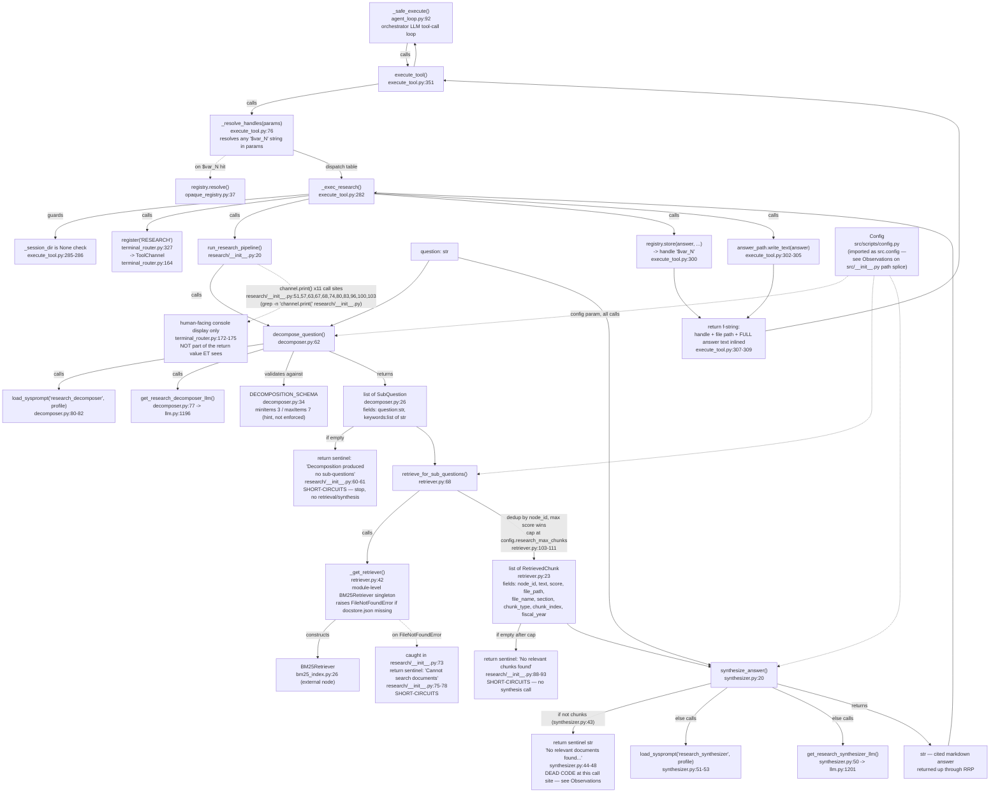

## Frontmatter
- Write date: 20260810
- Update date: 20260810
- Codebase last changed date: 20260810 (anchors below re-verified against tree at this date via `grep -n` and `graphify explain`)
- Implemented: Y (pre-existing — this doc is a Gate 1 retroactive graph, not a proposed change)
- Gate: 1, plus two Problem-space bullets opened below. Gate 2 is not fully worked — no failure instances or culprit-function breakdown yet. No outcome imagination, solution space, or file-by-file change yet.

## Problem space (partial — two bullets only, not full Gate 2)

- **91.5% of table chunks (8,333 of 9,106) are xlsx/xlsm-sourced** — 67.8% of the entire retrievable corpus (8,333 of 12,299 nodes). `01_Chunk.py:788` keeps every table atomic with no size ceiling. Reproducible: `python3 -c "import json; from collections import Counter; d=json.load(open('data/index/docstore.json')); c=Counter(n['__data__']['metadata'].get('filetype') for n in d['docstore/data'].values() if n['__data__']['metadata'].get('chunk_type')=='table'); print(c)"`.
- **No systematic mechanism bounds a single chunk's size before it reaches the LLM context.** `bm25_index.py:146-152` floors at 10 tokens, never ceilings. `research_max_chunks` (`config.py:91`) bounds chunk COUNT, not chunk SIZE — see `RES_MAXCHUNKS` note in the process view below. A single retrieval can already include a ~953k-token chunk today, at any count-cap value.
  - Edge case, not xlsx: `20250221_Jefferies_LITE_COHR-LITE_Networking_Party_Not_Over_Assuming_Cov.md`, chunk_index 23, section "USA | Communications Technology > LITE Financials", 56,507 chars, `sub_table: None`. PDF-sourced, so removing xlsx from ingest (per BunNavHarness discussion) does not fix this instance — a dense quarterly-model table with no blank-first-cell row never trips `_is_sub_header()` (`01_Chunk.py:463-471`), so it falls through `_split_sub_tables()` untouched regardless of file type.

## Gate 1 — Manual Graph: System Intention

Scope: the `run_research` tool end to end — orchestrator dispatch, the 3-stage
research pipeline, and the return path back to the orchestrator LLM. Files:
`decomposer.py`, `retriever.py`, `synthesizer.py`, `research/__init__.py`,
`execute_tool.py` (`execute_tool`, `_resolve_handles`, `_exec_research`),
`opaque_registry.py` (`registry.store`), `terminal_router.py` (`register`,
`ToolChannel`). `agent_loop.py` shown only as the entry terminator.
Excludes: `bm25_index.py` internals (external node), the LLM provider branch
in `llm.py` (`_make_llm` / `PROVIDER_CONFIG` — shared infra, already mapped
in `PMS2_DeepSeek_Callsites.md`).

Sources: `graphify explain` on each node, cross-checked with `grep -n`
against the live files.

Prior version of this doc (20260805) scoped only the 3 pipeline files and
predates this widening — its line anchors had already drifted (see
Observations).

### Node table (reproducible via `graphify explain "<name>"`)

| Node | file:line | Type |
|---|---|---|
| `_safe_execute()` | `agent_loop.py:92` | function |
| `execute_tool()` | `execute_tool.py:351` | function (dispatch) |
| `_resolve_handles()` | `execute_tool.py:76` | function |
| `_exec_research()` | `execute_tool.py:282` | function |
| `register()` | `terminal_router.py:327` | function (channel factory, idempotent) |
| `ToolChannel` | `terminal_router.py:164` | class |
| `run_research_pipeline()` | `research/__init__.py:20` | function (orchestrates 3 stages) |
| `decompose_question()` | `decomposer.py:62` | function |
| `SubQuestion` | `decomposer.py:26` | dataclass |
| `DECOMPOSITION_SCHEMA` | `decomposer.py:34` | dict const |
| `retrieve_for_sub_questions()` | `retriever.py:68` | function |
| `_get_retriever()` | `retriever.py:42` | function (singleton accessor) |
| `RetrievedChunk` | `retriever.py:23` | dataclass |
| `synthesize_answer()` | `synthesizer.py:20` | function |
| empty-chunks sentinel (dead) | `synthesizer.py:43-48` | branch, unreachable |
| `get_research_decomposer_llm()` | `llm.py:1196` | function |
| `get_research_synthesizer_llm()` | `llm.py:1201` | function |
| `registry.store()` | `opaque_registry.py:26` | method |
| `registry.resolve()` | `opaque_registry.py:37` | method |

### Observations at this resolution (not failure modes yet — Gate 7 territory, noted only for later gates)

- **Opaque-var contract bypassed.** `opaque_registry.py:4-5` states its purpose: "Prevents context bloat by giving the orchestrator LLM opaque handles ($var_N) instead of full data." `_exec_research()` stores a handle (`execute_tool.py:300`) but then returns the full answer text inline in the same string (`execute_tool.py:307-309`). Contrast `_exec_pms2()` (`execute_tool.py:276-279`), which returns only handles, never the stencil data. Research is the one tool on the dispatch table (`execute_tool.py:336-345`) that inlines full output. This is the mechanism behind the "not opaque, they exchange info" read — confirmed, not merely suspected.
- **Dead code.** `synthesizer.py:43-48`'s empty-chunks guard is unreachable from its only call site: `research/__init__.py:88-93` already returns before calling `synthesize_answer()` if `chunks` is empty. Two sentinel layers exist for the same condition; only the outer one can fire.
- **Line-number drift confirms staleness.** Prior doc (20260805) anchored `DECOMPOSITION_SCHEMA` at `decomposer.py:33` (now 34) and the LLM getters at `llm.py:1188`/`1193` (now `1196`/`1201`). Function bodies unchanged; something upstream in the same files shifted. Prior anchors were not re-verified before this session.
- **`src.config` resolves via namespace-package splice**, not a real file at that path: `src/__init__.py:8-10` appends `src/scripts/` to `__path__`, so `from src.config import Config` finds `src/scripts/config.py`. A second `config.py` exists at `src/scripts/Poony_Multiretrieval_S1/src/config.py`, also reachable as `src.config` — `src/__init__.py`'s comment states `scripts/` is searched first, so it shadows. Every node in this graph depends on this splice resolving correctly; it is unrelated to research specifically, so not drawn as its own node, but worth flagging.
- **No per-chunk size ceiling.** `bm25_index.py:146-152` indexes every docstore node with only a 10-token floor, no ceiling. Table chunks are kept atomic by `_chunk_documents()` (`01_Chunk.py:788`, comment: "Tables kept atomic") — `CHUNK_SIZE=768` (`ingest_config.py:49`) never applies to them; only pre-split at ≥10-row sub-headers (`SUB_TABLE_MIN_ROWS=10`, `01_Chunk.py:448`). Measured against the live `data/index/docstore.json` (12,299 nodes): 16 table chunks exceed 50k chars, worst is 2,632,209 chars (~953k tok at the corpus's measured 2.76 chars/tok for table text). 15 of those 16 outliers carry `metadata.filetype == "xlsx"`; the 16th is a PDF at 56,507 chars. Reproducible: `python3 -c "import json; d=json.load(open('data/index/docstore.json')); [print(len(n['__data__']['text']), n['__data__']['metadata'].get('filetype'), n['__data__']['metadata'].get('file_name')) for n in d['docstore/data'].values() if n['__data__']['metadata'].get('chunk_type')=='table' and len(n['__data__']['text'])>50000]"`.
- `_get_retriever()` is a lazy-built process-global singleton (`retriever.py:38,50-55`) — first call in a process pays the BM25 cold-build cost.
- The `channel.print()` side-channel (11 call sites, `research/__init__.py`, listed above) is display-only. It never reaches the string `execute_tool()` returns, so it cannot influence the orchestrator LLM — only a human watching the terminal sees it.

### Gate 1 — Process View (same scope, decision/process/resource abstraction)

Every hardcoded cap, retry, or config default that a decision reads is drawn as its
own blue parallelogram feeding that decision — never folded into the diamond's label.

```mermaid
flowchart TD
    classDef decision fill:#d32f2f,stroke:#7f1d1d,color:#fff
    classDef resource fill:#1565c0,stroke:#0d3f73,color:#fff
    classDef gap stroke:#e74c3c,stroke-dasharray:4 3,color:#111

    START(["orchestrator LLM emits tool call<br/>run_research(question)<br/>agent_loop.py:92,95"]) --> P0

    P0["execute_tool() dispatch (process)<br/>execute_tool.py:351"] --> PRESOLVE
    PRESOLVE["_resolve_handles(params) (process)<br/>execute_tool.py:76-91"] -.-> RES_REGISTRY[/"OpaqueRegistry<br/>(resource, in-memory handle store)<br/>opaque_registry.py:19"/]
    PRESOLVE --> D_SESSION{"_session_dir is None?<br/>(decision — harness state guard)<br/>execute_tool.py:285"}
    D_SESSION -->|"yes"| ERR1(["return 'Error: no active session'<br/>execute_tool.py:286 — stop, pipeline never entered"])
    D_SESSION -->|"no"| PCHAN["register('RESEARCH') (process)<br/>get-or-create ToolChannel<br/>terminal_router.py:327-332"]

    PCHAN --> P1["run_research_pipeline() entry (process)<br/>research/__init__.py:20"]
    P1 -.->|"11 channel.print() calls<br/>__init__.py:51,57,63,67,68,74,80,83,96,100,103"| CONSOLE(["human console display only —<br/>NOT part of return value<br/>terminal_router.py:172-175"])

    P1 --> P2["Decomposer: LLM call (process)<br/>decomposer.py:62"]
    RES_SCHEMA[/"DECOMPOSITION_SCHEMA<br/>(resource, hardcode JSON schema,<br/>minItems 3/maxItems 7 — hint only,<br/>not enforced)<br/>decomposer.py:34,54-55"/] --> P2
    RES_PROFILE_D[/"research_decomposer_profile =<br/>'deepseek_v4flash_temp0'<br/>(resource, hardcode default)<br/>config.py:86"/] --> D_SYSPROMPT
    P2 --> D_SYSPROMPT{"role+profile resolves to<br/>sysprompt path (decision — hardcode)<br/>sysprompts.py:20,27"}
    D_SYSPROMPT -->|"role=research_decomposer"| RES_SYS_D[/"sysprompts/research_decomposer/<br/>deepseek_v4flash_temp0.md<br/>(resource — only file in dir)"/]
    D_SYSPROMPT -->|"role=research_synthesizer"| RES_SYS_S[/"sysprompts/research_synthesizer/<br/>deepseek_v4pro_highalloc.md<br/>(resource — only file in dir)"/]

    P2 --> D_SQEMPTY{"sub_questions list empty?<br/>(decision)<br/>research/__init__.py:60"}
    D_SQEMPTY -->|"yes"| NOSQ(["return 'Decomposition produced<br/>no sub-questions' — stop<br/>research/__init__.py:61"])
    D_SQEMPTY -->|"no"| P3

    P3["Retriever: BM25 search per<br/>sub-question (process)<br/>retriever.py:68"]
    P3 --> D_IDXBUILT{"module-level BM25Retriever<br/>singleton already built?<br/>(decision)<br/>retriever.py:42,50"}
    RES_IDXDIR[/"config.pms2_index_dir<br/>(resource, hardcode default path)<br/>config.py:74"/] --> D_DOCSTORE
    D_IDXBUILT -->|"no"| D_DOCSTORE{"docstore.json exists at<br/>config.pms2_index_dir?<br/>(decision — hardcode path check)<br/>retriever.py:57-58"}
    D_DOCSTORE -->|"no"| NOIDX(["raise FileNotFoundError,<br/>caught research/__init__.py:73 →<br/>return 'Cannot search documents' — stop<br/>research/__init__.py:75-78"])
    D_DOCSTORE -->|"yes"| COLDBUILD["cold-build BM25Retriever<br/>from docstore (process, ~one-time)<br/>retriever.py:64"]
    COLDBUILD --> SEARCH
    D_IDXBUILT -->|"yes"| SEARCH["search per sub-question,<br/>dedup by node_id, keep max score (process)<br/>retriever.py:95-105"]
    RES_TOPK[/"research_bm25_top_k = 5<br/>(resource, hardcode default)<br/>config.py:90"/] --> SEARCH
    SEARCH --> DCAP["sort by score desc, cap<br/>at research_max_chunks (process,<br/>deterministic truncation not a branch)<br/>retriever.py:108,111"]
    RES_MAXCHUNKS[/"research_max_chunks = 20<br/>(resource, hardcode default,<br/>ARBITRARY — no derivation found in code/<br/>comments — measured budget math supports<br/>~220 chunks before the 300k-tok optimal<br/>ceiling; 10x+ headroom exists)<br/>config.py:91"/] --> DCAP
    DCAP -.->|"cap bounds CHUNK COUNT only —<br/>no per-chunk SIZE ceiling exists<br/>anywhere in this path"| TAILRISK["table chunks kept atomic, uncapped<br/>(01_Chunk.py:788) — 16 of 9,106 table<br/>chunks exceed 50k chars, one hits<br/>2,632,209 chars (~953k tok). 15 of those<br/>16 are xlsx-sourced (metadata.filetype).<br/>Any one is eligible for top-N selection<br/>at any cap value, today. See Observations."]
    class TAILRISK gap

    DCAP --> D_CHUNKSEMPTY{"chunks list empty<br/>after cap?<br/>(decision)<br/>research/__init__.py:88"}
    D_CHUNKSEMPTY -->|"yes"| NOCHUNK(["return 'No relevant chunks found'<br/>— stop, no synthesis call<br/>research/__init__.py:89-93"])
    D_CHUNKSEMPTY -->|"no"| P4

    P4["Synthesizer: LLM call (process)<br/>synthesizer.py:20"]
    P4 -.->|"dead — chunks already<br/>guaranteed non-empty by<br/>__init__.py:88 check above"| DEADCHECK["if not chunks: return sentinel<br/>synthesizer.py:43-48 — UNREACHABLE"]
    class DEADCHECK gap
    RES_PROFILE_S[/"research_synthesizer_profile =<br/>'deepseek_v4pro_highalloc'<br/>(resource, hardcode default)<br/>config.py:87"/] --> D_SYSPROMPT
    P4 --> ANSWERD(["markdown answer w/ citations<br/>(data) — returned to run_research_pipeline"])

    ANSWERD --> P5
    P5["_exec_research() post-processing (process)<br/>execute_tool.py:299-309"]
    P5 --> P5A["registry.store(answer, ...)<br/>-> handle '$var_N' (process)<br/>execute_tool.py:300"]
    P5 --> P5B["write full answer to<br/>session_dir/research_&lt;question&gt;.md<br/>(process, disk side-effect)<br/>execute_tool.py:302-305"]
    P5A --> P5C
    P5B --> P5C
    P5C["build return string:<br/>handle + file path +<br/>FULL answer text inlined (process)<br/>execute_tool.py:307-309"]
    P5C -.-> DONE(["orchestrator LLM receives full answer<br/>text in its context — NOT an opaque<br/>handle, though a handle also exists.<br/>Contradicts opaque_registry.py:4-5's<br/>stated purpose. See Observations."])
    class DONE gap

    class D_SESSION,D_SYSPROMPT,D_IDXBUILT,D_DOCSTORE,D_SQEMPTY,D_CHUNKSEMPTY decision
    class RES_REGISTRY,RES_SCHEMA,RES_PROFILE_D,RES_PROFILE_S,RES_SYS_D,RES_SYS_S,RES_IDXDIR,RES_TOPK,RES_MAXCHUNKS resource
```

No "is the answer good enough?" or "retry synthesis" decision exists anywhere in
this path — the pipeline is strictly linear once past the three empty-result
short-circuits (`D_SQEMPTY`, `D_DOCSTORE`, `D_CHUNKSEMPTY`). No loop caps, no
retries — flagged during confirmation as a contrast with PMS2's retry/turn-cap-heavy
process view; not drawn because none exist in the real code.
