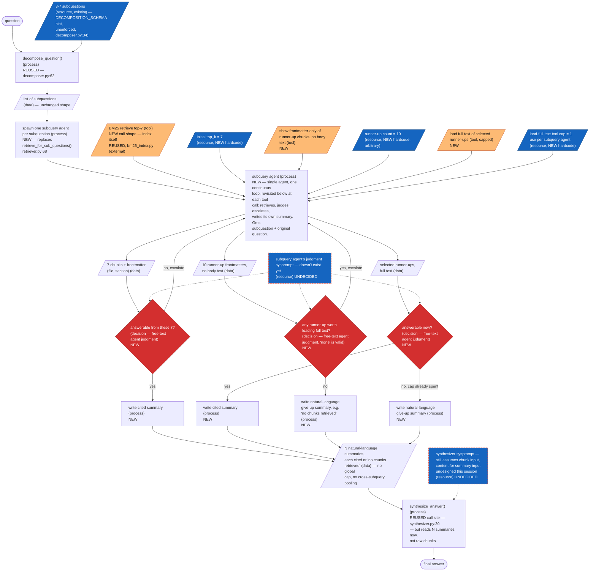

## Frontmatter
- Write date: 20260811
- Update date: 20260811
- Codebase last changed date: 20260810 (per `23_OSHAg.md`, unchanged since)
- Implemented: N — imagined design only, nothing built
- Gate: 2 (problem space, scoped to `failSystematicLog.md` #5 only) plus a Gate 1 manual graph of the proposed replacement. No outcome imagination, detailed solution space, file-by-file change, failure modes, or tests yet — out of scope this session.

## Problem space

- **Global chunk cap loses correct chunks under BM25 score competition across unrelated subqueries.** `retrieve_for_sub_questions()` (`retriever.py:68`) pools every subquery's top-`research_bm25_top_k=5` hits (`config.py:90`) into one list, dedups by node_id, sorts by score, and cuts to `research_max_chunks=20` (`config.py:91`) — nothing reserves a slot per subquery, so one subquery's single correct chunk can lose the cut to a different subquery's higher-scoring but less relevant hits. No step anywhere in `run_research_pipeline()` (`research/__init__.py:20`) checks whether a retrieved chunk actually answers its subquery before it competes for a cap slot — selection is pure BM25 score. Evidence: `failSystematicLog.md` #5, confirmed against undamaged source data twice (failLog #8, #10) and escalating to whole-document exclusion three more times (failLog #21, #23, #24).

## Solution space (idea only)

- Idea: replace the pooled-retrieve-and-cap step with one verification agent per subquery. Each agent retrieves, judges whether what it got actually answers its subquery, and only escalates to more retrieval if not — so subqueries stop competing against each other for a shared cap, and nothing is forwarded without a relevance check.
- Type: breaking. Changes `retriever.py`'s contract (chunks out → cited natural-language summaries out) and `synthesizer.py`'s input contract (reads N summaries, not raw chunks).

## Gate 1 — Manual Graph: Imagined Replacement (nothing below is built yet)

Replaces `retrieve_for_sub_questions()` (`retriever.py:68`) and its call site in
`run_research_pipeline()` (`research/__init__.py`, between the decomposer and
synthesizer stages). `decompose_question()` (`decomposer.py:62`) and
`synthesize_answer()` (`synthesizer.py:20`) are cited by file:line because they're
reused as-is (synthesizer's prompt content still needs updating for the new input
shape — see gap note below); every other node here is new, not built.
Judgment throughout is free-text — no forced schema, no structured yes/no. The
give-up path is also free text: an agent that exhausts its budget without an
answer writes a plain sentence like "no chunks retrieved," not a structured
refusal object.

Legend: rectangle = process, oval = start/end, red diamond = decision, blue
parallelogram = hardcode/config resource, orange parallelogram = tool (a
capability the agent calls) — both are resources and both only ever point
into a process/decision, never the reverse. Dashed red = open/undecided.

`AGENT` is drawn once but re-entered three times — each re-entry is the same
agent, in the same loop, making its next tool call; the repeated node is the
loop, not three separate processes.

Open items this diagram makes explicit (not resolved yet):
- `SYSGAP` — synthesizer's sysprompt still assumes it's reading raw chunks; the input shape changed to N cited summaries, prompt content not rewritten this session.
- `JUDGEGAP` — the subquery agent's three judgment points have no sysprompt yet; judgment is free-text by decision, but the prompt driving that judgment doesn't exist.
- No `D_SQEMPTY` short-circuit is drawn: unlike the current pipeline (`research/__init__.py:60-61`), every subquery agent always returns a summary — even a give-up is text, not an empty result — so there's nothing left to short-circuit on before the synthesizer.
