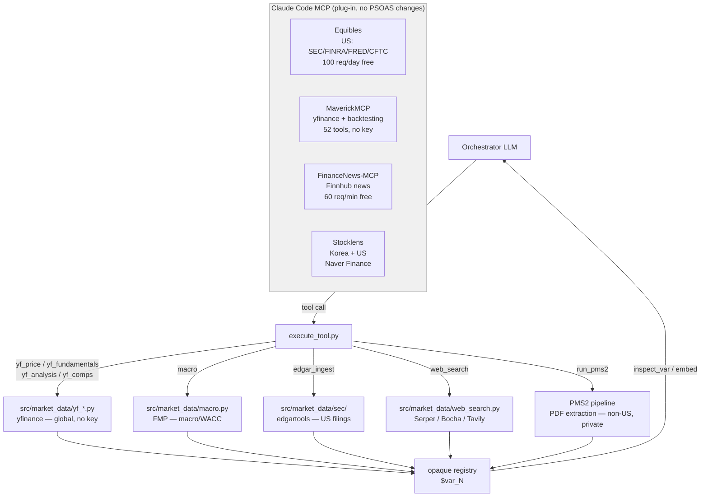

## Discovered resource(s)

Live financial data streams — prices, fundamentals, macro, news, filings, web — callable as PSOAS tools. Sources range from plug-and-play MCP servers to portable Python libraries. Catalogued below by source.

---

### Source map

| Source | Type | Key needed | Coverage | Integration effort |
|---|---|---|---|---|
| **LangAlpha mcp_servers** | Python library (port) | yfinance: none; FMP: free tier | Global (yfinance), US+macro (FMP) | Medium — strip FastMCP, fix imports |
| **Equibles** | MCP server (hosted) | OAuth only (free 100 req/day) | US (SEC/FINRA/FRED/CFTC) | One-liner `claude mcp add` |
| **MaverickMCP** | MCP server (self-host) | none for core; EXA for research | Global (yfinance-backed) | `git clone` + `uv sync` |
| **FinanceNews-MCP** | MCP server (self-host) | `FINNHUB_API_KEY` (free tier) | Global news | `npm install -g` |
| **Stocklens** | MCP server (self-host) | none | Korea + US (Naver Finance + yfinance) | clone + install |
| **edgartools** (`edgar` pip) | Python library | none | US SEC filings only | `pip install edgar` |
| **Web search** (Serper/Bocha/Tavily) | HTTP calls | key per provider | Global / Chinese web | 10-line httpx call |
| **Scrapling crawler** | Python library | none | Any URL (3-tier anti-bot) | `pip install scrapling[all]` |
| **London Strategic Edge (LSE)** | REST API + WebSocket | single API key (free tier) | Global — 118k datasets, 27 asset classes | Medium — REST client, export job poller |

---

### A. LangAlpha portable layer

`LangAlpha-main/mcp_servers/` — pure Python, zero LangChain. Strip FastMCP wrapper, call functions directly.

**yfinance servers (no key, sync)**

| File | Functions |
|---|---|
| `yf_price_mcp_server.py` | `get_stock_history`, `get_multiple_stocks_history`, `get_dividends_and_splits`, `get_multiple_stocks_dividends` |
| `yf_fundamentals_mcp_server.py` | `get_income_statement`, `get_balance_sheet`, `get_cash_flow`, `get_company_info`, `get_earnings_dates`, `get_earnings_data`, `compare_financials`, `compare_valuations`, `get_multiple_stocks_earnings` |
| `yf_analysis_mcp_server.py` | `get_analyst_recommendations`, `get_analyst_price_targets`, `get_upgrades_downgrades`, `get_earnings_estimates`, `get_revenue_estimates`, `get_growth_estimates`, `get_earnings_history`, `get_institutional_holders`, `get_mutualfund_holders`, `get_major_holders`, `get_insider_transactions`, `get_insider_roster`, `get_sustainability_data`, `get_news` |
| `yf_market_mcp_server.py` | `search_tickers`, `get_market_status`, `screen_stocks`, `get_predefined_screen`, `get_earnings_calendar`, `get_sector_info`, `get_industry_info` |

**FMP servers (free tier ~250-300 req/day, async)**

| File | Functions |
|---|---|
| `fundamentals_mcp_server.py` | `get_financial_statements`, `get_financial_ratios`, `get_growth_metrics`, `get_historical_valuation`, `get_insider_trades`, `get_dividends_and_splits`, `get_shares_float`, `get_key_executives`, `get_technical_indicator` |
| `macro_mcp_server.py` | `get_economic_indicator` (GDP/CPI/unemployment/Fed funds), `get_economic_calendar`, `get_treasury_rates` (full yield curve 1M–30Y), `get_market_risk_premium` (by country), `get_earnings_calendar` |
| `x_mcp_server.py` | `search_posts`, `search_all_posts`, `get_user_by_username`, `get_tweet_by_id`, `get_conversation` |

**Helper files to carry:** `_envelope.py` (pure stdlib response shaping), `_yf_common.py` (symbol boundary resolution + serialization)

**Symbol normalization — port this too:** `src/market_protocol/` — 6 files, only needs `pyyaml`. Maps `0700.HK` → yfinance symbol + HKD, A-shares (`.SS`/`.SZ`), LSE GBp→GBP conversion. Required by `_yf_common.py`.

**FMP free tier limits:** 15-min delayed quotes, 3-5 yr historical cap on some endpoints, no bulk/batch. Fine for fundamentals, macro, WACC inputs.

---

### B. Equibles MCP

`github.com/daniel3303/stock-market-mcp-server` — hosted MCP pulling directly from primary sources, not third-party estimates.

**Install (one line):**
```bash
claude mcp add --transport http equibles https://mcp.equibles.com/mcp
# then /mcp → Authenticate via OAuth
```

**Free tier:** 100 req/day, no card required. Pro: 10,000/day.

**Data sources:** SEC EDGAR, FINRA (short interest/dark pool), FRED (macro), CFTC (futures COT), CBOE (VIX/put-call), USAspending.gov, Congressional disclosures.

**90+ tools across:**
- SEC filings RAG: `SearchDocuments`, `ReadDocumentLines`, `ListCompanyDocuments`
- XBRL financials: `GetFinancialStatement`, `GetFinancialFact`, `CompareFinancialFact`, `GetRevenueBreakdown`
- 13F institutional holdings: `GetTopHolders`, `GetInstitutionPortfolio`, `GetFundOverlap`, `GetConsensusHoldings`
- Insider trading: `GetInsiderTransactions`, `GetInsiderOwnership`, `GetInsiderSentimentScores`
- Congressional trades: `GetCongressionalTrades`, `GetMemberTrades`
- Short interest (FINRA): `GetShortVolume`, `GetShortInterest`, `GetShortSqueezeScores`, `GetOffExchangeVolume`
- FRED macro: `GetEconomicIndicator`, `GetEconomicCalendar`
- Stock screener, valuation multiples, CFTC positioning, VIX/put-call ratios, FDA catalysts, government contracts

**Self-hostable:** `git clone github.com/daniel3303/Equibles && docker compose up` — runs at `localhost:8081/mcp`. Databases start empty, fill as scrapers run. Self-hosted has 62 tools; hosted adds earnings calls + screener.

**Limitation:** US public companies only (EDGAR/FINRA). Non-US: nothing.

---

### C. MaverickMCP

`github.com/wshobson/maverick-mcp` — 52-tool MCP server, yfinance-backed, 37 core tools need no key.

**Install:**
```bash
git clone https://github.com/wshobson/maverick-mcp.git
cd maverick-mcp
uv sync --extra dev
cp .env.example .env
make dev
```

**Optional keys:** `EXA_API_KEY` for research tools, BYOK LLM for backtesting/research.

**52 tools across:**
- Market data (7): OHLCV history, batch quotes, fundamentals, market overview, chart links
- Technical analysis (4): RSI, MACD, support/resistance, full technical analysis
- Screening (6): bullish/bearish/supply-demand/criteria screens (on local queried universe)
- Portfolio (20): positions, P&L, ATR-based sizing, regime-adjusted sizing, risk dashboard, watchlist, trade journal, correlation matrix, strategy analytics
- Backtesting (12, optional): single backtest, grid-search optimization, walk-forward, Monte Carlo, multi-strategy comparison, ML predictor, regime detection, strategy ensembles
- Research (3, optional): web-search-backed comprehensive research, company analysis, sentiment

**Coverage:** global via yfinance. SQLite default, optional Redis/Postgres.

---

### D. FinanceNews-MCP

`github.com/guangxiangdebizi/FinanceNews-MCP` — financial news via Finnhub.

**Install:**
```bash
npm install -g financenews-mcp
# add FINNHUB_API_KEY to .env (free at finnhub.io/register)
```

**Free tier:** 60 req/min. Runs on port 3000, streamableHttp transport.

**Single tool:** `get_financial_news(query)` — returns real-time financial news matching a query string. No ticker lookup, just news search.

---

### E. Stocklens (Korea + US)

`github.com/Johnhyeon/stocklens-mcp` — Korean and US market data via Naver Finance + yfinance.

**Coverage:** Korean stocks via Naver Finance (no key needed), US via yfinance. Useful if coverage includes Korean names.

---

### F. Regional MCPs (niche coverage)

| Repo | Market | Key needed |
|---|---|---|
| `revolutionarybukhari/psx-mcp` | Pakistan Stock Exchange — quotes, dividends, indices | none |
| `AnteWall/avanza-mcp` | Swedish stocks + funds via Avanza | none |
| `guangxiangdebizi/A-Scope-Research` | Chinese A-shares multi-agent (5 analysts debate) | Chinese LLM API key |

---

### G. SEC EDGAR direct (edgartools)

`pip install edgar` — no API key, no manual download. US public filers only.

LangAlpha's `src/tools/sec/parsers/edgartools_parser.py` (~420 lines, LangChain-free) wraps it cleanly:
- `get_latest_filing(symbol, "10-K"|"10-Q"|"8-K")`
- `_extract_10k_sections()` — item_1 (Business), item_1a (Risk Factors), item_7 (MD&A), item_8 (Financials) as markdown
- `_extract_financial_statements()` — balance sheet, income stmt, cash flow as tables
- `_extract_financial_metrics()` — typed dict: revenue, net_income, total_assets, FCF, ratios
- `get_filing_markdown()` — full filing as markdown blob
- 8-K: press release extraction, item-level filter (2.02=earnings, 2.01=M&A, 5.02=mgmt change, 7.01=guidance)

Copy: `parsers/edgartools_parser.py`, `parsers/base.py`, `types.py`. Skip `tool.py` (LangChain wrapper).

---

### H. Web search

LangAlpha's `src/tools/web/providers/` — strip LangChain, keep the 10-line httpx core per provider.

| Provider | Key | Standout |
|---|---|---|
| Serper | `SERPER_API_KEY` | `gl`/`hl` params — localized Google results in Chinese, Japanese, etc. |
| Bocha | `BOCHA_API_KEY` | Chinese-language AI search — indexes Baidu, Weibo, Chinese news natively |
| Tavily | `TAVILY_API_KEY` | `topic="finance"` for financial news; deep research mode |
| Exa | `EXA_API_KEY` | Semantic/neural search |

Inhouse crawler (`scrapling`): 3-tier pipeline (TLS impersonation → Playwright → Camoufox anti-bot), zero key, outputs markdown. `pip install scrapling[all]`.

---

### I. London Strategic Edge (LSE Databank)

`londonstrategicedge.com/data/` — 133B ticks across 118,000 datasets, 27 asset classes. Primary value here is **technical signal depth**: tick history + multi-resolution candles + options greeks at scale, free tier. Not a replacement for any existing source — additive stream for price/volume/flow signals.

**Free tier:** 10 dataset downloads/hour, up to 1,000,000 rows each. REST API + live WebSocket feed included. Single API key authenticates everything.

**What the HTTP API returns:**

| Endpoint type | Returns | Format |
|---|---|---|
| Historical candles | OHLCV at 14 resolutions | JSON rows |
| Raw tick exports | Full tick history | Export job → Parquet/Arrow |
| Macro economic series | 14,640 series, 100+ countries, some to 1900 | JSON rows |
| Government bond yields | 202 series | JSON rows |
| Options chains | Chains + greeks + IV across 3,186 underlyings | JSON rows |
| Options flow | Separate endpoint | JSON rows |
| Contract candles | Per-expiry futures OHLCV (unadjusted, not continuous) | JSON rows |
| Reference datasets | 9 datasets (universe/metadata) | JSON rows |

Bulk pulls (tick exports, large history) run as **export jobs** — submit job, poll for completion, download Parquet/Arrow. Not synchronous like the candle/JSON endpoints.

**Asset class coverage:**

| Asset | Count |
|---|---|
| US equities | 3,979 (tick history + 14 candle resolutions) |
| Options underlyings | 3,186 |
| Forex pairs | 62 |
| Crypto | 58 (majors back to 2017) |
| Futures contracts | 54 |
| ETFs | 25 |
| Commodities | 23 |
| Indices | 19 |
| Bond yield series | 202 |
| Macro series | 14,640 |

**Contract candles caveat:** per-expiry, unadjusted. For continuous futures signals, need to stitch/roll manually.

**Integration:** REST client + export job poller. Full endpoint schema requires JS-rendered docs at `londonstrategicedge.com/api-documentation/` — not statically scrapable. Docs need to be read in browser to get exact paths/params.

**Usecase framing (intentionally vague):** PM wants technical signals available as a datastream when they have higher salience than firm fundamentals — mechanism undefined. LSE is the repository. Specific signal construction (volume anomalies, price momentum, options flow) deferred until usecase crystallizes.

---

## Framing usecase

PSOAS extracts financial data from ingested PDFs/docx. The orchestrator reasons over extracted stencils but has no live market awareness — no prices, no consensus, no macro, no peer data unless manually ingested.

Want: orchestrator calls live data tools same as `run_pms2` — result stored as `$var_N`, orchestrator reasons over handle. Complements PDF extraction. Does not replace PMS2 for non-US or private companies.

---

## Emergent usecases

1. **Cross-validate PDF extractions vs live data** — `run_pms2` extracts reported revenue, `yf_fundamentals` / Equibles `GetFinancialStatement` pulls the same metric live, diff and flag discrepancies.

2. **Live comps on demand** — `compare_valuations([...tickers])` or Equibles `CompareFinancialFact` mid-session, no ingested docs needed.

3. **Macro-aware analysis** — `get_treasury_rates` + `get_market_risk_premium` → live WACC inputs. `GetEconomicIndicator("CPI")` for inflation context around margin analysis.

4. **Analyst consensus vs PDF guidance** — `get_earnings_estimates` + `get_analyst_price_targets` gives street view. Compare against management guidance extracted by PMS2.

5. **Insider / holder context** — `get_insider_transactions` + `get_institutional_holders` as ownership overlay mid-session.

6. **Sentiment** — X MCP or FinanceNews-MCP search around a ticker or executive name alongside PDF extraction.

7. **Sector screening → ingest queue** — `screen_stocks` + `get_sector_info` to identify comps universe, orchestrator proposes which filings to ingest next.

8. **US auto-ingest via EDGAR** — skip manual PDF download for US-listed companies. `edgar_ingest("AAPL", "10-K")` → edgartools pulls from EDGAR, extracts markdown → `$var_N`. Eliminates `data/files_raw/` → `00_Ingest.py` pipeline for SEC filers.

9. **Earnings call transcripts** — `fetch_earnings_transcript("AAPL", 2025, 2)` via FMP → full transcript in registry. Cross-reference against PMS2 filing extraction.

10. **Non-US filing discovery** — Serper/Bocha search `"{company} annual report 2024 filetype:pdf"` in local language → IR page URL → scrapling crawler fetches → markdown → PMS2 ingests. Bridges non-US companies (no EDGAR) to PMS2 pipeline.

11. **Real-time news context** — search company name around earnings date, headlines into registry alongside PMS2 extraction.

12. **Private company research** — no SEC, no yfinance. Web search + crawler is the only data path.

13. **Short interest + congressional trades (US)** — Equibles `GetShortSqueezeScores`, `GetCongressionalTrades` as signal overlays on top of fundamental extraction. Zero extra cost within free tier.

14. **Technical analysis + backtesting** — MaverickMCP's 12-tool backtesting suite (Monte Carlo, walk-forward, regime detection) callable mid-session against any ticker universe.

15. **Technical signal datastream (LSE)** — pull multi-resolution candles, raw tick history, options chains+flow, contract candles for any covered ticker via LSE API. Store as `$var_N`. Specific signal construction (volume anomaly, momentum, flow) deferred — LSE is the repository, usecase TBD by PM.

---

## Implementation

### Integration modes

Two modes — pick per source:

**Mode 1: Direct plug-in MCP (Equibles, MaverickMCP, FinanceNews-MCP)**
These are already MCP servers. `claude mcp add` or point Claude Desktop config at them. No PSOAS code changes needed — use them as Claude Code tools in the same session as PSOAS. Equibles in particular replaces most of the LangAlpha porting work for US companies.

**Mode 2: Port as PSOAS dispatch tools (LangAlpha, edgartools, web search)**
Call functions directly in PSOAS `execute_tool.py` handlers, store results in opaque registry.

---

### LangAlpha: what to copy

```
LangAlpha-main/mcp_servers/
  _envelope.py              → copy as-is
  _yf_common.py             → copy, fix one import (see below)
  yf_price_mcp_server.py    → strip FastMCP wrapper
  yf_fundamentals_mcp_server.py
  yf_analysis_mcp_server.py
  yf_market_mcp_server.py
  fundamentals_mcp_server.py  → async, asyncio.run() shim + FMP key
  macro_mcp_server.py
  x_mcp_server.py             → async, X bearer token

LangAlpha-main/src/market_protocol/   → copy whole folder
  __init__.py, symbology.py, models.py, enums.py, intervals.py, instruments.yaml

LangAlpha-main/src/tools/sec/
  parsers/edgartools_parser.py
  parsers/base.py
  types.py
  earnings_call.py            → async, FMP key
  DO NOT copy tool.py
```

Target: `src/market_data/`

**Strip FastMCP (all yf_* files):** remove `from mcp.server.fastmcp import FastMCP`, `mcp = FastMCP(...)`, `@mcp.tool()` decorators, `if __name__ == "__main__": mcp.run(...)`. Functions become plain callables.

**Fix `_yf_common.py` import:**
```python
# from src.market_protocol import ...
from src.market_data.market_protocol import to_canonical, to_display, to_provider
```

**Async shim (FMP/macro/X):** PSOAS dispatch is sync. `result = asyncio.run(get_treasury_rates())`

---

### PSOAS dispatch additions (`execute_tool.py`)

```python
def _exec_yf_price(params: dict) -> str:
    from src.market_data.yf_price import get_stock_history
    result = get_stock_history(params["ticker"], period=params.get("period", "1y"))
    handle = registry.store(result, f"{params['ticker']} price {params.get('period','1y')}")
    return f"Price data for {params['ticker']} → {handle}. {result.get('count', 0)} bars."

def _exec_yf_fundamentals(params: dict) -> str:
    from src.market_data.yf_fundamentals import get_income_statement, get_balance_sheet, get_cash_flow
    ticker = params["ticker"]
    quarterly = params.get("quarterly", True)
    data = {
        "income": get_income_statement(ticker, quarterly)["data"],
        "balance": get_balance_sheet(ticker, quarterly)["data"],
        "cashflow": get_cash_flow(ticker, quarterly)["data"],
    }
    handle = registry.store(data, f"{ticker} financials ({'Q' if quarterly else 'A'})")
    return f"Financials for {ticker} → {handle}."

def _exec_yf_analysis(params: dict) -> str:
    from src.market_data.yf_analysis import get_analyst_recommendations, get_analyst_price_targets, get_earnings_estimates
    ticker = params["ticker"]
    data = {
        "recommendations": get_analyst_recommendations(ticker)["data"],
        "price_targets": get_analyst_price_targets(ticker)["data"],
        "earnings_estimates": get_earnings_estimates(ticker)["data"],
    }
    handle = registry.store(data, f"{ticker} analyst data")
    return f"Analyst data for {ticker} → {handle}."

def _exec_yf_comps(params: dict) -> str:
    from src.market_data.yf_fundamentals import compare_financials, compare_valuations
    tickers = params["tickers"]
    data = {
        "financials": compare_financials(tickers)["data"],
        "valuations": compare_valuations(tickers)["data"],
    }
    handle = registry.store(data, f"comps: {', '.join(tickers)}")
    return f"Comps for {tickers} → {handle}."

def _exec_macro(params: dict) -> str:
    import asyncio
    from src.market_data.macro import get_treasury_rates, get_market_risk_premium, get_economic_indicator
    indicator = params.get("indicator")
    data = {
        "treasury_rates": asyncio.run(get_treasury_rates()),
        "risk_premium": asyncio.run(get_market_risk_premium()),
    }
    if indicator:
        data["indicator"] = asyncio.run(get_economic_indicator(indicator))
    handle = registry.store(data, "macro data")
    return f"Macro data → {handle}."

def _exec_edgar_ingest(params: dict) -> str:
    from src.market_data.sec.parsers.edgartools_parser import EdgarToolsParser
    from src.market_data.sec.types import FilingType
    symbol = params["symbol"]
    filing_type = FilingType(params.get("filing_type", "10-K"))
    parser = EdgarToolsParser()
    content, metadata = parser.parse_filing(symbol=symbol, filing_type=filing_type, output_format="markdown")
    data = {"symbol": symbol, "filing_type": filing_type.value, "metadata": metadata, "content": content}
    handle = registry.store(data, f"{symbol} {filing_type.value} EDGAR")
    return f"EDGAR {filing_type.value} for {symbol} → {handle}. {len(content):,} chars."

def _exec_web_search(params: dict) -> str:
    import asyncio, httpx, os
    query = params["query"]
    gl = params.get("gl", "us")
    hl = params.get("hl", "en")
    n = params.get("n", 10)

    async def _search():
        async with httpx.AsyncClient() as client:
            r = await client.post(
                "https://google.serper.dev/search",
                headers={"X-API-KEY": os.environ["SERPER_API_KEY"], "Content-Type": "application/json"},
                json={"q": query, "num": n, "gl": gl, "hl": hl},
            )
            r.raise_for_status()
            return r.json().get("organic", [])

    results = asyncio.run(_search())
    handle = registry.store(results, f"web: {query}")
    return f"Web search '{query}' → {handle}. {len(results)} results."
```

Add to `_dispatch`:
```python
"yf_price":        _exec_yf_price,
"yf_fundamentals": _exec_yf_fundamentals,
"yf_analysis":     _exec_yf_analysis,
"yf_comps":        _exec_yf_comps,
"macro":           _exec_macro,
"edgar_ingest":    _exec_edgar_ingest,
"web_search":      _exec_web_search,
```

---

### Dependencies

```
yfinance
pyyaml          # market_protocol/instruments.yaml
edgar           # edgartools
pydantic        # sec/types.py
httpx           # FMP, macro, web search
# scrapling[all]  # inhouse crawler (optional)
# tavily-python   # Tavily SDK (optional)
```

---


