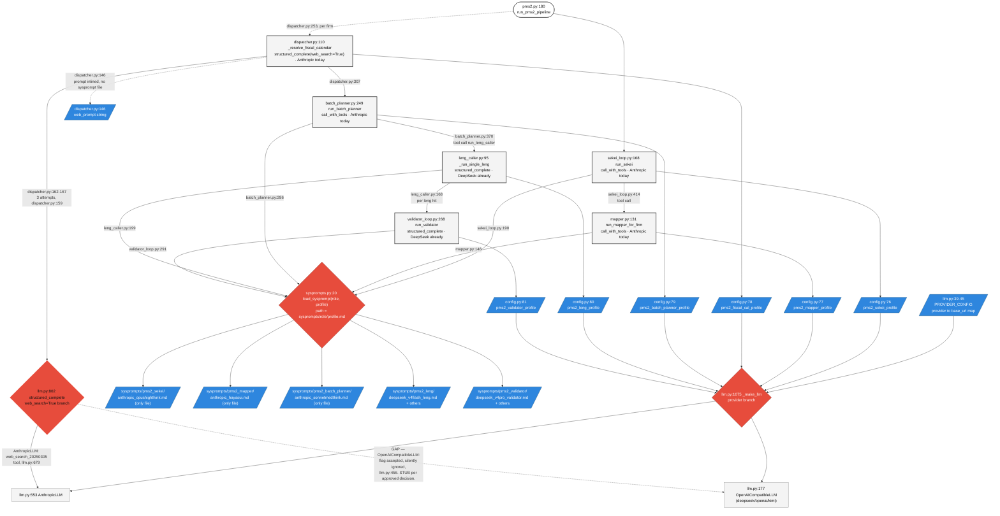
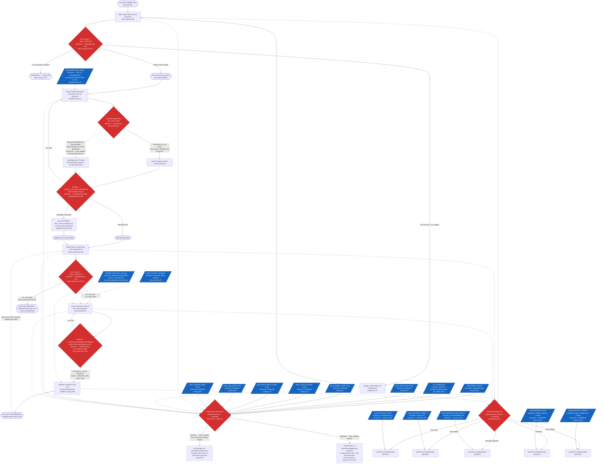

<!--
Date created: 2026-08-10
Date updated: 2026-08-10
Date surroundings last checked: 2026-08-10
-->

# PMS2 callsites — current state (pre-migration)

Every LLM call in PMS2, with its three swap-relevant dependencies: sysprompt file,
tool/backend capability, provider branch. Deterministic post-processing that only
consumes the final stencil (`merge_compute.py`, `stencil_safe_math.py`,
`stencil_topo.py`) is out of scope — it doesn't call a model, so it isn't touched
by a backend swap.

Sources: `grep -rn "pms2_<role>_profile" src/`, `graphify explain "<function>"`,
direct read of `pms2.py`, `dispatcher.py`, `batch_planner.py`, `leng_caller.py`,
`validator_loop.py`, `llm.py`, `sysprompts.py`.

Legend: rectangle = process/action · pill = start/end · red diamond = decision/branch ·
blue parallelogram = hardcoded config/resource feeding a decision.

## LLM callsites — dependency graph

## Process view (same scope, decision/process/resource abstraction)

Same 6 LLM callsites, redrawn as process/decision/resource instead of function-to-function
calls. Every decision that gates a repeat LLM call is included (loop caps, retries) since
those are backend-relevant — not deterministic post-processing.

## Validation

- TODO: `mapper.py` (`run_mapper_for_firm`) has no live/E2E test, unit-test coverage only (`tests/test_pms2_unit.py`) — regression risk for any future swap, unaddressed.
