### Musing
For any qualitative query, there multiple & conflicting sources (JPM report/model, Mizuho report/model, internal model), request of qualitative attributions to numerical data
- If general query, user doesnt expect a specific source, ``` askuserQ "source preference? have sources <sources>, if no preference I will pull ALL and tell u everything ... u want most recent? specific broker?```
  - Cant exactly RAG out the "justification" behind an internal model's hardcodes if they arent noted, provenance only reside in PDFs/notes etc
- Then when recieve a query, just walk the firm/sector dirs for all filenames to see what sources there can be
- Depending on what source files available, the best retrieval strat differs and what retrievals to run
- In event of vague query, wants comparison of sentiments/forecast from multiple sell side PDFs:
  - Each source can be its own retrieval path to orthogonally construct an ans, its own OSHA path with constrained output size
    - eg one retrieval path only consults JPM pdfs/xlsx/docx
  - If query wants seg figs but not in PDFs, can check the respective model, I guess this would burden the system with a "loop" design
  - Then each retriever outputs a summary ans MD with files cited in a strict format
  - Then master retriever can load the MDs, write a summary comparing the sources

### Bunragman low level
Get a query
List dirs 
Toolcall: walk_dirs() for all relevant dirs 
For all desired files:
If PDF/docx/other, order an OSHA
If xlsx, order a BunNav

Sends up to 10 toolcalls (OSHA-ite or BunNav

How to reconcile BunNav, OSHA outputs

### Process diagram

Build status: sekei's own control flow, the per-source agent, and the
orchestrator's routing are all real code.

- `src/harness/execute_tool.py`'s `run_research` tool — the one the
  orchestrator calls — is wired to `run_bunragman_sekei()`, not
  `run_research_pipeline()` directly. Every live research call goes
  through Bunragman now; OSHA is invoked only inside the per-source
  agent, several layers below the orchestrator, never directly.
- Discovery (`zako_discover()`, `src/scripts/zako/`) is real: a
  directory scan, an LLM select call on its own `zako_bunragman` role,
  and a real `ask_user` confirm/modify/redo loop over
  `config.zako_source_root`.
- `GROUP` is a real agentic tool-calling loop (`_run_group_loop()`,
  same shape as PMS2's `sekei_loop.py`) — `ask_user` is a tool the
  model calls itself, as many times as it needs, on its own dedicated
  `bunragman_sekei_group` role (thinking off — GROUP is filename
  classification, not synthesis). This replaced an earlier one-shot
  propose-then-Python-confirm design; confirming a proposal or asking
  for changes is now the same conversation, not a second cold LLM call.
- `RECONCILE` is a real LLM call on its own `bunragman_sekei` role
  (thinking on — real cross-source synthesis, that reasoning is
  earned). Its draft is then passed through `format_answer_sheet()` —
  reused as-is from OSHA's own contract module
  (`src/harness/answer_sheet_contract.py`), zero duplicated logic —
  which turns `[Source: file — section]` citations into `[1]`/`[1.1]`
  local labels plus a `## Bibliography`. Citations in the final answer
  resolve through to the real underlying documents, not to Bunragman's
  own intermediate per-source summary files.
- The Bunragman per-source agent (`call_bunragman()`, `PARTITION`
  through `WRITEDISK`) is real control flow with two real LLM calls of
  its own, on a third dedicated role (`bunragman_agent`): `SELECT`
  (which xlsx files, if any, are worth querying, and what to ask each)
  and `SUMMARIZE` (write the source-level summary). Conflict-flagging
  turned out to be a one-line sysprompt instruction inside `SUMMARIZE`,
  not a structured decision — if a source's narrative and spreadsheet
  data disagree, the model flags it in prose; there's no
  conflict-schema or conflict-format code path.
- Two calls inside the per-source agent remain monkeypatched:
  `_call_osha_stub()` always returns one fixed prior research answer
  regardless of source or query (OSHA's real `file_scope` param isn't
  landed yet — coworker-owned, separate branch), and
  `_call_bunnavharness_stub()` returns one of two fixed JSON fixtures,
  picked deterministically by xlsx path hash — BunNavHarness doesn't
  exist in this repo at all yet.
- Every real (and stub) external call — GROUP, RECONCILE, SELECT, the
  OSHA/BunNav stubs, SUMMARIZE — is wrapped in a spinner
  (`_router.start_spinner()`/`stop_spinner()`, same convention as
  PMS2), including under the per-source fan-out, which races multiple
  threads on the one global spinner the same way PMS2's per-firm
  fan-out already does.

Lane granularity: one Bunragman agent per source, source = an arbitrarily named
selection of unique files (firm-specific, broker-specific, dir-specific,
sector-specific, whatever the query calls for) — not bound to one firm or one
directory. Nothing in the per-source agent's two external calls is genuinely
reused yet — both OSHA and BunNavHarness are currently monkeypatched (see
Build status above); OSHA becomes the one piece of real reuse once its
`file_scope` param lands. Everything else is original design; naming an
existing file elsewhere in the codebase as "inspiration" isn't the same as
reuse, so nodes don't claim it.

`run_research()` gets its own sekei, shaped like PMS2's sekei pattern: it calls
the discovery tool, fans out one Bunragman agent per resolved source (each
agent gets that one source's file list as its argument), and — once every
agent has written its own summary file to disk and handed the filepath back —
reads all of them and writes the final cross-source answer. Sekei is both the
dispatcher and the reconciler; it's one component, not two.

Every external capability the diagram calls (OSHA, BunNavHarness, the discovery
tool) is blackboxed: only its calling contract is drawn, never its internals.
Legend per `/wsnSpecsutekisa` convention: rectangle = process, oval = start/end,
red diamond = decision, blue parallelogram = hardcode/resource feeding a
decision, orange parallelogram = a blackboxed tool being invoked — its
identity and I/O contract are drawn, its internal mechanics are not.
Parallelism is drawn as prose (e.g. "fired in parallel, one call each",
"waits for all N"), not literal N-way branching, since N is set by the query
at runtime.

```mermaid
%%{init: {'flowchart': {'useMaxWidth': false, 'htmlLabels': true}}}%%
flowchart TD
    classDef default text-align:left
    classDef decision fill:#d32f2f,stroke:#7f1d1d,color:#fff,text-align:left
    classDef resource fill:#1565c0,stroke:#0d3f73,color:#fff,text-align:left
    classDef tool fill:#ffab40,stroke:#e65100,color:#111,text-align:left
    classDef gap stroke:#e74c3c,stroke-dasharray:4 3,color:#111,text-align:left
    classDef resourcegap fill:#1565c0,stroke:#e74c3c,stroke-width:2px,stroke-dasharray:4 3,color:#fff,text-align:left

    START(["`user query, via execute_tool.py's run_research tool`"]) --> SEKEI

    SEKEI["`Bunragman sekei (process) — wraps run_research(), shaped like PMS2's sekei: calls the discovery tool, batches the raw file lists into per-broker sources via a real agentic ask_user loop, fans out one Bunragman agent per source, collects each agent's summary filepath, then reconciles`"]

    RES_BACKEND[/"`LLM backend (resource) — shared pluggable abstraction (llm.py + config.py + llm_profiles.yaml). Provider set per role by one profile string, zero code to swap. Three dedicated Bunragman roles: bunragman_sekei_profile (RECONCILE only, thinking on — get_bunragman_sekei_llm()), bunragman_sekei_group_profile (GROUP only, thinking off — get_bunragman_sekei_group_llm()), bunragman_agent_profile (the per-source agent's SELECT + SUMMARIZE — get_bunragman_agent_llm()). Discovery has its own separate role, zako_bunragman_profile, backed by get_zako_bunragman_llm() — reuses the existing deepseek_v4pro_highalloc profile, no new profile entry needed. Already-DeepSeek: generic sekei_profile, orchestrator_profile, OSHA's research_decomposer/research_synthesizer profiles, all four Bunragman/Zako roles above. Still-Anthropic: PMS2's pms2_sekei/pms2_mapper/pms2_fiscal_cal/pms2_batch_planner profiles. BunNavHarness is OUTSIDE this system — its own script, hardcoded straight to DeepSeek's endpoint, not routed through llm.py — and doesn't exist in this repo yet regardless.`"/] --> SEKEI
    class RES_BACKEND resource

    SEKEI --> DISC["`call discovery tool (process)`"]
    TOOL_DISCOVERY[/"`discovery tool — contract: query -> (final_query, {dir_name: [file_path]}) on success, or the string 'source discovery loop failed' on failure. File paths are relative to config.zako_source_root, not absolute. final_query may differ from the query sekei called it with, if the user replaced it mid-loop. Internals opaque by drawing convention (blackbox, same as OSHA/BunNavHarness) — real implementation: zako_discover(), src/scripts/zako/. Scans config.zako_source_root for top-level directories, an LLM call selects which are relevant, then a real ask_user confirm/modify/redo loop over channel before returning. Selection is by directory relevance only — files within a selected directory are not yet grouped into sources, that's GROUP's job.`"/] --> DISC
    DISC --> SEKEI

    SEKEI --> D_DISCRESULT{"`discovery tool returned dirs? (decision)`"}
    D_DISCRESULT -->|"`no — tool returned 'source discovery loop failed'`"| ERRDISC(["`discovery failed, no dirs resolved`"])
    D_DISCRESULT -->|"`yes`"| RAWDIRS

    RAWDIRS[/"`N relevance-confirmed directories, each with its unlabeled file list (data) — e.g. {'LITE': [...], '0 Optical': [...]}, paths relative to config.zako_source_root. N can be 0 — a valid empty result, not a failure. Confirmed relevant by Zako's own ask_user loop; files within each directory are not yet grouped into sources.`"/]

    RAWDIRS --> GROUP["`sekei batches raw dir files into sources by broker/source (process) — real agentic tool-calling loop, own role (thinking off). Two tools: ask_user (the model decides when to ask, can name specific files, e.g. to clarify an ambiguous file's owner) and finalize_grouping (ends the loop). A hard gate blocks finalizing before the user has confirmed via at least one ask_user exchange in the same conversation — a follow-up correction is the next turn of that conversation, not a fresh call. References files by index into a numbered listing rather than by full path, converted back to full paths before returning sources.`"]

    GROUP --> D_GROUPRESULT{"`GROUP loop finalized a grouping? (decision)`"}
    D_GROUPRESULT -->|"`no — user cancelled, or the loop exhausted its turn cap without finalizing`"| CANCELLED(["`cancelled, no sources resolved`"])
    D_GROUPRESULT -->|"`yes`"| SOURCES

    SOURCES[/"`N sources resolved, each an arbitrary named file selection (data) — e.g. JPM / Mizuho / Internal Model / a whole sector. N can be 0 — a valid empty result, not a failure, distinct from a cancelled loop above.`"/]

    SOURCES --> CALLAGENT["`sekei calls one Bunragman agent per source (process) — each call's argument is a single-entry dict {source_label: [file_path, ...]}, e.g. {'JPM': [jpm_file1, jpm_file2]}. One call per source, not one call for all sources.`"]

    CALLAGENT --> AGENT["`Bunragman agent — one call per source (process, single pass by design — see assumption below). Real control flow: call_bunragman() in sekei.py. PARTITION through WRITEDISK below are current code, not aspirational design.`"]

    AGENT --> PARTITION["`partition this source's files ONCE (process, mechanical — no judgment call) — non-xlsx files as one group, each xlsx file on its own`"]
    RES_FILETYPE[/"`file's filetype metadata (resource — already exists in OSHA's docstore, not re-carried through the discovery tool's output)`"/] --> PARTITION

    PARTITION -->|"`non-xlsx group, ONE call for all of them`"| CALLOSHA["`call OSHA (process)`"]
    TOOL_OSHA[/"`OSHA — run_research_pipeline() research/__init__.py:20. STUBBED: _call_osha_stub() always returns one fixed prior research answer regardless of source or query. Real version needs a file_scope param (in the works, separate initiative, coworker-owned on osha branch) so retrieval is scoped to this source's file set before ranking. Once real, can return 'nothing found' — a normal result, not a failure.`"/] --> CALLOSHA
    RES_MAXCHUNKS_ASSUME[/"`ASSUMPTION: research_max_chunks raised 20→50 makes a real (non-stub) OSHA call exhaustive for the non-xlsx group. Plausible for a small file set (budget math supports ~220 chunks total); NOT guaranteed for a source with many non-xlsx files — 50 chunks spread thinner. Still unverified — research_max_chunks is still 20 in config, not yet raised.`"/] --> CALLOSHA
    class RES_MAXCHUNKS_ASSUME resourcegap

    PARTITION -->|"`xlsx files`"| SELECT["`SELECT (process) — real LLM call, own role. Decides which xlsx files (if any) are worth querying for this query, and what specific metric(s)/period(s) to ask each. A purely qualitative query can validly select zero files.`"]
    SELECT -->|"`chosen xlsx targets, fired in PARALLEL, one call each`"| CALLBUNNAV["`call BunNavHarness (process)`"]
    TOOL_BUNNAV[/"`BunNavHarness — ask_bunnavharness(question, xlsx_path) -> str, DeepSeek-only, own script. Doesn't exist in this repo yet. STUBBED: _call_bunnavharness_stub() returns one of two fixed JSON fixtures (congruent/incongruent with the OSHA stub's content), picked deterministically by xlsx path hash — lets a test run exercise both the flagged and plain SUMMARIZE path.`"/] --> CALLBUNNAV

    CALLOSHA --> SUMMARIZE
    CALLBUNNAV --> SUMMARIZE
    SUMMARIZE["`write source-level summary (process) — real LLM call, own role. Conflict-flagging is a sysprompt instruction, not a code decision: if this source's narrative and spreadsheet data disagree, the model flags it in prose. Notes 'no data found' per file if a call above came back empty.`"]

    SUMMARIZE --> WRITEDISK
    WRITEDISK["`write summary MD to disk, return filepath to sekei (process)`"]

    WRITEDISK --> RECONCILE["`sekei (same component as above, reconciler phase): waits for all N agents' filepaths, reads every summary MD, writes final cross-source answer (process) — real LLM call, own role (thinking on). Per-source summaries already cite real documents as [Source: file — section]; RECONCILE carries those forward verbatim rather than citing the summary file itself. The draft then passes through format_answer_sheet() (reused from OSHA's own contract module, src/harness/answer_sheet_contract.py) — turns citations into [1]/[1.1] local labels plus a Bibliography resolving to the real documents. N=0 is valid — reconciler then writes 'no sources found' directly, no agents to wait for.`"]
    RECONCILE -.->|"`sysprompt guardrails against blending/fabricating across sources — still deferred. RECONCILE's citation-fidelity rule (carry forward real citations, never invent one) narrows this some, but doesn't address free-composed uncited claims`"| SYSGAP["`failSystematicLog #1/#6: this exact gap already causes recurring failures when unguarded`"]
    class SYSGAP gap
    RECONCILE --> ANSWER(["`final cross-source answer`"])

    class D_DISCRESULT,D_GROUPRESULT decision
    class RES_FILETYPE resource
    class TOOL_DISCOVERY,TOOL_OSHA,TOOL_BUNNAV tool
```



Open design questions:
- `RES_MAXCHUNKS_ASSUME` — the single-pass design depends on `research_max_chunks=50` making one *real* OSHA call exhaustive for a source's non-xlsx files. Still unresolved on two counts: unverified for a source with many non-xlsx files, and `research_max_chunks` hasn't actually been raised from 20 yet (deliberately left to the OSHA coworker's branch).
- `SYSGAP` — sekei's reconciler-phase citation/fabrication guardrails, still deferred by choice. RECONCILE's citation-fidelity rule (carry forward real `[Source: ...]` citations verbatim, never invent one) is a side effect of the citation-labeling work, not a designed fix for this — it narrows how a fabricated claim could look, it doesn't prevent one.
- Unattended-pipeline `ask_user` behavior — if sekei runs inside a pipeline with no person watching, do GROUP's and Zako's real `ask_user` calls still block and wait, or does ambiguity need to resolve some other way? Was filed under "ASKCONFIRM's stub behavior" when that was still a stub; the container it lived in is real now, but this question itself was never actually answered.
