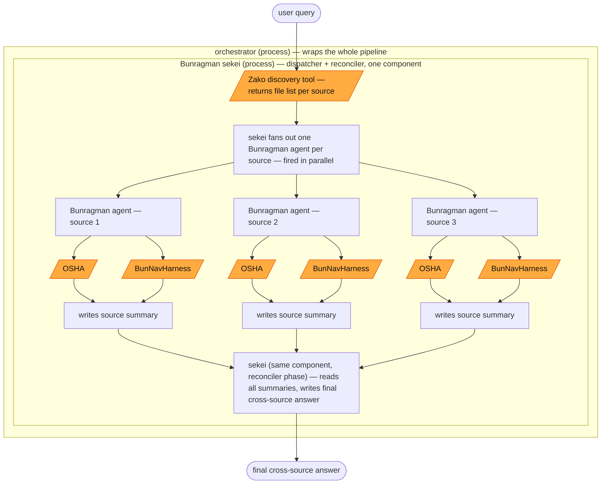

### Process diagram — working components only

Skeleton view of the Bunragman pipeline: orchestrator, sekei, the per-source
Bunragman fan-out, and the two tools each Bunragman agent calls. No decision
diamonds, resource nodes, or gap annotations — see `wsnBunragMan.md` for the
full build-status diagram those belong to. Three Bunragman boxes are drawn to
show the fan-out shape; the real count is set by how many sources sekei
resolves at runtime, same as the full diagram.

Legend: rectangle = process, oval = start/end, orange parallelogram =
blackboxed tool (identity and I/O contract drawn, internals not).

